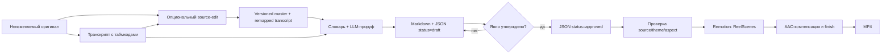

# Архитектура AutoMontage-Agent

Актуально на 2026-09-08. Документ описывает существующий код, а не будущую дорожную карту.

## 1. Назначение и границы

AutoMontage-Agent – локальный конвейер «видео или озвучка + монтажное решение → MP4». Он объединяет:

- Node.js-оркестратор и CLI;
- faster-whisper для локальной транскрибации;
- Remotion + React для программной графики;
- ffmpeg для подготовки исходника, музыки и финишной обработки;
- OpenCV/Python для анализа лица и перекадрирования;
- JSON-монтажные листы, отделяющие смысл и тайминг от визуальной темы.

Проект не является видеоредактором с GUI, облачным сервисом или хранилищем пользовательских
роликов. Исходники, музыка и результаты живут локально и не входят в репозиторий.

## 2. Главная модель: тема → композиция → монтажный лист

1. **Тема** (`src/theme/`) хранит цвета, шрифты, радиусы, тени и параметры движения.
2. **Композиция** (`src/`, `src/blocks/`, `src/scenes/`) знает, как рисовать и анимировать.
3. **Монтажный лист** (`props/*.json`, `schema/*.json`) определяет, что и когда показать.

Так один сценарий можно отрендерить в другой теме, не переписывая компоненты, а приватный
стиль можно подключить извне через `THEMES_EXT`.

Default зависит от композиции: lesson/ReelScenes использует встроенную
`lesson-neutral`, Dynamic использует `craft`. Оба значения задаются до построения props;
внешний theme id всегда передаётся явно.

## 3. Потоки данных

### 3.1 Dynamic – общий монтаж

```mermaid
flowchart LR
  A["Видео"] --> B["ffprobe: геометрия, FPS, длительность"]
  B --> C["ffmpeg: WAV 16 kHz mono"]
  C --> D["faster-whisper: transcript.json"]
  D --> E["Опционально: tighten / reframe / autopos"]
  E --> F["scenario JSON + captions.js"]
  F --> G["JSON Schema + quality gates"]
  G --> H["Remotion: Dynamic"]
  H --> I["ffmpeg finish / music"]
  I --> J["MP4 в projects/ или legacy out/"]
```

`scripts/build.js` является границей пользовательского ввода: пути сначала разрешаются
как host paths, затем ffprobe, ffmpeg, Python и Remotion получают их отдельными argv через
`scripts/process.js`. Числовые CLI-параметры проходят конечные диапазоны до первого spawn.
После исходного и каждого производного видео (reframe/tighten) build берёт геометрию, FPS и
длительность из соответствующего ffprobe. `scripts/source-timing.js` сохраняет точный numeric
FPS, включая NTSC `30000/1001` и `24000/1001`, вычисляет `durationInFrames` через `ceil` и
не даёт положительному целому `--frames` увеличить доступную длину.

Точка оркестрации – `scripts/build.js`. Без `--scenario` он создаёт черновой монтажный
лист; смысловую расстановку блоков агент затем правит и запускает повторно с готовым JSON.

В project-режиме `scripts/project/workspace.js` оборачивает render, finish, music и
публикацию в единый lifecycle. Ошибка переводит текущую версию из `started` в `failed`,
не меняя `latestRender`; новый canonical final сначала копируется во временный соседний
файл, синхронизируется и только затем атомарно заменяет предыдущий.

`project.json` – недоверенная граница между сохранёнными метаданными и файловой системой:
`project.json → schema/project.schema.json → resolveProjectPath() → filesystem`.
Перед чтением и записью старый manifest без `transcript` мигрируется к каноническим путям,
затем AJV-схема запрещает неизвестные поля, а resolver проверяет каждый project-путь.
Даже schema-valid manifest не получает доверия к путям: resolver принимает только канонический
относительный путь внутри workspace, отвергает
absolute/Windows/traversal-варианты, проверяет `lstat` каждого уже существующего компонента,
включая dangling symlink, и затем подтверждает containment через `realpath`. Slug ограничен
каноническим lowercase token. Legacy `--id` отдельно ограничен безопасным filename token,
а общий для lesson и Dynamic экспорт через `--outdir` проверяет `lstat` каждого существующего
компонента outdir и финала, включая dangling link, создаёт отсутствующие родители по одному,
подтверждает `realpath` containment и копирует в непредсказуемый exclusive/no-follow temp.
Атомарный `rename` публикует temp вместо прямой записи через статическую ссылку назначения.
Единственное исключение – `source.originalPath`: это provenance исходника, а не workspace-путь.

`project.json` записывается через непредсказуемый соседний temp, открытый с exclusive и
no-follow flags там, где платформа их поддерживает. Temp-файл проверяется как regular file,
синхронизируется и атомарно переименовывается; cleanup удаляет его только при совпадении
file identity с созданным процессом.

Все изменяющие project-операции используют один межпроцессный lease из
`scripts/project/workspace.js`: Save, approval, регистрация brief и lifecycle render не могут
одновременно менять один workspace, но чтения остаются доступными. Полный owner record
публикуется атомарно; live owner и owner с другого host сохраняются. Lease умершего PID на том
же host можно забрать через identity-проверенный recovery claim. Под lease manifest заново
читается с диска, stale in-memory snapshot получает `PROJECT_MANIFEST_CONFLICT`, а замена
`project.json` выполняется только после повторной проверки persisted file snapshot. Для
существующего manifest даже низкоуровневый writer обязан передать expected snapshot; успешный
`rename` является однозначной commit point и после него transaction не запускает fallible probe,
который мог бы ошибочно откатить уже опубликованную историю.

Containment защищает от вредоносного manifest и symlink, существующих на момент проверки.
Соперничающий локальный процесс с правом записи в workspace или внешний `--outdir` может заменить предка между
проверкой и файловой операцией; portable Node API не даёт для этого кроссплатформенный
descriptor-relative `openat`-аналог. Такая конкурентная подмена вне границы модели угроз:
не предоставляйте untrusted локальным процессам запись в папку проекта или каталог экспорта;
проверки и операции в коде расположены настолько близко друг к другу, насколько позволяет API.

### 3.2 Lesson – ТЗ до рендера

`scripts/lesson/workflow.js` определяет режим `plan` или `render`.
`scripts/gen-brief.js` выбирает только официальные сцены и создаёт draft.
`scripts/lesson/brief.js` валидирует данные и превращает approved brief в props.
`schema/lesson-brief.schema.json` фиксирует контракт.

Approval под project lease заново читает и полностью валидирует текущий persisted draft и
manifest. Markdown и JSON публикуются первыми атомарными no-replace hard links, поэтому уже
существующая историческая ревизия никогда не заменяется. `project.json` публикуется CAS-последним:
reader либо видит прежний currentBrief, либо новый указатель на уже существующий JSON. Сбой до
manifest удаляет только собственные опубликованные файлы; hard exit может оставить безопасный
orphan, и следующая draft-ревизия пропускает занятое имя. При рендере точный legacy
`faceSrc: "source.mp4"` внутри сцены переводится на
текущий source lease вместе с top-level `faceSrc` и `audioSrc`. Другой approved
`scene.faceSrc` разрешён только как canonical `assets/...` project video или web-relative
repository-public video. Props обязаны сохранить точный исходный reference и scene type до
bundle boundary; после проверки cloned scene получает отдельный `.automontage/...` snapshot,
а top-level `audioSrc` не меняется.
Канонический builder отдельно передаёт trusted source alias (`source.mp4`): top-level
`faceSrc`/`audioSrc` обязаны совпасть с ним, поэтому forged props не превращают custom reference
в alias главного видео. Same-inode dedup хранит полную source identity и SHA-256; ctime-only
повтор требует стабильного полного rehash, любое другое расхождение отклоняется.

Первичный lesson/scenario draft тоже использует этот contract: build context не резервирует
номер заранее, генератор сначала создаёт временную no-replace пару, а `publishBriefRevision()`
под lease выбирает свободную ревизию, публикует исторические файлы no-replace и обновляет
manifest последним. Поэтому параллельный build или foreign destination не перезаписывается.

Brief замораживает исходник, тему, аспект, размеры, FPS, длительность, сцены и проверенное
кадрирование лица. Это защищает от ситуации, когда утверждали один монтаж, а рендерится другой.

Сокращение исходника - отдельная data-boundary до draft. `scripts/project/build-master.js`
валидирует `edit/vNN-source.json` относительно активной source revision и FPS, собирает диапазоны
через существующий trim pipeline, полностью декодирует результат и атомарно публикует новую пару
`input/source-vNN.mp4` + `transcript/words-vNN.json`. Слова вне оставленных диапазонов удаляются,
пересекающие разрез клипуются, а последующие таймкоды сдвигаются без повторного Whisper.
Оригинал и история immutable; manifest переключается последним и очищает только устаревший
`currentPreview`. Draft не переписывается автоматически: новая режиссура должна явно зафиксировать
новую source revision.

Draft имеет отдельную непередаваемую в final возможность: `scripts/preview.js` принимает только
текущий зарегистрированный draft, выбирает `ReelScenes` или `MotionReel` по `briefs[].kind`
через `scripts/project/brief-contract.js` и готовит props через закрытую preview-boundary,
материализует медиа в том же изолированном bundle и выполняет Remotion → `finish.js` →
`mix-music.js`. Отличия только технические: `--scale=0.5`, CRF 28 и детерминированная отметка
«ЧЕРНОВИК». После полного decode immutable revision и `previews/current-preview.mp4` публикуются
атомарно, а manifest обновляет только `currentPreview`; `renders`, `latestRender` и `final`
недоступны этой границе. Approved builder по-прежнему отклоняет draft.

Preview не имеет отдельного HTML- или FFmpeg-дизайна: такие имитации могли бы показать не тот
монтаж, который затем соберёт final. И preview, и final используют одну соответствующую kind композицию,
одни scene props, тему, шрифты, media bundle и аудиопорядок; разрешённые различия preview
ограничены scale, CRF и watermark.

#### Motion workflow

Публичный путь: тема → script в текущей агентной сессии → выбор готового аудио или платного
provider → canonical words → timed motion draft → полный preview → явное approval → final → QA.
Канон инструкции – `skills/motion-reel/SKILL.md` с reference; `.agents` и `.codex` хранят
byte-identical копии. `reel-turnkey` маршрутизирует запросы без камеры до применения lesson-правил.

`automontage demo --motion` использует `scripts/project/cli-options.js` и отдельный
`scripts/motion/demo.js`: из `generate-neutral-fixtures.js` получает детерминированные WAV-тоны,
PNG-геометрию, иллюстративный transcript/script и все семь сцен. Публикуется только draft
audio-only workspace, стандартно `projects/motion-demo/`, без Whisper, провайдера и скрытого
approval/render. Любая существующая папка назначения отклоняется. Tracked
`examples/motion-brief-demo.json` равен генератору; бинарные данные остаются локальными.
Демо длится 27 секунд: steps/list получают 5/7 секунд и минимум 0,75 секунды полной видимости
последнего элемента. WAV и иллюстративные таймкоды выводятся из тех же границ сцен. Следующая
preview-команда печатается с POSIX single-quote escaping как подсказка; исполнение остаётся argv-only.
Scheduling и автопубликация – будущая отдельная orchestration-система, не часть этого pipeline.

`scripts/motion/build.js` владеет отдельным CLI-маршрутом. Первый вызов `motion <audio> --project`
использует `createMotionProject`, dedicated audio probe и локальную транскрипцию; scaffold
публикуется через `publishBriefRevision`. Новый проект по умолчанию живёт внутри `projects/`
текущей папки; явный `--project-dir` выбирает другое место. Проба открытого аудио использует seekable
`cache:pipe:0` с `read_ahead_limit=-1`, чтобы определять длительность обычных WAV/MP3 больше
64 KiB; timeout ограничен 30 секундами.

Общий `scripts/project/private-workspace.js` защищает все motion workspaces: локальный звук,
демо, TTS и возобновляемый preview/final. До первой записи source/manifest сохраняются новая
цепочка каталогов и локальный `.gitignore` с последним правилом `*`; существующие bytes правил
сохраняются. Проверка Git отклоняет корень репозитория и tracked-содержимое; no-follow/identity
guards отклоняют symlinks и подмену каталогов/ignore. Source staging, canonical words и draft
повторяют guard; неудачная начальная запись удаляет принадлежащие ей частичные файлы.

Опциональная async-ветка `motion --script --voice elevenlabs --accept-provider-cost` использует
`scripts/voice/elevenlabs.js`: официальный POST `/v1/text-to-speech/:voice_id/with-timestamps`,
ограничение ответа 32 MiB и общий deadline 60 секунд включая тело. Fetch и filesystem заменяемы
в тестах; redirects и автоматические retries запрещены. `alignment.js` собирает слова из
character entries с кириллицей/Unicode в канонический transcript, поэтому Whisper не вызывается.
SHA-256 кэш включает текст, ID голоса, модель, voice settings и output format. Workspace имеет
локальный `.gitignore` с `*`; tracked-папки и symlinks отклоняются. Exclusive `attempt.json`
резервирует запрос до отправки, сохраняется при неоднозначном отказе и предотвращает дубликаты.
До fetch сохраняются файл `.gitignore`, каждая новая папка цепочки и её запись в родителе;
directory fsync следует общей платформенной политике `filesystem-capabilities` (POSIX).
Общий `writeFilesNoReplace` принимает optional parent guard и after-commit проверку: guard
повторяется сразу после temp open до записи bytes, rollback ownership сохраняется до
последнего fsync каталога и workspace-check. При отказе удаляются только собственные output-файлы.
Готовый receipt связывает hashes MP3/words; повреждение кэша не вызывает новый платный запрос.
После probe/copy actual `input/narration.*` сверяется с digest receipt; открытый snapshot
удерживается и проверяется до публикации canonical words и draft.
Конфигурация читается в локальный объект из `.env`/environment без записи в `process.env`, manifest
или props. Кэш и canonical transcript переходят в прежний motion draft/approval pipeline.

`prepareMotionPreview`/`prepareMotionRender` связывают brief с `manifest.source.localPath`,
не создают `faceSrc`, проверяют тему `motion-neutral` и сохраняют глобальный таймкод озвучки.
Общий `render-media-bundle` различает роли audio/image/video: narration, scene media и музыка
копируются с no-follow в изолированный каталог. Motion media и music имеют обязательные hashes;
все ссылки относительны workspace. Music использует существующий finish/ducking pipeline.
Перед копированием motion video ffprobe читает тот же закреплённый дескриптор, который затем
хешируется. Каждый scene, включая повторное использование файла, проверяет наличие пригодного
аудиопотока для `mix`/`replace` и конец обрезки по FPS проекта. Порог совпадает с lesson:
округлённый trim + длительность сцены не превышают округлённое число кадров видео, а для
`replace` – также аудио. Silent video разрешён в `mute`; image media сохраняет прежний путь.
Отсутствующие `audioMode`/`trimStartSec` проверяются как `mute`/`0`, как в схеме и renderer.
Значения нормализуются только в локальной копии preflight; approved JSON и его SHA не меняются.
Ошибка preflight не вызывает Remotion и не публикует preview, поэтому preview QA не получает
нового непригодного пакета. Тот же media gate действует при approval и final bundle.
Для motion preview digest фактически скопированной narration должен совпасть с digest исходника,
полученным до snapshot; именно он записывается в `currentPreview.sourceSha256`. Подмена аудио
на время копирования с последующим возвратом прежних bytes отклоняется до Remotion.

Motion approval всегда требует просмотренного полного current preview. Поле `approval` содержит
`draftSha256`, `previewSha256`, `sourceSha256`, `confirmedAt`; draft не может содержать receipt.
Approved entry сохраняет SHA-256 точных JSON bytes. Final принимает только текущую зарегистрированную
approved-копию, сверяет её с исходным draft и receipt, держит дескрипторы и повторяет проверки
после рендера. Все долгие digest-проверки завершаются общим быстрым контролем identities
approved/draft/preview/narration. Motion включает этот guard после staging/fsync MP4,
до и после его атомарной замены, а также после staging/fsync manifest перед его commit.
Прежний final сохраняется до успешного commit manifest и восстанавливается при поздней правке
входных файлов; failed-сборка не меняет `latestRender`. Занятая папка версии не перезаписывается.

Motion Review работает в режиме просмотра: browser state включает названия/текст сцен и тип
источника `audio`, но не содержит source paths, media hashes, approval/provider data или
lesson-edit capabilities. Изменившаяся озвучка помечает preview устаревшим.

#### 3.2.1 Пакет Reels и hook-family

Пакетный монтаж является оркестрацией нескольких независимых lesson-workspace, а не новой
render capability. Локальный игнорируемый batch index связывает `itemId`, fingerprint исходника,
`hookFamily`, состояние approval/QA и относительные пути preview/final. Канонические данные
каждого результата остаются в его собственном `projects/<id>/project.json`.

Для hook-family агент один раз фиксирует общую основу после точки стыка и проверяет её identity
во всех вариантах: речь, сцены, графика, субтитры и музыка должны совпасть. Отдельный вариант
можно вернуть в draft независимо; изменение общей основы инвалидирует approval и QA всей семьи.

Подготовка транскриптов, brief и активов может идти параллельно. Полные Remotion-рендеры в одном
checkout выполняются последовательно из-за общих legacy `tmp/`; параллельные render workers
требуют отдельных clone/worktree. Публичный контракт процесса описан в
[docs/BATCH-REELS-WORKFLOW.md](docs/BATCH-REELS-WORKFLOW.md).

### 3.3 Review Workbench — локальная проверка до рендера

Эта секция описывает внутренние границы безопасности. Пошаговая работа пользователя с окном
описана отдельно в [docs/REVIEW-WORKBENCH.md](docs/REVIEW-WORKBENCH.md).

Путь нового b-roll проходит через несколько границ; браузер никогда не получает project path
или SHA-256:

```mermaid
flowchart LR
  A["Файл в браузере"] --> B["POST /api/assets/import"]
  B --> C["owned quarantine 0700"]
  C --> D["ffprobe + полный decode + лимиты"]
  D --> E["WebP или H.264/AAC master + WebM proxy"]
  E --> F["immutable UUID bundle + asset.json"]
  F --> G["opaque asset-N в Review"]
  G --> H["allowlist command + /api/validate"]
  H --> I["Save: brollMedia + SHA-256 в новом draft"]
  I --> J["approve: повторный probe/hash/identity"]
  J --> K["одноразовый render media bundle"]
  K --> L["Remotion Img / OffthreadVideo"]
```

`scripts/review/server.js` поднимает loopback-сервер с непредсказуемым session token и отдаёт
browser-safe модель: исходник, отдельный смонтированный preview, сцены, слова, разрешённые медиа
и аудит таймингов. Реальные пути
остаются на сервере; `/api/*` и `/media/*` требуют токен, а файловые ответы привязаны к snapshot
regular-файла и закрываются при его подмене после старта. `/media/current-preview` дополнительно
перечитывает manifest и сверяет SHA-256 открытого immutable revision и канонического preview на
каждом запросе; браузер не получает ни путь, ни hash.

`GET /api/state` каждый раз заново читает текущие manifest, brief и transcript с диска. Opaque
asset id сохраняется, пока совпадают server-side reference, device и inode; замена исходника или
зарегистрированного медиа завершает старую сессию с `409`, а не привязывает прежний handle к
новым байтам. Тот же identity gate действует перед validate/save. Для выбранного подменённого
asset preview даёт `404`, а validate/save — `422`.

По умолчанию сессия read-only и не имеет POST-маршрутов или edit controls. Флаг `--edit`
открывает `POST /api/validate`, `POST /api/save` и отдельный потоковый
`POST /api/assets/import`. Для protected edit-запроса token и Origin
своей loopback-сессии проверяются до чтения body. Сам body сервер вычитывает с жёстким лимитом;
лишь затем сверяет method, route, edit permission и точный content type. Только допущенный body
разбирается как JSON. Validate заново читает
зарегистрированный текущий brief и manifest, сверяет их hashes, воспроизводит allowlist-команды
и возвращает browser-safe diff. Save повторяет эту проверку на свежем snapshot и через project
workspace создаёт новую draft Markdown/JSON-ревизию и ровно одну manifest entry. Исходный draft,
approved-файлы и render history не перезаписываются. Search, import и Save не вызывают approval
или final render. Отдельные явные действия пользователя запускают настоящий draft-preview и
утверждение просмотренной сохранённой ревизии.
Перед повторным чтением CAS и выделением номера workspace берёт общий project mutation lease.
Живой или foreign-host owner даёт прежний `409`, а lease завершившегося PID восстанавливается
без удаления чужих байтов. Review публикует Markdown и канонический JSON через atomic
no-replace, повторно сверяет старый manifest и лишь после этого атомарно публикует новый
manifest. Поэтому `/api/state` продолжает видеть старую согласованную ревизию, пока оба файла
новой пары не стали видимы. Orphan после hard exit не перезаписывается: allocator выбирает
следующий свободный номер ревизии.

Редактор принимает только `move-boundary`, `replace-broll`, `set-broll-fit`,
`set-broll-video-start`, `set-broll-audio-mode`, `set-broll-query` и `allow-broll-text`.
Выбор медиа использует непрозрачный `asset-N` из текущего allowlist.
Первая команда меняет только `left.end` и `right.start`: это adjacent edit, а не global ripple.
Остальные выбирают image/video, `contain|cover`, покадрово округлённый старт и
`mute|mix|replace`; video default равен `contain`, frame 0, `mute`, image default — `cover`.
Видео без аудиопотока допускает только `mute`. Все времена brief остаются абсолютными временами
исходника; поздние сцены не сдвигаются. Undo/redo хранит команды только в памяти браузера;
серверный validate заново строит registry, пробует/хэширует тот же открытый descriptor и остаётся
источником геометрии, diff и timing audit. Текст, scene type, effects, keyframes, masks и прочие
поля fail closed как unsupported diff. `set-broll-query` меняет только два поисковых запроса
в существующем intent, а `allow-broll-text` - разрешение на встроенный текст выбранного файла.

#### Поиск B-roll и границы доверия

В draft сцена может содержать `brollIntent` без файла: цель кадра, фразу из транскрипта,
исходный и английский запросы. Генератор сохраняет такую сцену, а Remotion показывает штатную
`[ B-ROLL ]` заглушку. Английский запрос пишет текущий агент или человек; отдельного LLM API нет.
Approved не содержит intent: незаполненный блокирует утверждение, заполненный удаляется из
approved-копии с сохранением происхождения материала.

`scripts/broll/pexels.js` реализует provider-интерфейс для официального поиска фото и видео.
`config.js` читает необязательный локальный ключ; браузер его не получает. `candidates.js`
создаёт отдельный allowlist на Review-сессию: случайные candidate/search ID привязаны к сцене,
запросу и сроку жизни. Повторный поиск заменяет поколение кандидатов. Карточки содержат автора,
публичную страницу Pexels, лицензию и характеристики; изображения и короткие видео идут через
аутентифицированный локальный proxy. Read-only сессия не получает доступ к поиску или proxy.

Remotion по умолчанию переносит все поля корневого `.env` в браузер рендера. Поэтому центральный
resolver находит установленный `@remotion/cli` через Node package lookup (включая hoisted npm
installation), проверяет имя пакета и containment entrypoint, затем явно задаёт `config/remotion-public.env` без значений. Эта граница действует
для preview, final, chunks и still; разрешённые `REMOTION_*` настройки сохраняются. Ключи
провайдеров также исключены из наследуемого окружения preview-job. Реальный ключ не входит
в браузерную модель или код сцены; regression проверяет поведение установленного Remotion
с синтетическим ключом во временном fixture-проекте.
Префикс `REMOTION_*` предназначен только для публичных значений. Настройки с этим префиксом из
корневого `.env` сохраняются; значения из `.env.local` нужно явно экспортировать в запускающий
процесс. `remotion.config.js` сохраняет штатные Webpack-правила Remotion, исключая из
`node_modules`-фильтра только реальный `src/` установленного AutoMontage-пакета: JSX публичного
renderer бандлится и из npm tarball, а сторонние зависимости сохраняют штатные исключения.
Самостоятельный запуск сырого `npx remotion` обходит resolver движка.

`scripts/broll/remote.js` разрешает только HTTPS на точных доменах провайдера. Каждый redirect
заново проходит проверку адреса и публичного DNS; соединение использует проверенный IP с исходным
TLS hostname. Ограничены redirect, время, заголовки и фактически прочитанные байты, включая поток
без достоверного Content-Length. Сжатые ответы, private/loopback IP, произвольные URL, ошибочный
MIME и оборванные ответы отклоняются. Ошибки фиксированные, без ответа провайдера или ключа.

`scripts/review/broll-discovery.js` связывает поиск с существующим импортом. Только явное
«Выбрать» скачивает полный файл; затем работают прежние quarantine, probe, полный decode,
нормализация и SHA-256. CDN URL не становится `brollSrc`. Завершение асинхронной операции
повторно проверяет snapshot проекта и поколение поиска. Выбранный импортированный asset
назначается обычной командой `replace-broll`; Save остаётся immutable draft-публикацией.

Для discovery `asset.json` версии 3 расширяет v2 полями `provenance` и `textScan`.
Provenance содержит provider ID, источник, автора, лицензию, запросы, время получения и rendition;
геометрия, длительности, наличие аудио и hashes берутся из нормализованных байтов. v1/v2
сохраняют прежние правила. `text-scan.js` локально вызывает Tesseract для изображения или трёх
кадров видео; pipe, время и вывод ограничены. Распознанный текст даёт `needs-review`, отсутствие
инструмента или ошибка - `unavailable`. OCR не доказывает отсутствие логотипа или текста.

Машинный результат не меняется после импорта. Разрешение пользователя хранится в сцене как
`brollReview={assetSha256,scanSha256,allowEmbeddedText:true}`. Браузер посылает только boolean;
сервер подставляет hashes проверенного asset. Замена очищает разрешение. Approval проверяет
его по открытым metadata/media descriptors и повторяет identity/hash barrier перед публикацией.
Без совпадающего разрешения `needs-review` и `unavailable` блокируют approval.

Discovery устанавливает `brollReviewPolicy: "preview-required"`; approval также определяет
необходимость гейта по проверенной metadata v3, даже если поле policy пропущено вручную.
Публикация preview сохраняет
`briefSha256` точных байтов прочитанного draft и `sourceSha256` исходника. Полный preview должен
соответствовать текущим байтам draft, исходнику, формату и полному диапазону. Фрагмент или старый
preview не открывает approval. После явного подтверждения просмотра approved получает
`brollApproval={draftSha256,previewSha256,confirmedAt}`. Повторная draft-правка удаляет receipt
и делает старый preview неактуальным. Старые approved-проекты с metadata v1/v2 сохраняют
совместимость. Final render запускается отдельно и использует только approved локальные
проверенные assets; для v3 он также требует policy и receipt.

Позиция маленького video preview — локальное UI-состояние по паре scene/opaque asset: rerender
после validate, настройки, Undo или Redo восстанавливает playhead, но не отправляет его в brief.
Показанный used interval берёт подтверждённый `trimStartSec` и прибавляет текущую длительность
сцены из server diff; отдельного end-handle нет. Во время validate workbench имеет
`aria-busy=true`, сообщает о проверке и блокирует все мутации. Timing error подсвечивает только
границы рядом с указанным сервером `sceneIndex`; обычная media/HTTP ошибка границы не красит.
Ответ `201` фиксирует import независимо от следующего `GET /api/state`: если refresh падает,
браузер честно сообщает, что файл уже добавлен и требуется reload, сохраняя команды и diff.
Единственная доступная точка открытия file chooser — именованная кнопка «Добавить медиа»:
скрытый native file input исключён из Tab-порядка и accessibility tree, но остаётся программной
границей выбора файла. Enter/Space на кнопке вызывают тот же input и не обходят mutation lock.

`POST /api/assets/import` доступен только в edit-сессии и принимает один raw body за раз.
Заявленный размер, MIME и безопасное имя проверяются до обработки; поток пишется в отдельный
owner-only quarantine с точным `Content-Length`, abort signal и фиксированным запасом диска.
До создания quarantine импорт берёт тот же project mutation lease, что Save, approval и render,
но чтения Review остаются доступными. Quarantine `0700` до upload публикует append-only `0600`
owner journal с hard-link anchor; master/proxy inode создаются и фиксируются до запуска encoder.
После hard exit следующий владелец lease удаляет только записи умершего local PID с совпавшими
inode и ожидаемым набором детей. UUID, имя и возраст не доказывают ownership; malformed/foreign,
symlink, replacement и неожиданный child сохраняются. Publication claim так же удаляет только
identity-записанные stage/final paths, а валидный bundle с marker-last `asset.json` неизменяем.
Если setup quarantine падает до появления durable owner journal, каждый уже созданный файл и
каталог удаляется в обратном порядке только по сразу записанным identity и точным bytes. Корень
удаляется только обычным non-recursive `rmdir`, когда он всё ещё тот же и пуст; неожиданный или
заменённый child сохраняет и себя, и quarantine для диагностики.
Preview stage, claim и canonical final получают private inode и owner-journal запись до первой
записи bytes; identity final-каталога журналируется сразу после `mkdir`. Удаление сначала атомарно
перемещает pathname в случайный `0700` tombstone, проверяет перенесённый inode/размер/mtime и лишь
затем удаляет его; малые immutable owner/claim/temp-файлы дополнительно сверяются побайтово.
Подмена исходного pathname, попавшая в claim-rename, сохраняется внутри tombstone. Node 20 не даёт
unlink по descriptor или rename no-replace, поэтому это намеренная strongest-available граница,
а не обещание абсолютной атомарности против процесса с тем же UID и открытым private pathname.
Затем ffprobe и полный decode подтверждают реальный контейнер, codec, геометрию, длительность и
аудио. Общий probe не выводит media duration из `format.duration`: canonical `durationSec`
равен только длительности visual video stream, а `audioDurationSec` хранит отдельную длительность
audio stream. Stream timing берётся из stream duration, `duration_ts × time_base` или stream
`DURATION` tag; отсутствие проверяемой video/audio длительности закрывает импорт.
Для video FPS сначала используется положительный `avg_frame_rate`; отсутствующее, `0/0` или
другое невалидное среднее значение переключается на положительный `r_frame_rate`, а две
невалидные величины сохраняют прежний fail-closed FPS error.

Legacy project/public изображения используют тот же V1-предел 25 MiB, что browser upload.
Размер проверяется до хеширования, SHA-256 читается из no-follow descriptor порциями не больше
64 KiB, а полные path/descriptor identity до и после чтения закрывают mutation fail closed.

Изображение нормализуется в WebP; видео – в H.264/yuv420p master с AAC 48 kHz stereo при
наличии звука и отдельный VP8/Opus WebM proxy для браузера. После autorotate нечётные стороны
дополняются до чётных максимум на один пиксель, поэтому encoder не требует crop и не искажает
aspect ratio. Оба видео ограничены visual duration: длинный audio trim-ится, короткий остаётся
коротким. Metadata удаляется. Публикация
атомарно переносит один immutable UUID bundle в `assets/broll/images|video/` и proxy в
`previews/broll/`; `asset.json` содержит параметры и hashes без путей, а фиксированные
относительные ссылки сервер выводит из UUID и типа медиа. Metadata v2 требует
`audioDurationSec`; legacy v1 image безопасно читается, legacy v1 video отклоняется для
переимпорта, а не получает догадку из старого `durationSec`.

После начального admission `4 × input + 512 MiB` импорт вычисляет BigInt output budgets из
проверенных bytes/geometry/visual duration/FPS/audio. Hard caps равны 128 MiB для WebP,
2 GiB для master и 512 MiB для proxy; `ffmpeg -fs`, bounded writer/copy и post-close size gate
не позволяют encoder или publication превысить budget. `statfs` повторяется перед encode,
master, proxy и каждой publication copy с учётом peak live copies, 4 MiB overhead и 512 MiB
reserve. Любая граница возвращает стабильный `507`, а существующий owned cleanup/retry contract
удаляет только доказанные partial paths.
Импорт не отправляет `replace-broll`: после refresh новая карточка появляется в media lane, но
пользователь обязан отдельно назначить её сцене.
Browser upload нормализует общий MIME `.m4v` (`video/mp4`) в контрактный `video/x-m4v`, не задаёт
`Content-Length` вручную и сохраняет XHR progress. Большая media lane прокручивается внутри
панели и не создаёт горизонтальный overflow всей страницы.

Project lesson planning использует уникальную JSON/Markdown temp-пару только как handoff от
генератора к transactional publisher. После успеха и ошибки удаляются лишь заранее снятые inode;
подмена сохраняется в private tombstone и завершает planning fail closed.

SIGINT/SIGTERM Review сначала abort-ит активный import и начинает закрытие HTTP server, но процесс
завершает только после всех tracked import-finalizers: quarantine cleanup, controller release и
bounded retry shared lease release. Media child получает `SIGTERM`, а после ограниченного grace
period — `SIGKILL`. Persistent release error остаётся явным и прикрепляется к исходной ошибке
операции, не маскируя её. Публичный `automontage review` запускает Review неблокирующим child,
пересылает каждый shutdown signal ровно один раз и принимает его exit code лишь после cleanup.

Save не доверяет browser descriptor. Он повторно сканирует immutable bundle, открывает master
без следования symlink и передаёт тот же read-only descriptor в bounded ffprobe через `pipe:0`.
Общий `scripts/media-probe.js` задаёт один argv/timeout/buffer/error contract для Save и approval;
живой host pathname в probe не передаётся. Затем Save хэширует те же открытые байты и только
после повторной identity-проверки материализует канонический `brollMedia` в новый draft.
Approval повторяет containment, probe, metadata/proxy/hash и clip-duration проверки, удерживает
descriptors до commit boundary и публикует approved только если все identities сохранились.
Один и тот же UUID можно использовать в нескольких сценах с разными start/fit/audio; удалить
или заменить опубликованный asset на месте в V1 нельзя.

Registry, Review state, Save/restart и approval переносят обе длительности без вычисления одной
из другой. Для `mute` и `mix` trim обязан помещаться в visual duration. Для `replace` он обязан
помещаться одновременно в visual и audio duration; короткий audio поэтому нельзя молча
дополнить тишиной или растянуть до картинки.

Filesystem capability сосредоточен в `scripts/filesystem-capabilities.js` и независимо описывает
`noFollow`, `posixPermissions` и `directoryFsync`. POSIX сохраняет `O_NOFOLLOW`, точные private
`0600/0700` и fsync каталога после изменения directory entries. На Windows Node не поддерживает
используемую пару open-directory + `fsyncSync`, поэтому пропускается только этот directory-entry
durability flush; это не следствие отсутствия POSIX mode bits. Regular-file fsync, containment,
opened-handle/path identity, timestamps, size и SHA-256 barriers остаются обязательными. Поэтому
replacement, append, overwrite и same-size byte change fail closed на всех трёх платформах.

Внешний `409` синхронно переводит браузер в отдельное конфликтное состояние ещё до асинхронной
перезагрузки: active/redo stacks очищаются, проверенный diff сбрасывается, а timeline, b-roll,
undo/redo и Save блокируются. Ошибка `GET /api/state` сохраняет quarantine и не разрешает discard.
Только успешно загруженный канонический state выставляет отдельный fresh-ready gate; после него
явное удаление устаревших правок снимает блокировку. Никакого silent rebase нет, и следующая
команда валидируется отдельно от свежей базы, поэтому дорефрешные команды не могут попасть в
новый replay. Тот же порядок действует для `409` от validate и save.

Asset registry публикует только browser-safe descriptors и capabilities. Изображения и
нормализованные видео можно назначать b-roll; audio-only остаётся только preview-активом и не
проходит командный/approval/render contract. Канонические ссылки, UUID, hashes и абсолютные пути
остаются server-side. Drag может притянуть границу к слову; ArrowLeft/Down и ArrowRight/Up идут
на соседний кадр, а Home/End — на первый/последний допустимый кадр внутри пары сцен. Slider ARIA
публикует именно эти достижимые frame-inset min/max и пересчитывает их из server diff после
validate/Undo/Redo. Timing audit использует нормализованные word timestamps и объясняет
`reason: frame|word`.

Token обычно передаётся только существующему browser-launch process. Для `--no-open` или ошибки
launch сервер вместо URL в stdout создаёт в системной temp-папке exclusive regular URL-файл
mode `0600`; stdout содержит лишь путь. Owned файл удаляется при закрытии сервера либо через
10 минут, а collision, symlink или ошибка записи закрывают старт сервера. CLI обрабатывает
обычные `SIGINT` и `SIGTERM`: close-listener удаляет owned handoff, а import-finalizer освобождает
lease/quarantine до завершения прямого CLI или публичной wrapper-команды. Для не перехватываемого
`SIGKILL` cleanup намеренно не обещается.

`scripts/review/waveform.js` best-effort создаёт через argv-only ffmpeg изображение
`previews/review-waveform-<fingerprint>.png`. Fingerprint включает workspace-relative identity,
размер и временные метаданные исходника. Генерация идёт в непредсказуемый соседний temp,
проверяет regular file и публикует его атомарным rename; symlink и dangling symlink отклоняются.
Identity каталога `previews/` фиксируется до запуска ffmpeg и повторно сверяется через resolver,
realpath, device и inode после процесса и непосредственно перед rename. Если parent подменён,
публикация закрывается, а cleanup не следует по новому внешнему пути.
Ошибка или отсутствие ffmpeg дают `waveform: null` и не меняют manifest, brief или render state.
При успехе браузер видит только `{ url: "/media/waveform" }`, а timeline добавляет PNG внутрь
существующей дорожки исходника без отдельной пустой панели.

Workbench изолирован от OpenCut runtime/project format и Remotion Studio. Он не экспортирует
видео в браузере, не меняет текст, не делает global ripple и не реализует effects registry,
keyframes или masks. Канонический путь остаётся прежним: draft -> внешнее approval -> approved
brief -> `scripts/build.js --brief` -> Remotion. Перед вызовом Remotion lesson build копирует
source, approved custom scene face videos и все локальные legacy/structured b-roll в один
immutable одноразовый owner-only `public` под системным temp, переписывает только clone props на
безопасные `.automontage/...` basenames и передаёт каталог Remotion отдельным `--public-dir` argv.
Repository `public` целиком не копируется; lesson fonts уже встроены в bundle, а remote legacy
images остаются HTTPS. File Provider `ctime` может быть ограниченно re-pin-нут только до начала
render callback после полного стабильного SHA-256 при неизменных
`dev/ino/size/mtime/mode/nlink`. Baseline фиксируется до единственного Remotion render; после
всего callback identity/hash сверяются строго без ctime re-pin, поэтому mutation + byte/mtime
restore всё равно закрывает build. Owned temp-root удаляется после success/error. Approved JSON
не меняется и не содержит host path.

## 4. Remotion-слой

`src/index.js` регистрирует композиции через `src/Root.jsx`.

- `Dynamic` – блоки из scenario: карточки, счётчики, b-roll, CTA и субтитры.
- `ReelScenes` – официальная библиотека lesson-сцен через `SceneDirector`.
- `MotionReel` – независимый camera-free `MotionDirector`: `kinetic-title`, `card`, `steps`,
  `list`, `counter`, `media`, `cta`; props строятся из проверенного motion brief.
- `LessonSeq` и связанные lesson-композиции – ранний слайдовый путь, сохранённый в коде.
- Демо-композиции используют готовые данные из `src/scenario-*.js` и `examples/`.

`MotionReel` по умолчанию имеет 1080×1920/30 FPS; `calculateMetadata` берёт геометрию, FPS
и полную длительность narration из props, включая хвост после последней сцены. Единственный
`Audio` narration находится на корне с кадра 0. Каждая `Sequence` использует глобальные
округлённые start/end, а входы текста, карточек, шагов и счётчика считают локальные кадры.
Шаги раскрываются node → connector → node; счётчик интерполирует к точному утверждённому
значению, включая знак и дробь, и сохраняет число на одной строке.

`src/motion/motion-theme.js` содержит оригинальные публичные токены `motion-neutral` и
длительности анимации в секундах. Другие имена тем отклоняются. Общие локальные шрифты и
сейф-зона переиспользуются без lesson-декора: Onest, текстовая область x=70…950/y=250…1500
на базовом 1080×1920 холсте, масштабируемом целиком при другой геометрии. Текст подгоняется
по фактической браузерной раскладке после загрузки шрифта; кадр ждёт окончания подгонки.
Слова не обрезаются и не заменяются многоточием. Обычной полосы субтитров по умолчанию нет;
только явное `caption` выделяет место для подписи. Draft имеет отдельный watermark.

Motion `media` использует `Img`/`OffthreadVideo` с утверждёнными `fit` и `trimStartSec`.
`contain` сохраняет края исходного изображения, `cover` допускает небольшой плавный zoom.
Видео по умолчанию muted; `mix`/`replace` переиспользуют общие аудио-envelope, включая
приглушение единственного narration в глобальном интервале `replace`-сцены.

`SceneDirector.jsx` раскладывает сцены по глобальным таймкодам. Видео внутри каждой сцены
получает `trimBefore`, равный глобальному стартовому кадру; единая аудиодорожка не сбрасывается.
Сцены соединяются непрозрачным hard cut: fade-in без перекрытия запрещён, потому что он создавал
пустой кадр на каждом стыке.

`src/scenes/BrollMedia.jsx` сохраняет legacy image через `Img`, а structured video выводит через
Remotion `OffthreadVideo`. `trimBefore = round(trimStartSec × fps)`, а длину ограничивает
родительская scene `Sequence`. `mute` выключает только клип; `mix` оставляет исходный голос и
подаёт клип с постоянным коэффициентом −18 dB; `replace` плавно меняет source/clip gain на
границах сцены. Музыка остаётся отдельной root-level дорожкой. Отдельный loudness pass для
каждого b-roll asset в V1 намеренно не выполняется.

Официальные lesson-сцены находятся в `src/scenes/scenes.jsx`:

| JSON-ключ | Назначение |
|---|---|
| `fullscreen` | спикер на весь экран, короткая подпись; `side-overlay` использует свободную половину горизонтального кадра для текста и лёгкой схемы |
| `split` | спикер + заголовок и тезисы |
| `bottom-diagram` | последовательность шагов |
| `blur-overlay` | сильный числовой или смысловой акцент |
| `text-only` | крупная цитата без спикера |
| `stat` | реально произнесённая метрика |
| `broll` | визуальный пример из локального файла; draft допускает `brollIntent` с заглушкой до выбора; `showSpeakerPip: false` убирает окно спикера и оставляет медиа полноэкранным |

`chart` реализован как эксперимент, но запрещён в автоматическом lesson-brief.
Сторона `fullscreen/side-overlay` вычисляется по `facePos`: графика всегда занимает отрицательное
пространство напротив спикера. В вертикальном формате вариант безопасно возвращается к обычной
нижней подписи. Необязательный массив `stepStartsSec` хранит относительный таймкод входа каждого
пункта и позволяет синхронизировать последовательность с конкретными смыслами транскрипта.
Финальный `fullscreen/side-overlay` может включить `centerOnFade`: в последнюю секунду сцены
заголовок плавно перемещается в центр, а вертикальный акцент исчезает.
У `broll` необязательный `showSpeakerPip` управляет окном спикера: по умолчанию оно сохраняется,
а `false` даёт чистый полноэкранный скринкаст без второго видеослоя.

## 5. Скрипты и ответственность

| Область | Основные файлы |
|---|---|
| Пользовательский CLI | `scripts/cli.js`, `scripts/doctor.js` |
| Оркестрация и процессы | `scripts/build.js`, `scripts/env.js`, `scripts/process.js`, `scripts/media-probe.js`, `scripts/source-timing.js` |
| Папки и версии роликов | `scripts/project/workspace.js`, `scripts/project/build-context.js` |
| Транскрипция и субтитры | `scripts/transcribe.py`, `scripts/build-captions.js` |
| Lesson brief | `scripts/gen-brief.js`, `scripts/lesson/*` |
| Локальная проверка | `scripts/review/*`, `review/*` |
| Валидация и качество | `scripts/validate.js`, `scripts/quality-gate.js`, `scripts/dynamic-gate.js` |
| Монтаж аудио/видео | `scripts/finish.js`, `scripts/finish-audio.js`, `scripts/mix-music.js`, `scripts/pack-tg.js` |
| Длинные рендеры | `scripts/render-chunks.js` |
| Паузы и кадрирование | `scripts/tighten.js`, `scripts/cut-pauses.js`, `scripts/reframe.py`, `scripts/face-center.py` |
| Внешние темы | `scripts/load-ext-theme.js` |
| Release gates | `scripts/check-release.js`, `scripts/smoke-release.js` |

Длинный рендер хранит части в `out/.chunks/<job-sha256>/`. Cache descriptor v2 включает
composition, канонизированные props, identities source/audio, диапазоны и Remotion options,
а также identity реализации рендера: всего `src/`, `package.json` и `package-lock.json`. Для каждого реально
упомянутого в props файла из `public/` сохраняются JSON pointer, размер и SHA-256; остальные
ресурсы `public/` на key не влияют. Канонические props убирают volatile path только у generated
`.automontage/<lease>/source.<ext>`, поэтому новый lease с теми же байтами продолжает resume.
Обычные asset paths и произвольные видимые строки сохраняются: два разных b-roll path с
одинаковыми байтами дают разные keys. Также сохраняется исходный порядок ключей props, наблюдаемый
Remotion. Общий resolver public media отклоняет symlink на любом
сегменте и любой realpath escape. Обход `src/` сортирует POSIX-relative paths и не следует
symlink; symlink прерывает построение cache key.

## 6. Данные и артефакты

- `projects/YYYY.MM.DD_<slug>/` – основной локальный workspace одного ролика. В нём лежат
  `project.json`, один исходник, транскрипт, ревизии brief, активы, превью, версии рендера и финал.
- Локальный batch index – игнорируемый сводный указатель на независимые project workspace; он не
  заменяет их manifest, не является release asset и не попадает в Git.
- `project.json` – журнал относительных project-путей, статусов brief и рендеров. Только
  `source.originalPath` хранит исторический абсолютный путь исходника.
- `assets/broll/images|video/<uuid>/` – immutable normalized master и bounded `asset.json`;
  `previews/broll/<uuid>.webm` – браузерный video proxy. Review показывает их только через
  token-protected opaque routes.
- `out/<id>.transcript.json` и `out/<id>.captions.js` – generated data legacy-режима;
  отслеживаемые `src/data/` остаются только историческими fixtures и не перезаписываются.
- `props/` – входные props и сценарии для воспроизводимых рендеров.
- `public/` – tracked/локальные статические ресурсы checkout, доступные legacy/Dynamic Remotion.
  Личные `public/source*.mp4`, музыка и `public/efir/` игнорируются. Approved lesson ничего сюда
  не пишет: source и утверждённые local scene media копируются в owner-only системный temp
  `os.tmpdir()/automontage-render-*/public/.automontage/<safe-namespace>-<uuid>/media-N.<ext>`, а абсолютный
  temp `public` передаётся Remotion отдельным `--public-dir` argv и не попадает в props.
- `out/` – legacy/cache-путь для запуска без `--project` и `--project-dir`.
- `tmp/` – промежуточные файлы.
- `examples/` – небольшие публичные входы для проверки установки.

Approved lesson bridge изолирован: каждый render получает отдельный unpredictable owner-only
temp-root и собственный web-relative media lease. Cleanup сначала сверяет identity каталога и
точный набор owned-файлов, переносит bundle в случайный owner-only tombstone, удаляет только
записанные regular-file inode и затем выполняет `rmdir` пустых bundle, tombstone, `.automontage`,
`public` и temp-root. Symlink, replacement или любой foreign entry оставляется нетронутым и
закрывает cleanup ошибкой; recursive delete в production не используется. Node не предоставляет
portable descriptor-relative `unlinkat`/`rmdirat`, поэтому между последней проверкой pathname и
системным вызовом остаётся документированный same-UID syscall gap.
Но `tmp/` и legacy-пути пока общие, поэтому один checkout по-прежнему допускает только одну
активную сборку. Для параллельных рендеров нужны отдельные clone/worktree.

## 7. Переменные окружения

Ниже перечислены пользовательские runtime-переменные. Pexels-настройки читаются из окружения
или локального `.env`; системный `PATH` и внутренние test hooks из `.env.example` пользователю
задавать не нужно.

| Переменная | Обязательность | Назначение |
|---|---|---|
| `ANTHROPIC_API_KEY` | только legacy/developer opt-in | provider-режим старого генератора brief; стандартный монтаж не использует |
| `OPENAI_API_KEY` | только явный отдельный opt-in | provider-режим или подтверждённая генерация изображения, когда текущая модель не умеет её сама |
| `BROLL_SEARCH_PROVIDER` | опционально | провайдер интернет-поиска B-roll; в 1.6.0 поддерживается только `pexels` |
| `PEXELS_API_KEY` | опционально | бесплатный ключ официального Pexels API; нужен только локальному Review server для поиска |
| `PIXABAY_API_KEY` | зарезервировано | будущий провайдер, в 1.6.0 не читается рабочим кодом |
| `OPENVERSE_CLIENT_ID` | зарезервировано | будущий провайдер, в 1.6.0 не читается рабочим кодом |
| `OPENVERSE_CLIENT_SECRET` | зарезервировано | будущий провайдер, в 1.6.0 не читается рабочим кодом |
| `THEMES_EXT` | опционально | корневая папка внешних тем `<id>/theme.json` |
| `AUTOMONTAGE_FFMPEG_DIR` | опционально | каталог отдельной `ffmpeg` + `ffprobe`; CLI ставит его первым в дочерний `PATH` |

Dynamic, канонический lesson через текущую подписку Claude Code/Codex, Review, preview, render,
QA и `automontage demo` работают без provider API-ключей.

## 8. Внешние зависимости

- Node.js 20+ и npm – CLI, тесты, Remotion.
- Python 3 + пакеты из `requirements.txt` – Whisper/OpenCV-сценарии.
- faster-whisper выполняет распознавание локально; первый запуск может скачать выбранную модель
  из Hugging Face, после чего она используется из локального кэша без provider API-ключа.
- ffmpeg/ffprobe – анализ, аудио, нормализация импорта, сборка и контроль результата. Для фото
  в Review обязателен encoder `libwebp`; video import также использует `libx264`, `libvpx`,
  `libopus` и AAC. `automontage doctor` проверяет WebP и объясняет выбор отдельной полной сборки.
- Chromium для Playwright – browser regression tests и пересборка PNG-моков скриптами
  `shot-*`; обычный Review открывается в установленном системном браузере.
- Tesseract OCR локально проверяет изображения и три кадра выбранного видео на встроенный текст.
  Его отсутствие превращается в подтверждаемое предупреждение и не отключает основной монтаж.
- Официальный Pexels API является единственным сетевым провайдером рабочего B-roll-поиска в
  1.6.0. Pixabay/Openverse объявлены только как зарезервированные будущие интеграции.

## 9. Инварианты безопасности и качества

- Тексты и числа lesson-сцен происходят из транскрипта, а не из фантазии модели.
- Draft рендерится только через отдельный `automontage preview` в `previews/`; final builder
  по-прежнему принимает исключительно approved brief и проверяет его до тяжёлых шагов.
- Явный неизвестный theme id не подменяется на `craft`: внешняя тема обязана успешно
  загрузиться через `THEMES_EXT` до Remotion.
- Формат по умолчанию наследуется от исходника.
- Все визуальные слои используют общий таймкод; A/V-синхрон проверяется в начале, середине и конце.
- Тексты должны оставаться в safe-zone обеих ориентаций.
- Секреты, приватные темы, пользовательские медиа и локальная память не попадают в Git.
- `scripts/check-public-privacy.js` проверяет tracked tree в CI и staged blobs перед коммитом;
  Gitleaks отдельно сканирует секреты, поэтому один gate не подменяет другой.
- Внешние инструменты получают отдельные argv без shell; длинные процессы наследуют stdio,
  а короткий capture ограничен явным `maxBuffer` и проверяет error/status/signal.
- Release checker читает committed Git-объект, а не рабочую папку; smoke подтверждает оба
  публичных render path и после них сверяет hashes защищённых transcript/captions fixtures.
- Временное принятие dependency advisory допустимо только через неистёкшую машинно
  проверяемую запись в `SECURITY.md`: review date совпадает с датой текущего release, уже
  наступила хотя бы в UTC+14, а документированная цепочка точно совпадает с candidate
  `package-lock.json`.

## 10. Как расширять

- Новая встроенная тема: добавить файл в `src/theme/` и зарегистрировать в `src/theme/index.js`.
- Приватная тема: положить `<theme-id>/theme.json` вне репозитория и задать `THEMES_EXT`.
- Новый Dynamic-блок: компонент в `src/blocks/`, поддержка в `Timeline`, контракт в
  `schema/scenario.schema.json`, тест и документация.
- Новая официальная lesson-сцена: это изменение продуктового контракта. Нужны компонент,
  адаптив обеих ориентаций, safe-zone, brief-схема, нормализация в `gen-brief`, тесты,
  обновление `docs/TEMPLATES.md` и отдельное решение в `DECISIONS.md`.
