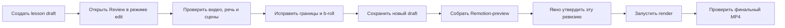

# Монтаж в браузере: Review Workbench

Эта инструкция описывает полный путь от черновика монтажного листа до готового MP4 через
локальное окно **«Проверка монтажа»**. Она актуальна для исходников AutoMontage-Agent v1.6.0.
Опубликованные версии находятся в [GitHub Releases](https://github.com/mcdenil-skills/AutoMontage-Agent/releases).
Если вы впервые запускаете монтаж, начните с короткой инструкции
[«Монтаж от видео до готового MP4»](MONTAGE-GUIDE.md), а сюда возвращайтесь за подробностями.

Review Workbench - не второй видеоредактор и не Remotion Studio. Это контрольный стол перед
рендером: здесь сверяют исходное видео, речь и сцены, двигают только границы соседних сцен,
добавляют b-roll и сохраняют новую черновую ревизию. Утверждение и рендер выполняются отдельно,
чтобы случайный клик в браузере не запустил финальную сборку.



## Что доступно в v1.6.0

- импорт фото AVIF/GIF/JPEG/PNG/WebP и видео MP4/MOV/M4V/WebM прямо из браузера;
- `cover`/`contain`, покадровый старт видео и режимы звука `mute`/`mix`/`replace`;
- один и тот же импортированный ролик можно использовать в нескольких b-roll-сценах;
- Undo/Redo, серверная проверка каждой правки и Save только в новую draft-ревизию;
- безопасная локальная сессия: реальные пути проекта и контрольные хеши не выдаются браузеру;
- повторная проверка b-roll при утверждении и перед рендером.
- поиск фото и видео через официальный Pexels API без передачи ключа в браузер;
- ручной выбор одного кандидата, локальный импорт, provenance и OCR-предупреждение;
- обязательный полный Remotion-preview выбранного B-roll перед общим approval.

## 1. Подготовить проект

Сначала проверь окружение:

```bash
automontage doctor
```

Для загрузки фото строка WebP должна быть `OK`. Полный импорт видео также требует ffmpeg с
`libx264`, `libvpx`, `libopus` и AAC. Если глобальная команда ещё не установлена, из корня
репозитория можно использовать `npm run doctor`.

Review открывает только уже созданную project-папку с lesson draft. В новой сессии попроси
агента собрать lesson-проект локально по подписке, без provider API, и сначала показать draft.
Агент создаст workspace, локально транскрибирует source и сам подготовит монтажный лист.

После этого появится папка вида
`projects/YYYY.MM.DD_tema-rolika/` и файлы
`brief/v01-draft.lesson.md` + `brief/v01-draft.lesson.json`. Рендер на этом шаге не запускается.
API-ключи не нужны: транскрипция, draft, preview, Review, approval, render и QA выполняются
локально с текущей подпиской Claude Code или Codex. OpenAI API используется только после
отдельной явной просьбы сгенерировать новое изображение.

Если нужно вырезать паузы или неудачные дубли, сделай это **до** следующего draft и до открытия
Review: `automontage master --project-dir <проект> --edit edit/vNN-source.json`. Команда создаёт
новую source/transcript-ревизию, но не переписывает монтажный лист. Поэтому после неё сначала
подготовь draft для активной source revision, и только затем открывай браузер.

Чтобы назначать фото или видео через окно, в draft должна быть хотя бы одна сцена типа `broll`.
Review не меняет тип сцены и не превращает обычную сцену в b-roll.

## 2. Открыть окно в браузере

Сначала полезно открыть безопасный просмотр без правок:

```bash
automontage review --project-dir projects/YYYY.MM.DD_tema-rolika
```

Когда монтажный лист проверен, перезапусти команду с правом редактирования:

```bash
automontage review --project-dir projects/YYYY.MM.DD_tema-rolika --edit
```

Из клона репозитория та же команда выглядит так:

```bash
npm run review -- --project-dir projects/YYYY.MM.DD_tema-rolika --edit
```

Обычный запуск сам открывает системный браузер. Если это нежелательно, добавь `--no-open`.
Команда напечатает путь к временному защищённому файлу с URL сессии. Открой URL только локально:
не отправляй его в чат и не публикуй, потому что ссылка даёт доступ к текущему предпросмотру.

Терминал с командой Review должен оставаться открытым. После окончания работы вернись в него и
нажми `Ctrl+C`. Во время импорта сначала дождись завершения или нажми **«Отменить загрузку»**.

## 3. Что находится в окне

| Область | Что показывает | Что с ней делать |
|---|---|---|
| Верхняя строка | режим **«Только просмотр»** или **«Редактирование»** | убедиться, что открыт нужный режим |
| Карточка проекта | статус draft, хронометраж, размер и FPS | сверить, что открыт правильный ролик |
| **ИСХОДНИК** | видео для правок речи и границ | слушать речь, искать точный таймкод и двигать границы |
| **СМОНТИРОВАННЫЙ ПРЕДПРОСМОТР** | настоящий Remotion-результат или «Предпросмотр ещё не собран» | проверять сцены, графику, шрифты, b-roll и музыку; сверять `ПОЛНЫЙ РОЛИК` или точный диапазон |
| **Диагностика** | ошибки и подсказки по кадрам/словам | исправить красные ошибки до Save |
| Дорожка **Видео** | весь исходник и waveform, если она построилась | видеть общую длину и позицию воспроизведения |
| Дорожка **Сцены** | сцены и их границы | кликнуть по сцене или перенести доступную границу |
| Дорожка **Речь** | слова транскрипта на таймлайне | кликнуть по слову и перейти к его таймкоду |
| Дорожка **Медиа** | доступные фото и видео проекта | проверить, что импортированный файл появился |
| Панель **Редактирование** | Undo, Redo, Save, импорт и b-roll | внести только разрешённые безопасные правки |

Клик по сцене или слову переводит **исходное** видео к соответствующему месту. Предпросмотр -
отдельный готовый файл и не управляет границами. Одна вертикальная
линия показывает текущую позицию сразу на всех дорожках.

Для длинного ролика не тяни нижний ползунок через все полторы минуты. Кликни по нужной сцене
или слову - исходный плеер и вертикальная линия сразу перейдут к этому таймкоду. Горизонтальная
прокрутка таймлайна нужна только чтобы рассмотреть соседние элементы; на узком экране дорожка
прокручивается внутри своей панели и не растягивает всю страницу. Смонтированный preview можно
собрать отдельным коротким диапазоном через `--from-sec` + `--to-sec` и быстро проверить только
изменённое место, а перед approval один раз собрать полный ролик.

После Save собери текущую draft-ревизию перед утверждением:

```bash
automontage preview --project-dir projects/YYYY.MM.DD_tema-rolika \
  --brief brief/vNN-draft.lesson.json
```

Для быстрой проверки части длинного ролика добавь оба флага, например
`--from-sec 31.5 --to-sec 57.5`. Команда использует настоящую композицию `ReelScenes`, тему,
шрифты и финальный порядок обработки голоса/музыки; отличается только половинным разрешением,
повышенным CRF и меткой «ЧЕРНОВИК». Успешный результат атомарно становится
`previews/current-preview.mp4`; при ошибке предыдущий файл остаётся целым. Затем заново открой
Review и смотри второй плеер.

Для короткой технической проверки результата без просмотра всего ролика выполни:

```bash
npm run qa:preview -- --project-dir projects/YYYY.MM.DD_tema-rolika
```

Команда сообщает, полный это ролик или фрагмент с точным диапазоном, проверяет файл целиком,
первый/последний кадр и отдельно оценивает голос и музыку под речью. Это именно QA-отчёт: он не
утверждает draft и не запускает final render.

## 4. Проверить монтаж до правок

1. Сверь название проекта, статус, формат, FPS и хронометраж вверху окна.
2. Проиграй исходное видео от начала до конца или хотя бы каждую смену сцены.
3. Кликни по нескольким сценам и словам: плеер должен переходить к правильному моменту.
4. Посмотри **Диагностику**. Подсказка не всегда означает ошибку, но красная ошибка тайминга
   блокирует Save.
5. Убедись, что текст и типы сцен соответствуют утверждаемому замыслу. Их нельзя исправить в
   Review: для смысловой правки нужно обновить монтажный лист вне браузера и открыть его заново.

## 5. Передвинуть границу соседних сцен

В режиме `--edit` между соседними сегментами дорожки **Сцены** появляются ручки границ.

- Мышью перетащи ручку к нужному слову или кадру. Метка **«слово»** или **«кадр»** показывает,
  к чему притянулась граница.
- Для точной правки сфокусируй ручку и нажимай `←`/`↓` или `→`/`↑`: один клик равен одному
  кадру.
- `Home` ставит ручку на первый допустимый кадр, `End` - на последний допустимый кадр.
- Перенос меняет конец левой и начало правой сцены. Все более поздние сцены остаются на месте.
- Кнопка **«Отменить»** убирает последнюю правку, **«Повторить»** возвращает её.

После каждого движения сервер перепроверяет весь набор текущих правок. Пока идёт сообщение
**«Проверяем изменения…»**, остальные элементы временно заблокированы.

## 6. Добавить фото или видео

1. В панели **Редактирование → Медиа проекта** нажми **«Добавить медиа»**.
2. Выбери один файл. Поддерживаются AVIF/GIF/JPEG/PNG/WebP и MP4/MOV/M4V/WebM.
3. Дождись двух фаз: загрузки и сообщения **«Проверяем и готовим предпросмотр…»**. Обработка
   большого видео может занять несколько минут и заметно загрузить процессор.
4. После сообщения **«Добавлено: имя-файла»** проверь карточку на дорожке **Медиа**.

Импорт не меняет ни одну сцену. Это специально: сначала файл попадает в библиотеку проекта,
а затем пользователь явно назначает его нужной b-roll-сцене.

Ограничения импорта:

- фото - до 25 MiB, до 12 000 пикселей по стороне и до 100 мегапикселей;
- видео - до 1 GiB, 30 минут, 4096 пикселей по стороне и 8 847 360 пикселей в кадре;
- импортируется по одному файлу; анимированный GIF/WebP в v1.3.0 использует только первый кадр;
- для старта нужно свободное место не меньше `4 × размер файла + 512 MiB`.

## 7. Назначить b-roll сцене

В блоке **B-roll** отображаются только сцены, которые уже имеют тип `broll`.

Файл можно подобрать прямо здесь. Для этого текущий агент при подготовке draft записывает
`brollIntent`: цель кадра, исходную фразу и поисковый запрос. До выбора файла сцена остаётся
видимой, а настоящий Remotion-preview показывает `[ B-ROLL ]`.

### Найти фото или видео Pexels

1. Получи бесплатный ключ на [Pexels API](https://www.pexels.com/api/). Сохрани его локально
   в `.env` в корне установленного проекта: `PEXELS_API_KEY=…`. Ключ нельзя отправлять в чат
   или коммитить. Перезапусти Review после изменения окружения.
2. В нужной сцене проверь цель кадра и фразу. Уточни исходный и английский запросы: именно
   английский запрос отправляется провайдеру. Автоматического платного перевода нет.
3. Выбери вкладку **«Видео»** или **«Фото»**, ориентацию, минимальное разрешение; для видео
   задай минимальную длительность не короче используемого отрезка.
4. Нажми **«Подобрать B-roll»**. Рассмотри карточки: автора, источник, лицензию, размер
   и длительность. Маленький плеер показывает короткую доступную preview-rendition; если её нет,
   остаётся постер. Полный файл ещё не скачан.
5. **«Не подходит»** убирает кандидат из текущей полки, **«Ещё варианты»** запрашивает
   следующую страницу. Старые candidate ID после нового поиска больше не действуют.
6. Нажми **«Выбрать»** у одного материала. Сервер скачает только его полный файл, проверит
   фактический формат и весь поток, нормализует его и добавит локальный asset в проект.
   Во время загрузки и локальной проверки строка состояния показывает прошедшие секунды;
   видео большого размера может обрабатываться несколько минут. Не нажимай **«Выбрать»**
   повторно: дождись сообщения **«Медиа добавлено»**. Выбор назначает asset сцене как
   обратимую draft-правку.
7. Проверь локальное медиа и настройки ниже. У видео безопасное начальное значение звука -
   **«Без звука»**. При необходимости смени кадрирование и начало используемого интервала.

Для API действуют [лимиты и правила Pexels](https://www.pexels.com/api/documentation/):
по умолчанию 200 запросов в час и 20 000 в месяц. Карточки сохраняют ссылки на Pexels и автора;
проверь [лицензию](https://www.pexels.com/license/) и
[правила атрибуции API](https://help.pexels.com/hc/en-us/articles/900005851903-How-should-I-give-credit-Can-I-use-your-logo).
Доступность и лимиты аккаунта определяет Pexels. При исчерпании лимита поиск покажет ошибку,
а ручной импорт и весь локальный монтаж продолжат работать.

Без ключа полка показывает инструкцию по настройке. Основной монтаж, Whisper, Review,
preview и render не требуют API-ключей. Read-only Review показывает сохранённый проект,
но не включает поиск или выбор. Ручной путь остаётся прежним:

1. Найди карточку **«Сцена N»**.
2. В списке **«Выберите медиа»** выбери загруженный файл.
3. Проверь, что в **«Проверенных изменениях»** появилась строка о замене медиа сцены.

Для изображения выбери положение:

- **«Заполнить кадр»** (`cover`) - заполняет весь экран, но может обрезать края;
- **«Вписать целиком»** (`contain`) - показывает всё изображение, но может оставить поля.

Для видео доступны дополнительные шаги:

1. В маленьком плеере найди нужный момент.
2. Нажми **«Начать с текущего места»**. Review округлит старт к кадровой сетке.
3. Проверь строку **«Используется: начало–конец»**. Весь интервал должен помещаться в видео.
4. Выбери `contain` или `cover`.
5. Выбери звук:
   - **«Без звука»** - остаётся исходный голос, звук b-roll выключен;
   - **«Тихо поверх голоса»** - звук b-roll идёт примерно на −18 dB под речью;
   - **«Вместо голоса»** - на время сцены основным становится звук b-roll.

У видео без аудиодорожки два последних режима заблокированы. Один файл можно назначить разным
сценам и для каждой отдельно выбрать старт, положение и звук. Зацикливания и автоматического
удержания последнего кадра нет: выбранный отрезок обязан полностью помещаться в файл.

### Проверить встроенный текст

После discovery-импорта локальный Tesseract проверяет изображение либо три кадра видео.
Review показывает распознанный текст и предупреждение. OCR может ошибаться или пропускать
логотипы: самостоятельно просматривай материал и предпочитай чистые stock-кадры, оставляя
текст ролика нативной графике Remotion.

Если надпись нужна намеренно, включи **«Разрешить встроенный текст»**. Разрешение относится
только к выбранному файлу и текущему результату проверки. Замена материала его очищает;
Undo возвращает прежний выбор вместе с разрешением. Без подтверждения предупреждение
блокирует approval, но позволяет Save и preview. Если Tesseract отсутствует или не смог
проверить материал, статус `unavailable` тоже требует просмотра и явного разрешения.
Для файла со статусом `clear` отдельного подтверждения не нужно.

## 8. Проверить и сохранить новую ревизию

Перед Save пройди короткий контроль:

1. В **«Проверенных изменениях»** перечислены только ожидаемые границы и b-roll.
2. В **Диагностике** нет красных ошибок.
3. Кнопка **«Сохранить»** активна, а импорт и серверная проверка завершены.
4. Проиграй изменённые места в исходном плеере и проверь строку используемого интервала видео.

Нажми **«Сохранить»**. Браузер покажет подтверждение с номером будущей ревизии и полным списком
изменений. После подтверждения Review создаст новую пару
`brief/vNN-draft.lesson.md` + `brief/vNN-draft.lesson.json` и переключит экран на неё.

**Save не собирает видео.** Он фиксирует новый монтажный лист. После Save нажми
**«Preview фрагмента»** для быстрой проверки выбранной сцены, затем **«Полный preview»**.
Готовый ролик появится в верхнем правом плеере **«СМОНТИРОВАННЫЙ ПРЕДПРОСМОТР»**.

Исходный draft, approved-файлы и старые рендеры не перезаписываются. Undo/Redo живут только в
памяти браузера и после успешного Save очищаются.

## 9. Утвердить именно сохранённую ревизию

После Save собери preview изменённого фрагмента, если хочешь быстро проверить вставку.
Затем обязательно собери **полный preview** сохранённой ревизии и посмотри смонтированный
ролик во втором плеере. Кандидат, локальный asset-плеер и preview фрагмента не заменяют этот шаг.

В edit-сессии действия preview запускают настоящий `automontage preview`. Когда полный
preview соответствует текущему draft, отметь **«Я посмотрел полный preview»** и нажми
**«Утвердить»**. Поиск, выбор, Save и окончание preview сами approval не выполняют.
Незаполненная B-roll-сцена, неподтверждённое предупреждение, устаревший или заменённый preview
не пропускают утверждение. Любая новая draft-ревизия требует своего полного preview.

Через терминал тот же явный шаг выполняется для сохранённого `vNN-draft.lesson.json`:

```bash
node scripts/project/approve-brief.js \
  projects/YYYY.MM.DD_tema-rolika \
  brief/vNN-draft.lesson.json --confirm-preview-viewed
```

Появится отдельная approved-копия. Не утверждай старый draft по привычке: номер `NN` должен
совпасть с последней проверенной ревизией из окна.

## 10. Отрендерить и проверить MP4

```bash
node scripts/build.js \
  projects/YYYY.MM.DD_tema-rolika/input/source.mp4 \
  --template lesson \
  --project-dir projects/YYYY.MM.DD_tema-rolika \
  --brief brief/vNN-approved.lesson.json \
  --version-label browser-review
```

Успешная сборка создаёт версию в `renders/vNN-browser-review/`, а принятый результат - в
`final/<slug>.mp4`. Проверь начало и конец, каждую изменённую границу, все b-roll-врезки,
синхрон голоса и режимы звука. Полный технический чек-лист находится в [TESTING.md](../TESTING.md).

## Если окно сообщает об ошибке

| Сообщение или симптом | Что означает | Что делать |
|---|---|---|
| Фото не обрабатывается | ffmpeg не умеет WebP | запустить `automontage doctor` и подключить полную сборку ffmpeg |
| Поиск просит `PEXELS_API_KEY` | ключ не настроен локально | получить ключ Pexels, сохранить в `.env` и перезапустить Review; значение не отправлять в чат |
| Кандидат недоступен после повторного поиска | старое поколение или истёк срок ID | выбрать из новой полки |
| Счётчик проверки идёт, а кнопки выключены | выбранный полный файл скачивается, декодируется, нормализуется и проходит OCR | дождаться сообщения **«Медиа добавлено»**; повторный клик создаст лишний локальный asset |
| Утверждение заблокировано | нет материала, разрешения на текст или текущего полного preview | заполнить сцену, просмотреть предупреждение, Save и собрать полный preview |
| Файл добавлен, но сцена не изменилась | импорт не назначает медиа автоматически | выбрать файл в карточке нужной **«Сцены N»** |
| `mix` и `replace` недоступны | в видео нет аудиодорожки | оставить **«Без звука»** или выбрать другое видео |
| Старт видео не принимается | выбранный отрезок выходит за конец видеопотока | выбрать более ранний старт, укоротить сцену или взять длинный клип |
| `replace` не принимается | аудиопоток короче выбранного отрезка | выбрать другой старт/клип или режим `mute`/`mix` |
| Ошибка `507` | не хватает места или превышен лимит результата | освободить место либо выбрать меньший файл и повторить импорт |
| **«Файл добавлен, но экран не обновился»** | импорт уже сохранён, но список не перечитался | перезагрузить страницу; повторно загружать файл не нужно |
| **«Другой файл ещё обрабатывается»** | проект занят другим импортом | дождаться окончания и нажать **«Повторить проверку»** |
| **«Конфликт ревизий»** | проект изменился в другой сессии | дождаться свежего состояния и нажать **«Отбросить устаревшие правки и продолжить»** |
| Save неактивен | нет проверенных изменений, идёт операция или есть ошибка тайминга | дождаться проверки и исправить сообщение в Диагностике |
| Waveform отсутствует | её best-effort генерация не удалась | продолжать работу: видео, сцены, речь и Save остаются доступны |

## Что нельзя сделать в этом окне

Review Workbench не меняет текст, тип сцены, эффекты, keyframes или masks, не делает глобальный
ripple, не удаляет импортированные файлы и не запускает final render. Preview и approval
доступны только как отдельные явные действия после сохранения.
Если нужен новый смысл, другой тип сцены или иной дизайн, сначала обнови монтажный лист, затем
снова открой Review. Байты импортированного актива неизменяемы: для замены загрузи новый файл и
назначь его сцене.

## Контрольный список готовности

- открыт правильный project и режим **«Редактирование»**;
- исходник, сцены и слова совпадают по времени;
- Диагностика не показывает красных ошибок;
- каждое новое медиа явно назначено нужной b-roll-сцене;
- интервалы видео и режимы звука проверены;
- Save создал новую `vNN-draft` пару;
- утверждён именно этот `vNN-draft`;
- render использует соответствующий `vNN-approved`;
- финальный MP4 просмотрен и проверен со звуком.

## Пакетное согласование

Review Workbench открывает один project workspace за раз. Для нескольких Reels агент собирает
над ним общий локальный индекс и показывает пользователю одну таблицу со всеми draft-preview,
обложками и QA-статусами. Каждый выход по-прежнему имеет собственные `project.json`, brief и
approval history; общего mutable manifest для всего пакета нет.

Пользователь может отклонить одну версию, не возвращая остальные в draft. Исключение: изменение
общего тела hook-family: тогда повторное согласование и проверку идентичности проходят все её
варианты. Полные рендеры в одном checkout выполняются последовательно. Подробный порядок – в
[пакетном workflow](BATCH-REELS-WORKFLOW.md).


## Audio-only MotionReel

Review читает сохранённый `briefs[].kind`; расширение имени файла не переключает композицию.
Для `motion-reel` он показывает озвучку, waveform/transcript, типы сцен и их текст, а также текущий
MotionReel-preview. Камера не требуется. Media references, SHA-256 и approval/provider settings
не передаются в browser state. Изменённая озвучка делает preview устаревшим.

Motion открывается в режиме просмотра даже при `--edit`: lesson boundary/b-roll команды не
применяются к другому формату brief. Агент правит motion JSON по схеме, запускает `automontage
preview`, а после явного просмотра утверждает его через `approve-brief.js --confirm-preview-viewed`.
