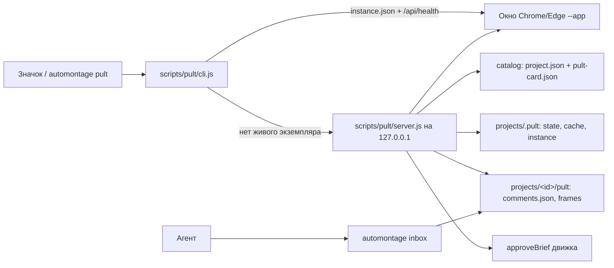

# Пульт роликов — план реализации

> **For agentic workers:** REQUIRED SUB-SKILL: Use superpowers:subagent-driven-development (recommended) or superpowers:executing-plans to implement this plan task-by-task. Steps use checkbox (`- [ ]`) syntax for tracking.

**Цель:** русский локальный «Пульт роликов» (`automontage pult`) со всеми роликами из
`projects/`: статусы, текущее видео, правки на таймкоде, утверждение полного preview,
архив без удаления, значок запуска для macOS/Windows и `automontage inbox` для агента.

**Архитектура:** отдельный маленький Node-сервер на `127.0.0.1` (модель защиты как у Review:
токен во фрагменте URL, `Bearer`, проверка `Host`/`Origin`, CSP) отдаёт статическую страницу
`pult/` и JSON. Каталог читает `project.json` и необязательный `pult-card.json`; статус
вычисляет чистая функция. Утверждение идёт через существующую `approveBrief`, правки хранятся
в `projects/<id>/pult/comments.json`. Сервер Review не меняется.

**Стек:** Node.js 20+ (CommonJS), `node:test`, `ajv`, Playwright (`playwright/test`),
ffmpeg/ffprobe через `scripts/process.js`. Новых npm-зависимостей нет.

**Спецификация:** [docs/superpowers/specs/2026-09-24-pult-rolikov-design.md](../specs/2026-09-24-pult-rolikov-design.md)

---

## Правила выполнения

- Работать в ветке `feat/pult-rolikov` от `main`. Push, тег и релиз — только по явной просьбе.
- Это задача движка, а не client-delivery: меняются `scripts/`, `schema/`, `tests/`, документы.
- Коммит после каждой задачи. Pre-commit hook запускает privacy-check и Gitleaks — не обходить
  через `--no-verify`. В каждый коммит добавлять строку
  `Co-Authored-By: Claude Opus 5.5 (1M context) <noreply@anthropic.com>`.
- В тестах и документах не писать настоящие домашние пути (`/Users/…`, `/home/…`, `C:\Users…`):
  privacy-check заблокирует коммит. Домашняя папка в тестах — `/tmp/home-u`.
- Браузер никогда не получает абсолютных путей, путей brief и SHA-256 (инвариант Review из
  `ARCHITECTURE.md`). Видео адресуются ключом варианта, утверждение — непрозрачным билетом.
- Пульт ничего не удаляет и не перемещает в папках роликов. Пишет только `projects/.pult/` и
  `projects/<id>/pult/`.
- Сообщения пользователю — на русском.

## Карта файлов

| Файл | Ответственность |
|---|---|
| `schema/pult-card.schema.json` | Схема необязательной карточки папки: группа, подпись варианта, legacy-варианты |
| `scripts/pult/card-file.js` | Чтение и проверка `pult-card.json` |
| `scripts/pult/status.js` | Чистая функция статуса варианта и русские формы «правка/правки/правок» |
| `scripts/pult/files.js` | Атомарная запись JSON, безопасные папки, SHA-256 файла |
| `scripts/pult/comments.js` | Правки на таймкоде: добавить, удалить, принять, посчитать |
| `scripts/pult/state.js` | Архив карточек в `projects/.pult/state.json` |
| `scripts/pult/media-cache.js` | ffprobe-метаданные, обложки и кадры с кэшем в `projects/.pult/cache/` |
| `scripts/pult/catalog.js` | Сканирование `projects/`: стандартные, legacy, без паспорта, битые |
| `scripts/pult/cards.js` | Группировка вариантов в карточки, разделы и сортировка |
| `scripts/pult/http.js` | Заголовки безопасности, токены, тело JSON, статика, Range-отдача файлов |
| `scripts/pult/launcher.js` | Окно Chrome/Edge `--app`, «Показать в папке», запуск без shell |
| `scripts/pult/server.js` | HTTP-сервер пульта и его маршруты |
| `scripts/pult/instance.js` | `projects/.pult/instance.json`, health-проверка живого экземпляра |
| `scripts/pult/shortcut.js` | Значок: `.app` для macOS, `.lnk` для Windows |
| `scripts/pult/inbox.js` | `automontage inbox`: входящие агента и `--accept` |
| `scripts/pult/cli.js` | `automontage pult`: открыть, `--serve`, `--install-shortcut` |
| `scripts/cli.js` | Маршрутизация `pult` и `inbox`, строки справки |
| `pult/index.html`, `pult/app.js`, `pult/styles.css` | Браузерный интерфейс |
| `tests/helpers/pult-projects.js` | Фикстуры: настоящие проекты через API движка |
| `tests/pult-*.test.js`, `tests/pult-ui.spec.js` | Тесты |
| `playwright.config.js`, `package.json` | Подключение браузерного теста пульта |
| `AGENTS.md`, `skills/*/SKILL.md` | Правила агента: inbox, паспорт, `pult-card.json` |
| `docs/PULT.md`, `README.md`, `ARCHITECTURE.md`, `TESTING.md`, `DECISIONS.md`, `CHANGELOG.md` | Документация |

---

### Task 0: Ветка и трекер

**Files:**
- Create: `_progress.md` (локальный, в `.gitignore`)

- [ ] **Step 1: Создать ветку**

```bash
git checkout main && git pull --ff-only && git checkout -b feat/pult-rolikov
```

- [ ] **Step 2: Создать `_progress.md`**

```markdown
# Пульт роликов — прогресс

План: docs/superpowers/plans/2026-09-24-pult-rolikov.md
Ветка: feat/pult-rolikov

- [ ] Task 1–7: данные и статусы
- [ ] Task 8–14: сервер, окно, значок, inbox, CLI
- [ ] Task 15: интерфейс
- [ ] Task 16–17: правила агента и документация
- [ ] Task 18: полная проверка
```

- [ ] **Step 3: Убедиться, что базовые тесты зелёные**

Run: `npm test`
Expected: все тесты PASS (это исходное состояние `main`).

---

### Task 1: Фикстуры, схема и чтение `pult-card.json`

**Files:**
- Create: `tests/helpers/pult-projects.js`
- Create: `schema/pult-card.schema.json`
- Create: `scripts/pult/card-file.js`
- Test: `tests/pult-card-file.test.js`

- [ ] **Step 1: Создать фикстуры проектов**

`tests/helpers/pult-projects.js` строит настоящие проекты через API движка, чтобы статусы
проверялись на реальных манифестах, а не на выдуманных JSON.

```js
const fs = require('node:fs');
const os = require('node:os');
const path = require('node:path');
const { createHash } = require('node:crypto');

const {
  approveBrief,
  createOrOpenProject,
  nextRenderPaths,
  publishBriefRevision,
  publishFinal,
  recordRender,
} = require('../../scripts/project/workspace');
const { planPreview, publishCurrentPreview } = require('../../scripts/project/preview-workspace');

const ROOT = path.resolve(__dirname, '../..');
const sha256 = (value) => createHash('sha256').update(value).digest('hex');

// registrar — объект с методом after(fn): node:test `t` или обёртка в Playwright.
function makePultRoot(registrar) {
  const base = fs.mkdtempSync(path.join(os.tmpdir(), 'automontage-pult-'));
  registrar.after(() => fs.rmSync(base, { recursive: true, force: true }));
  const projectsDir = path.join(base, 'projects');
  fs.mkdirSync(projectsDir);
  return { base, projectsDir };
}

function reopen(projectDir) {
  return createOrOpenProject({ projectDir });
}

function addDraftProject(projectsDir, {
  folder,
  name = folder,
  preview = true,
  previewKind = 'full',
  approve = false,
  final = false,
  card = null,
} = {}) {
  const sourcePath = path.join(path.dirname(projectsDir), `${folder}-source.mp4`);
  fs.writeFileSync(sourcePath, `source ${folder}`);
  let workspace = createOrOpenProject({
    projectDir: path.join(projectsDir, folder),
    name,
    sourcePath,
    now: new Date('2026-09-20T10:00:00.000Z'),
  });
  const brief = {
    version: 1,
    status: 'draft',
    source: workspace.sourcePath,
    theme: 'lesson-neutral',
    title: name,
    output: { aspect: 'horizontal', width: 320, height: 180, fps: 25, durationInFrames: 100 },
    corrections: [],
    scenes: [{ scene: 'fullscreen', start: 0, end: 4, caption: 'ПУЛЬТ' }],
  };
  const draft = publishBriefRevision(workspace, { brief, markdown: `# ${name}` });
  workspace = reopen(workspace.dir);
  let previewResult = null;
  if (preview) {
    const plan = planPreview(workspace, {
      briefPath: draft.jsonPath,
      briefSha256: sha256(fs.readFileSync(draft.jsonPath)),
      range: { kind: previewKind, fromSec: 0, toSec: previewKind === 'full' ? 4 : 2 },
    });
    const staged = path.join(workspace.dir, 'previews', 'stage.mp4');
    fs.writeFileSync(staged, `preview ${folder}`);
    previewResult = publishCurrentPreview(workspace, plan, staged, {
      width: 160,
      height: 90,
      fps: 25,
      generatedAt: '2026-09-20T10:05:00.000Z',
    });
    workspace = reopen(workspace.dir);
  }
  let approved = null;
  if (approve) {
    approved = approveBrief(workspace, draft.jsonPath, { confirmPreviewViewed: true });
    workspace = reopen(workspace.dir);
  }
  if (final) {
    const render = nextRenderPaths(workspace, 'final');
    fs.writeFileSync(render.finalPath, `final ${folder}`);
    recordRender(workspace, {
      version: render.version,
      label: render.label,
      dir: render.dir,
      briefPath: approved ? approved.jsonPath : null,
      status: 'complete',
    });
    workspace = reopen(workspace.dir);
    publishFinal(workspace, render.finalPath);
    workspace = reopen(workspace.dir);
  }
  if (card) {
    fs.writeFileSync(path.join(workspace.dir, 'pult-card.json'), `${JSON.stringify(card, null, 2)}\n`);
  }
  return { projectDir: workspace.dir, workspace, draft, preview: previewResult, approved };
}

function addLegacyFolder(projectsDir, folder, { card = null, files = {} } = {}) {
  const dir = path.join(projectsDir, folder);
  fs.mkdirSync(dir, { recursive: true });
  for (const [relative, content] of Object.entries(files)) {
    const target = path.join(dir, ...relative.split('/'));
    fs.mkdirSync(path.dirname(target), { recursive: true });
    fs.writeFileSync(target, content);
  }
  if (card) fs.writeFileSync(path.join(dir, 'pult-card.json'), `${JSON.stringify(card, null, 2)}\n`);
  return dir;
}

module.exports = { ROOT, addDraftProject, addLegacyFolder, makePultRoot, sha256 };
```

- [ ] **Step 2: Написать падающий тест карточки**

`tests/pult-card-file.test.js`:

```js
const test = require('node:test');
const assert = require('node:assert/strict');
const fs = require('node:fs');
const path = require('node:path');

const { readPultCard } = require('../scripts/pult/card-file');
const { addLegacyFolder, makePultRoot } = require('./helpers/pult-projects');

test('missing pult-card.json is not an error', (t) => {
  const { projectsDir } = makePultRoot(t);
  const dir = addLegacyFolder(projectsDir, 'plain');
  assert.deepEqual(readPultCard(dir), { ok: true, card: null });
});

test('valid group and legacy variants are accepted', (t) => {
  const { projectsDir } = makePultRoot(t);
  const card = {
    version: 1,
    group: { id: 'series-agents', title: 'Серия про агентов' },
    legacy: {
      status: 'ready',
      variants: [{ label: 'Ролик 1', video: 'final/one.mp4', final: true }],
    },
  };
  const dir = addLegacyFolder(projectsDir, 'series', { card });
  assert.deepEqual(readPultCard(dir), { ok: true, card });
});

test('unknown fields, bad JSON and escaping paths are rejected', (t) => {
  const { projectsDir } = makePultRoot(t);
  const extra = addLegacyFolder(projectsDir, 'extra', { card: { version: 1, color: 'red' } });
  assert.equal(readPultCard(extra).ok, false);

  const broken = addLegacyFolder(projectsDir, 'broken');
  fs.writeFileSync(path.join(broken, 'pult-card.json'), '{ not json');
  assert.equal(readPultCard(broken).ok, false);

  const payloads = ['../other/final.mp4', '/etc/passwd', 'final/../../x.mp4', 'C:\\x.mp4'];
  payloads.forEach((video, index) => {
    const dir = addLegacyFolder(projectsDir, `escape-${index}`, {
      card: { version: 1, legacy: { status: 'ready', variants: [{ label: 'X', video }] } },
    });
    assert.equal(readPultCard(dir).ok, false, video);
  });
});

test('symlinked pult-card.json is rejected', { skip: process.platform === 'win32' }, (t) => {
  const { base, projectsDir } = makePultRoot(t);
  const outside = path.join(base, 'outside.json');
  fs.writeFileSync(outside, JSON.stringify({ version: 1 }));
  const dir = addLegacyFolder(projectsDir, 'linked');
  fs.symlinkSync(outside, path.join(dir, 'pult-card.json'));
  assert.equal(readPultCard(dir).ok, false);
});
```

- [ ] **Step 3: Запустить и увидеть падение**

Run: `node --test tests/pult-card-file.test.js`
Expected: FAIL — `Cannot find module '../scripts/pult/card-file'`.

- [ ] **Step 4: Создать схему**

`schema/pult-card.schema.json`:

```json
{
  "$schema": "http://json-schema.org/draft-07/schema#",
  "$id": "https://automontage.local/schema/pult-card.schema.json",
  "title": "AutoMontage Pult Card",
  "type": "object",
  "additionalProperties": false,
  "required": ["version"],
  "properties": {
    "version": { "const": 1 },
    "title": { "$ref": "#/definitions/text" },
    "group": {
      "type": "object",
      "additionalProperties": false,
      "required": ["id", "title"],
      "properties": {
        "id": { "type": "string", "pattern": "^[a-z0-9]+(?:-[a-z0-9]+)*$", "maxLength": 80 },
        "title": { "$ref": "#/definitions/text" }
      }
    },
    "variantLabel": { "$ref": "#/definitions/text" },
    "legacy": {
      "type": "object",
      "additionalProperties": false,
      "required": ["status", "variants"],
      "properties": {
        "status": { "enum": ["working", "waiting", "ready"] },
        "nextStep": { "$ref": "#/definitions/text" },
        "variants": {
          "type": "array",
          "minItems": 1,
          "maxItems": 100,
          "items": {
            "type": "object",
            "additionalProperties": false,
            "required": ["label", "video"],
            "properties": {
              "label": { "$ref": "#/definitions/text" },
              "video": { "type": "string", "minLength": 1, "maxLength": 400 },
              "final": { "type": "boolean" }
            }
          }
        }
      }
    }
  },
  "definitions": {
    "text": {
      "type": "string",
      "minLength": 1,
      "maxLength": 200,
      "pattern": "^(?=.*\\S)[^\\u0000-\\u001F\\u007F]+$"
    }
  }
}
```

- [ ] **Step 5: Реализовать чтение карточки**

`scripts/pult/card-file.js`:

```js
const fs = require('node:fs');
const Ajv = require('ajv');

const schema = require('../../schema/pult-card.schema.json');
const { resolveProjectPath } = require('../project/workspace');

const CARD_FILE = 'pult-card.json';
const validateCard = new Ajv({ allErrors: true }).compile(schema);

// Карточка необязательна. Любая ошибка возвращается как ok:false, чтобы каталог
// показал папку в разделе «Не читается», а не упал целиком.
function readPultCard(projectDir) {
  let cardPath;
  try {
    cardPath = resolveProjectPath(projectDir, CARD_FILE, {
      label: CARD_FILE,
      mustExist: false,
      type: 'file',
    });
  } catch (_) {
    return { ok: false, error: 'pult-card.json недоступен' };
  }
  let text;
  try {
    text = fs.readFileSync(cardPath, 'utf8');
  } catch (error) {
    if (error && error.code === 'ENOENT') return { ok: true, card: null };
    return { ok: false, error: 'pult-card.json не читается' };
  }
  let card;
  try {
    card = JSON.parse(text);
  } catch (_) {
    return { ok: false, error: 'pult-card.json: неверный JSON' };
  }
  if (!validateCard(card)) return { ok: false, error: 'pult-card.json не соответствует схеме' };
  for (const variant of card.legacy ? card.legacy.variants : []) {
    try {
      resolveProjectPath(projectDir, variant.video, {
        label: 'pult-card video',
        mustExist: false,
        type: 'file',
      });
    } catch (_) {
      return { ok: false, error: 'pult-card.json: путь видео выходит за папку ролика' };
    }
  }
  return { ok: true, card };
}

module.exports = { CARD_FILE, readPultCard };
```

- [ ] **Step 6: Запустить тест**

Run: `node --test tests/pult-card-file.test.js`
Expected: PASS, 4 теста. Если падает тест symlink — проверить, что `resolveProjectPath`
отклоняет симлинк в последнем сегменте; при необходимости добавить `fs.lstatSync(cardPath)`
с отказом при `isSymbolicLink()` перед чтением.

- [ ] **Step 7: Commit**

```bash
git add tests/helpers/pult-projects.js schema/pult-card.schema.json scripts/pult/card-file.js tests/pult-card-file.test.js
git commit -m "feat: add pult card schema and reader"
```

---

### Task 2: Статус варианта

**Files:**
- Create: `scripts/pult/status.js`
- Test: `tests/pult-status.test.js`

- [ ] **Step 1: Написать падающий тест**

```js
const test = require('node:test');
const assert = require('node:assert/strict');

const { deriveVariantStatus, pluralEdits } = require('../scripts/pult/status');

const BRIEF = 'brief/v02-draft.lesson.json';
const APPROVED = 'brief/v03-approved.lesson.json';
const DRAFT_SHA = 'a'.repeat(64);
const PREVIEW_SHA = 'b'.repeat(64);

function manifest(overrides = {}) {
  return {
    currentBrief: BRIEF,
    currentPreview: {
      filePath: 'previews/v02-draft-full.mp4',
      briefPath: BRIEF,
      kind: 'full',
      sha256: PREVIEW_SHA,
      briefSha256: DRAFT_SHA,
    },
    renders: [],
    latestRender: null,
    final: 'final/clip.mp4',
    ...overrides,
  };
}

function derive(overrides = {}, input = {}) {
  return deriveVariantStatus({
    manifest: manifest(overrides),
    currentBriefStatus: 'draft',
    currentBriefSha256: DRAFT_SHA,
    finalExists: false,
    pendingComments: 0,
    ...input,
  });
}

test('fresh full preview of the current draft waits for the author', () => {
  const result = derive();
  assert.equal(result.status, 'waiting');
  assert.equal(result.nextStep, 'Посмотрите preview и утвердите');
  assert.deepEqual(result.video, { kind: 'preview', path: 'previews/v02-draft-full.mp4', sha256: PREVIEW_SHA });
  assert.equal(result.approvable, true);
  assert.equal(result.needsFinal, false);
  assert.equal(result.briefPath, BRIEF);
  assert.equal(result.previewSha256, PREVIEW_SHA);
});

test('stale, excerpt, foreign or missing preview keeps the agent working', () => {
  const cases = [
    ['changed brief bytes', {}, { currentBriefSha256: 'c'.repeat(64) }],
    ['excerpt', { currentPreview: { ...manifest().currentPreview, kind: 'excerpt' } }, {}],
    ['other brief', { currentPreview: { ...manifest().currentPreview, briefPath: 'brief/v01-draft.lesson.json' } }, {}],
    ['no preview', { currentPreview: null }, {}],
  ];
  for (const [label, overrides, input] of cases) {
    const result = derive(overrides, input);
    assert.equal(result.status, 'working', label);
    assert.equal(result.nextStep, 'Агент готовит preview', label);
    assert.equal(result.approvable, false, label);
  }
  assert.equal(derive({}, { currentBriefSha256: 'c'.repeat(64) }).video.kind, 'stale-preview');
  assert.equal(derive({ currentPreview: null }).video, null);
});

test('no brief yet means the agent prepares a draft', () => {
  const result = derive(
    { currentBrief: null, currentPreview: null },
    { currentBriefStatus: null, currentBriefSha256: null },
  );
  assert.equal(result.status, 'working');
  assert.equal(result.nextStep, 'Агент готовит черновик');
});

test('approved brief without its final waits for the agent render', () => {
  const result = derive({ currentBrief: APPROVED }, { currentBriefStatus: 'approved' });
  assert.equal(result.status, 'working');
  assert.equal(result.nextStep, 'Утверждено — агент собирает финал');
  assert.equal(result.approvable, false);
  assert.equal(result.needsFinal, true);
  assert.equal(result.video.kind, 'preview');
});

test('complete render of the approved brief with an existing final is ready', () => {
  const result = derive({
    currentBrief: APPROVED,
    renders: [{ version: 1, label: 'final', dir: 'renders/v01-final', briefPath: APPROVED, status: 'complete' }],
    latestRender: 'renders/v01-final',
  }, { currentBriefStatus: 'approved', finalExists: true });
  assert.equal(result.status, 'ready');
  assert.equal(result.nextStep, 'Готов — можно забирать');
  assert.equal(result.needsFinal, false);
  assert.deepEqual(result.video, { kind: 'final', path: 'final/clip.mp4', sha256: null });
});

test('final of an older brief is not ready for the new approval', () => {
  const result = derive({
    currentBrief: APPROVED,
    renders: [{ version: 1, label: 'old', dir: 'renders/v01-old', briefPath: 'brief/v01-approved.lesson.json', status: 'complete' }],
    latestRender: 'renders/v01-old',
  }, { currentBriefStatus: 'approved', finalExists: true });
  assert.equal(result.status, 'working');
  assert.equal(result.needsFinal, true);
  assert.equal(result.video.kind, 'final');
});

test('scenario-only projects with a complete render are ready', () => {
  const result = derive({
    currentBrief: null,
    currentPreview: null,
    renders: [{ version: 1, label: 'smoke', dir: 'renders/v01-smoke', briefPath: null, status: 'complete' }],
    latestRender: 'renders/v01-smoke',
  }, { currentBriefStatus: null, currentBriefSha256: null, finalExists: true });
  assert.equal(result.status, 'ready');
});

test('new comments hand the video back to the agent', () => {
  const result = derive({}, { pendingComments: 3 });
  assert.equal(result.status, 'working');
  assert.equal(result.nextStep, 'Ждёт агента: 3 правки');
  assert.equal(result.approvable, false);
  assert.equal(result.video.kind, 'preview');
});

test('russian plural forms for edits', () => {
  assert.deepEqual(
    [1, 2, 5, 11, 12, 21, 22, 25].map(pluralEdits),
    ['1 правка', '2 правки', '5 правок', '11 правок', '12 правок', '21 правка', '22 правки', '25 правок'],
  );
});
```

- [ ] **Step 2: Запустить и увидеть падение**

Run: `node --test tests/pult-status.test.js`
Expected: FAIL — модуль не найден.

- [ ] **Step 3: Реализовать**

`scripts/pult/status.js`:

```js
const STATUS_ORDER = Object.freeze({ waiting: 0, working: 1, ready: 2 });

function pluralEdits(count) {
  const mod10 = count % 10;
  const mod100 = count % 100;
  if (mod10 === 1 && mod100 !== 11) return `${count} правка`;
  if (mod10 >= 2 && mod10 <= 4 && (mod100 < 12 || mod100 > 14)) return `${count} правки`;
  return `${count} правок`;
}

// Чистая функция: статус выводится только из явных данных движка (project.json,
// хеш текущего brief, наличие файла финала, число новых правок), без угадывания по MP4.
function deriveVariantStatus({
  manifest,
  currentBriefStatus,
  currentBriefSha256,
  finalExists,
  pendingComments = 0,
}) {
  const preview = manifest.currentPreview || null;
  const latest = manifest.latestRender
    ? manifest.renders.find((render) => render.dir === manifest.latestRender) || null
    : null;
  const renderMatchesBrief = Boolean(latest && latest.status === 'complete' && (
    manifest.currentBrief === null
    || (currentBriefStatus === 'approved' && latest.briefPath === manifest.currentBrief)
  ));
  const finalIsCurrent = Boolean(finalExists && renderMatchesBrief);
  const previewIsCurrent = Boolean(preview
    && preview.kind === 'full'
    && preview.briefPath === manifest.currentBrief
    && currentBriefSha256
    && preview.briefSha256 === currentBriefSha256);
  const previewVideo = preview ? {
    kind: previewIsCurrent || currentBriefStatus === 'approved' ? 'preview' : 'stale-preview',
    path: preview.filePath,
    sha256: preview.sha256 || null,
  } : null;
  const finalVideo = finalExists ? { kind: 'final', path: manifest.final, sha256: null } : null;

  let status;
  let nextStep;
  if (pendingComments > 0) {
    status = 'working';
    nextStep = `Ждёт агента: ${pluralEdits(pendingComments)}`;
  } else if (finalIsCurrent) {
    status = 'ready';
    nextStep = 'Готов — можно забирать';
  } else if (currentBriefStatus === 'approved') {
    status = 'working';
    nextStep = 'Утверждено — агент собирает финал';
  } else if (currentBriefStatus === 'draft' && previewIsCurrent) {
    status = 'waiting';
    nextStep = 'Посмотрите preview и утвердите';
  } else if (currentBriefStatus === 'draft') {
    status = 'working';
    nextStep = 'Агент готовит preview';
  } else {
    status = 'working';
    nextStep = 'Агент готовит черновик';
  }

  const showPreview = status === 'waiting' || (pendingComments > 0 && previewIsCurrent);
  return {
    status,
    nextStep,
    video: showPreview ? previewVideo : (finalVideo || previewVideo),
    approvable: status === 'waiting',
    needsFinal: currentBriefStatus === 'approved' && !finalIsCurrent,
    briefPath: manifest.currentBrief,
    previewSha256: preview ? preview.sha256 || null : null,
  };
}

module.exports = { STATUS_ORDER, deriveVariantStatus, pluralEdits };
```

- [ ] **Step 4: Запустить тест**

Run: `node --test tests/pult-status.test.js`
Expected: PASS, 9 тестов.

- [ ] **Step 5: Commit**

```bash
git add scripts/pult/status.js tests/pult-status.test.js
git commit -m "feat: derive pult video status from the project manifest"
```

---

### Task 3: Файловые помощники и правки на таймкоде

**Files:**
- Create: `scripts/pult/files.js`
- Create: `scripts/pult/comments.js`
- Test: `tests/pult-comments.test.js`

- [ ] **Step 1: Написать падающий тест**

```js
const test = require('node:test');
const assert = require('node:assert/strict');
const fs = require('node:fs');
const path = require('node:path');

const {
  acceptComment,
  addComment,
  countNewComments,
  deleteComment,
  readComments,
} = require('../scripts/pult/comments');
const { addLegacyFolder, makePultRoot } = require('./helpers/pult-projects');

const VIDEO = { kind: 'preview', path: 'previews/v01-draft-full.mp4', sha256: 'b'.repeat(64) };

function project(t) {
  const { projectsDir } = makePultRoot(t);
  return addLegacyFolder(projectsDir, 'clip', { files: { 'previews/v01-draft-full.mp4': 'video' } });
}

test('comments are stored with time, text and video identity', (t) => {
  const dir = project(t);
  const frames = [];
  const comment = addComment(dir, { timeSec: 14.24, text: '  Текст залезает на лицо  ', video: VIDEO }, {
    now: () => new Date('2026-09-24T12:00:00.000Z'),
    id: () => 'c-0001',
    captureFrame: (videoPath, timeSec, outPath) => {
      frames.push({ videoPath, timeSec, outPath });
      fs.writeFileSync(outPath, 'jpg');
      return true;
    },
  });
  assert.deepEqual(comment, {
    id: 'c-0001',
    createdAt: '2026-09-24T12:00:00.000Z',
    timeSec: 14.24,
    text: 'Текст залезает на лицо',
    video: VIDEO,
    frame: 'pult/frames/c-0001.jpg',
    status: 'new',
  });
  assert.equal(frames[0].videoPath, path.join(dir, 'previews', 'v01-draft-full.mp4'));
  assert.equal(frames[0].timeSec, 14.24);
  assert.deepEqual(readComments(dir), [comment]);
  assert.equal(countNewComments(dir), 1);
  assert.equal(countNewComments(dir, 'previews/v01-draft-full.mp4'), 1);
  assert.equal(countNewComments(dir, 'final/other.mp4'), 0);
});

test('frame capture failure keeps the comment without a frame', (t) => {
  const dir = project(t);
  const comment = addComment(dir, { timeSec: 1, text: 'Тише музыку', video: VIDEO }, { captureFrame: () => false });
  assert.equal(comment.frame, null);
  assert.match(comment.id, /^c-[a-f0-9]{8}$/);
});

test('invalid comments are rejected without writing anything', (t) => {
  const dir = project(t);
  const inputs = [
    { timeSec: -1, text: 'x', video: VIDEO },
    { timeSec: Number.NaN, text: 'x', video: VIDEO },
    { timeSec: 1, text: '   ', video: VIDEO },
    { timeSec: 1, text: 'x'.repeat(1001), video: VIDEO },
    { timeSec: 1, text: 'x', video: { ...VIDEO, path: '../escape.mp4' } },
    { timeSec: 1, text: 'x', video: { ...VIDEO, kind: 'other' } },
  ];
  for (const input of inputs) {
    assert.throws(() => addComment(dir, input, { captureFrame: () => false }), /правк/);
  }
  assert.deepEqual(readComments(dir), []);
});

test('only new comments can be deleted; accepted ones stay as history', (t) => {
  const dir = project(t);
  const options = { captureFrame: () => false };
  const first = addComment(dir, { timeSec: 1, text: 'Первая', video: VIDEO }, options);
  const second = addComment(dir, { timeSec: 2, text: 'Вторая', video: VIDEO }, options);
  assert.equal(deleteComment(dir, first.id), true);
  assert.equal(acceptComment(dir, second.id).status, 'accepted');
  assert.throws(() => deleteComment(dir, second.id), /принят/);
  assert.equal(deleteComment(dir, 'c-ffffffff'), false);
  assert.throws(() => acceptComment(dir, 'c-ffffffff'), /не найдена/);
  assert.equal(countNewComments(dir), 0);
  assert.deepEqual(readComments(dir).map((comment) => comment.id), [second.id]);
});

test('a corrupted comments file is reported, not silently replaced', (t) => {
  const dir = project(t);
  fs.mkdirSync(path.join(dir, 'pult'));
  fs.writeFileSync(path.join(dir, 'pult', 'comments.json'), '{ broken');
  assert.throws(() => readComments(dir), /comments\.json/);
  assert.throws(
    () => addComment(dir, { timeSec: 1, text: 'x', video: VIDEO }, { captureFrame: () => false }),
    /comments\.json/,
  );
  assert.equal(fs.readFileSync(path.join(dir, 'pult', 'comments.json'), 'utf8'), '{ broken');
});
```

- [ ] **Step 2: Запустить и увидеть падение**

Run: `node --test tests/pult-comments.test.js`
Expected: FAIL — модуль не найден.

- [ ] **Step 3: Реализовать `files.js`**

```js
const fs = require('node:fs');
const path = require('node:path');
const { createHash, randomUUID } = require('node:crypto');

// undefined — файла нет; битый JSON — ошибка с понятным именем файла.
function readJsonIfExists(filePath, label) {
  let text;
  try {
    text = fs.readFileSync(filePath, 'utf8');
  } catch (error) {
    if (error && error.code === 'ENOENT') return undefined;
    throw new Error(`${label} не читается`);
  }
  try {
    return JSON.parse(text);
  } catch (_) {
    throw new Error(`${label}: неверный JSON`);
  }
}

function ensureDirectory(dirPath) {
  fs.mkdirSync(dirPath, { recursive: true });
  const stat = fs.lstatSync(dirPath);
  if (stat.isSymbolicLink() || !stat.isDirectory()) {
    throw new Error(`${path.basename(dirPath)}: небезопасная папка`);
  }
}

// Запись через временный файл и rename: оборванная запись не оставит полупустой JSON.
function writeJsonAtomic(filePath, value, { mode = 0o644 } = {}) {
  ensureDirectory(path.dirname(filePath));
  const temporary = `${filePath}.tmp-${randomUUID()}`;
  fs.writeFileSync(temporary, `${JSON.stringify(value, null, 2)}\n`, { mode, flag: 'wx' });
  try {
    fs.renameSync(temporary, filePath);
  } catch (error) {
    fs.rmSync(temporary, { force: true });
    throw error;
  }
  if (process.platform !== 'win32') fs.chmodSync(filePath, mode);
}

function hashFile(filePath) {
  return createHash('sha256').update(fs.readFileSync(filePath)).digest('hex');
}

module.exports = { ensureDirectory, hashFile, readJsonIfExists, writeJsonAtomic };
```

- [ ] **Step 4: Реализовать `comments.js`**

```js
const fs = require('node:fs');
const path = require('node:path');
const { randomBytes } = require('node:crypto');

const { resolveProjectPath } = require('../project/workspace');
const { ensureDirectory, readJsonIfExists, writeJsonAtomic } = require('./files');

const COMMENT_ID = /^c-[A-Za-z0-9-]{1,40}$/;
const VIDEO_KINDS = new Set(['preview', 'stale-preview', 'final']);
const MAX_TEXT = 1000;
const MAX_TIME_SEC = 24 * 60 * 60;

function commentsPath(projectDir) {
  return path.join(projectDir, 'pult', 'comments.json');
}

function readComments(projectDir) {
  const value = readJsonIfExists(commentsPath(projectDir), 'pult/comments.json');
  if (value === undefined) return [];
  if (!value || value.version !== 1 || !Array.isArray(value.comments)) {
    throw new Error('pult/comments.json: неверный формат');
  }
  return value.comments;
}

function writeComments(projectDir, comments) {
  writeJsonAtomic(commentsPath(projectDir), { version: 1, comments });
}

function countNewComments(projectDir, videoPath = null) {
  try {
    return readComments(projectDir).filter((comment) => comment.status === 'new'
      && (videoPath === null || comment.video.path === videoPath)).length;
  } catch (_) {
    return 0;
  }
}

function validateInput(projectDir, { timeSec, text, video }) {
  if (!Number.isFinite(timeSec) || timeSec < 0 || timeSec > MAX_TIME_SEC) {
    throw new Error('правка: неверное время');
  }
  const trimmed = typeof text === 'string' ? text.trim() : '';
  if (!trimmed) throw new Error('правка: пустой текст');
  if (trimmed.length > MAX_TEXT) throw new Error('правка: слишком длинный текст');
  if (!video || !VIDEO_KINDS.has(video.kind) || typeof video.path !== 'string'
    || !(video.sha256 === null || /^[a-f0-9]{64}$/.test(video.sha256))) {
    throw new Error('правка: неверное видео');
  }
  let videoPath;
  try {
    videoPath = resolveProjectPath(projectDir, video.path, {
      label: 'comment video',
      mustExist: true,
      type: 'file',
    });
  } catch (_) {
    throw new Error('правка: неверное видео');
  }
  return {
    timeSec: Math.round(timeSec * 100) / 100,
    text: trimmed,
    video: { kind: video.kind, path: video.path, sha256: video.sha256 },
    videoPath,
  };
}

function addComment(projectDir, input, {
  now = () => new Date(),
  id = () => `c-${randomBytes(4).toString('hex')}`,
  captureFrame = null,
} = {}) {
  const checked = validateInput(projectDir, input);
  const comments = readComments(projectDir);
  const commentId = id();
  if (!COMMENT_ID.test(commentId) || comments.some((comment) => comment.id === commentId)) {
    throw new Error('правка: неверный идентификатор');
  }
  let frame = null;
  if (typeof captureFrame === 'function') {
    const framesDir = path.join(projectDir, 'pult', 'frames');
    ensureDirectory(framesDir);
    try {
      if (captureFrame(checked.videoPath, checked.timeSec, path.join(framesDir, `${commentId}.jpg`))) {
        frame = `pult/frames/${commentId}.jpg`;
      }
    } catch (_) {
      frame = null;
    }
  }
  const comment = {
    id: commentId,
    createdAt: now().toISOString(),
    timeSec: checked.timeSec,
    text: checked.text,
    video: checked.video,
    frame,
    status: 'new',
  };
  writeComments(projectDir, [...comments, comment]);
  return comment;
}

function deleteComment(projectDir, commentId) {
  const comments = readComments(projectDir);
  const target = comments.find((comment) => comment.id === commentId);
  if (!target) return false;
  if (target.status !== 'new') throw new Error('правка уже принята агентом');
  writeComments(projectDir, comments.filter((comment) => comment.id !== commentId));
  if (target.frame) fs.rmSync(path.join(projectDir, ...target.frame.split('/')), { force: true });
  return true;
}

function acceptComment(projectDir, commentId) {
  const comments = readComments(projectDir);
  const target = comments.find((comment) => comment.id === commentId);
  if (!target) throw new Error(`правка ${commentId} не найдена`);
  const accepted = { ...target, status: 'accepted', acceptedAt: new Date().toISOString() };
  writeComments(projectDir, comments.map((comment) => (comment.id === commentId ? accepted : comment)));
  return accepted;
}

module.exports = {
  COMMENT_ID,
  acceptComment,
  addComment,
  countNewComments,
  deleteComment,
  readComments,
};
```

- [ ] **Step 5: Запустить тест**

Run: `node --test tests/pult-comments.test.js`
Expected: PASS, 5 тестов.

- [ ] **Step 6: Commit**

```bash
git add scripts/pult/files.js scripts/pult/comments.js tests/pult-comments.test.js
git commit -m "feat: store timecoded pult edits per video"
```

---

### Task 4: Архив карточек

**Files:**
- Create: `scripts/pult/state.js`
- Test: `tests/pult-state.test.js`

- [ ] **Step 1: Написать падающий тест**

```js
const test = require('node:test');
const assert = require('node:assert/strict');
const fs = require('node:fs');
const path = require('node:path');

const { readPultState, setArchived } = require('../scripts/pult/state');
const { addLegacyFolder, makePultRoot } = require('./helpers/pult-projects');

test('archive state starts empty and toggles card ids in order', (t) => {
  const { projectsDir } = makePultRoot(t);
  assert.deepEqual(readPultState(projectsDir), { version: 1, archived: [] });
  setArchived(projectsDir, 'folder:old-test', true);
  setArchived(projectsDir, 'group:agents', true);
  setArchived(projectsDir, 'folder:old-test', true);
  assert.deepEqual(readPultState(projectsDir).archived, ['folder:old-test', 'group:agents']);
  setArchived(projectsDir, 'folder:old-test', false);
  assert.deepEqual(readPultState(projectsDir).archived, ['group:agents']);
});

test('archiving never touches the video folder', (t) => {
  const { projectsDir } = makePultRoot(t);
  const dir = addLegacyFolder(projectsDir, 'old-test', { files: { 'final/x.mp4': 'x' } });
  setArchived(projectsDir, 'folder:old-test', true);
  assert.equal(fs.readFileSync(path.join(dir, 'final', 'x.mp4'), 'utf8'), 'x');
  assert.deepEqual(fs.readdirSync(projectsDir).sort(), ['.pult', 'old-test']);
});

test('invalid card ids are rejected', (t) => {
  const { projectsDir } = makePultRoot(t);
  for (const id of ['', '../x', 'folder:', `folder:${'x'.repeat(200)}`, 'folder:a/b', 'other:x']) {
    assert.throws(() => setArchived(projectsDir, id, true), /карточк/, id);
  }
});
```

- [ ] **Step 2: Запустить и увидеть падение**

Run: `node --test tests/pult-state.test.js`
Expected: FAIL — модуль не найден.

- [ ] **Step 3: Реализовать**

```js
const path = require('node:path');

const { readJsonIfExists, writeJsonAtomic } = require('./files');

const CARD_ID = /^(folder|group):[\p{L}\p{N}._ -]{1,120}$/u;

function statePath(projectsDir) {
  return path.join(projectsDir, '.pult', 'state.json');
}

function readPultState(projectsDir) {
  const value = readJsonIfExists(statePath(projectsDir), '.pult/state.json');
  if (value === undefined) return { version: 1, archived: [] };
  if (!value || value.version !== 1 || !Array.isArray(value.archived)) {
    throw new Error('.pult/state.json: неверный формат');
  }
  return {
    version: 1,
    archived: value.archived.filter((id) => typeof id === 'string' && CARD_ID.test(id)),
  };
}

// Архив — только пометка «не показывать» в projects/.pult. Папки роликов не меняются.
function setArchived(projectsDir, cardId, archived) {
  if (typeof cardId !== 'string' || !CARD_ID.test(cardId)) throw new Error('неверный id карточки');
  const state = readPultState(projectsDir);
  if (archived && state.archived.includes(cardId)) return state;
  const next = { version: 1, archived: state.archived.filter((id) => id !== cardId) };
  if (archived) next.archived.push(cardId);
  writeJsonAtomic(statePath(projectsDir), next);
  return next;
}

module.exports = { CARD_ID, readPultState, setArchived };
```

- [ ] **Step 4: Запустить тест**

Run: `node --test tests/pult-state.test.js`
Expected: PASS, 3 теста.

- [ ] **Step 5: Commit**

```bash
git add scripts/pult/state.js tests/pult-state.test.js
git commit -m "feat: archive pult cards without touching folders"
```

---

### Task 5: Метаданные, обложки и кадры

**Files:**
- Create: `scripts/pult/media-cache.js`
- Test: `tests/pult-media-cache.test.js`

- [ ] **Step 1: Написать падающий тест**

```js
const test = require('node:test');
const assert = require('node:assert/strict');
const fs = require('node:fs');
const path = require('node:path');

const { extractFrame, probeMedia, thumbnailFor } = require('../scripts/pult/media-cache');
const { makePultRoot } = require('./helpers/pult-projects');

const PROBE = JSON.stringify({
  streams: [{ codec_type: 'video', width: 1080, height: 1920, r_frame_rate: '25/1', duration: '27.48' }],
  format: { duration: '27.48' },
});

test('probe results are cached by file identity', (t) => {
  const { projectsDir } = makePultRoot(t);
  const video = path.join(projectsDir, 'clip.mp4');
  fs.writeFileSync(video, 'video');
  let calls = 0;
  const captureImpl = (command) => {
    calls += 1;
    assert.equal(command, 'ffprobe');
    return { stdout: PROBE };
  };
  const expected = { width: 1080, height: 1920, durationSec: 27.48 };
  assert.deepEqual(probeMedia(projectsDir, video, { captureImpl }), expected);
  assert.deepEqual(probeMedia(projectsDir, video, { captureImpl }), expected);
  assert.equal(calls, 1);
  fs.writeFileSync(video, 'changed video bytes');
  probeMedia(projectsDir, video, { captureImpl });
  assert.equal(calls, 2);
});

test('probe failure returns null instead of breaking the list', (t) => {
  const { projectsDir } = makePultRoot(t);
  const video = path.join(projectsDir, 'clip.mp4');
  fs.writeFileSync(video, 'video');
  assert.equal(probeMedia(projectsDir, video, { captureImpl: () => { throw new Error('no ffprobe'); } }), null);
});

test('thumbnail is rendered once into the pult cache', (t) => {
  const { projectsDir } = makePultRoot(t);
  const video = path.join(projectsDir, 'clip.mp4');
  fs.writeFileSync(video, 'video');
  let calls = 0;
  const captureImpl = (command, args) => {
    calls += 1;
    assert.equal(command, 'ffmpeg');
    fs.writeFileSync(args.at(-1), 'jpg');
    return { stdout: '' };
  };
  const first = thumbnailFor(projectsDir, video, { captureImpl });
  assert.ok(first.startsWith(path.join(projectsDir, '.pult', 'cache')));
  assert.equal(thumbnailFor(projectsDir, video, { captureImpl }), first);
  assert.equal(calls, 1);
});

test('frame extraction passes arguments without a shell and reports failure', (t) => {
  const { projectsDir } = makePultRoot(t);
  const video = path.join(projectsDir, 'clip.mp4');
  const out = path.join(projectsDir, 'frame.jpg');
  let seen;
  const ok = extractFrame(video, 14.24, out, {
    captureImpl: (command, args) => {
      seen = { command, args };
      fs.writeFileSync(out, 'jpg');
      return { stdout: '' };
    },
  });
  assert.equal(ok, true);
  assert.equal(seen.command, 'ffmpeg');
  assert.deepEqual(seen.args.slice(seen.args.indexOf('-ss'), seen.args.indexOf('-ss') + 4), ['-ss', '14.24', '-i', video]);
  assert.equal(seen.args.at(-1), out);
  assert.equal(extractFrame(video, 1, path.join(projectsDir, 'none.jpg'), { captureImpl: () => ({ stdout: '' }) }), false);
});
```

- [ ] **Step 2: Запустить и увидеть падение**

Run: `node --test tests/pult-media-cache.test.js`
Expected: FAIL — модуль не найден.

- [ ] **Step 3: Реализовать**

```js
const fs = require('node:fs');
const path = require('node:path');
const { createHash } = require('node:crypto');

const { parseVideoProbe } = require('../media-probe');
const { captureToolResult } = require('../process');
const { ensureDirectory, readJsonIfExists, writeJsonAtomic } = require('./files');

function cacheDir(projectsDir) {
  return path.join(projectsDir, '.pult', 'cache');
}

// Ключ меняется вместе с файлом: новый рендер с тем же именем получит новую обложку.
function cacheKey(filePath) {
  const stat = fs.statSync(filePath);
  return createHash('sha256')
    .update(`${path.resolve(filePath)}\0${stat.size}\0${stat.mtimeMs}`)
    .digest('hex')
    .slice(0, 32);
}

function probeMedia(projectsDir, filePath, { captureImpl = captureToolResult } = {}) {
  try {
    const cachePath = path.join(cacheDir(projectsDir), `${cacheKey(filePath)}.json`);
    const cached = readJsonIfExists(cachePath, 'probe cache');
    if (cached) return cached;
    const result = captureImpl('ffprobe', [
      '-v', 'error',
      '-select_streams', 'v:0',
      '-show_entries', 'stream=codec_type,width,height,r_frame_rate,duration:format=duration',
      '-of', 'json',
      path.resolve(filePath),
    ], { maxBuffer: 4 * 1024 * 1024, stage: 'pult probe' });
    const probe = parseVideoProbe(result.stdout, 'pult probe');
    const value = {
      width: probe.width,
      height: probe.height,
      durationSec: Math.round(probe.duration * 100) / 100,
    };
    writeJsonAtomic(cachePath, value);
    return value;
  } catch (_) {
    return null;
  }
}

function extractFrame(videoPath, timeSec, outPath, { captureImpl = captureToolResult } = {}) {
  try {
    captureImpl('ffmpeg', [
      '-hide_banner', '-loglevel', 'error', '-y',
      '-ss', String(timeSec),
      '-i', path.resolve(videoPath),
      '-frames:v', '1',
      '-vf', 'scale=480:-2',
      '-q:v', '4',
      outPath,
    ], { maxBuffer: 1024 * 1024, stage: 'pult frame' });
    return fs.existsSync(outPath) && fs.statSync(outPath).size > 0;
  } catch (_) {
    return false;
  }
}

function thumbnailFor(projectsDir, filePath, { captureImpl = captureToolResult } = {}) {
  try {
    const target = path.join(cacheDir(projectsDir), `${cacheKey(filePath)}.jpg`);
    if (fs.existsSync(target)) return target;
    ensureDirectory(cacheDir(projectsDir));
    const ok = extractFrame(filePath, 1, target, { captureImpl })
      || extractFrame(filePath, 0, target, { captureImpl });
    return ok ? target : null;
  } catch (_) {
    return null;
  }
}

module.exports = { extractFrame, probeMedia, thumbnailFor };
```

- [ ] **Step 4: Запустить тест**

Run: `node --test tests/pult-media-cache.test.js`
Expected: PASS, 4 теста. Тест с `-ss` ожидает `path.resolve(video) === video` — `video`
уже абсолютный.

- [ ] **Step 5: Commit**

```bash
git add scripts/pult/media-cache.js tests/pult-media-cache.test.js
git commit -m "feat: cache pult video metadata, covers and frames"
```

---

### Task 6: Каталог роликов

**Files:**
- Create: `scripts/pult/catalog.js`
- Test: `tests/pult-catalog.test.js`

- [ ] **Step 1: Написать падающий тест**

```js
const test = require('node:test');
const assert = require('node:assert/strict');
const fs = require('node:fs');
const path = require('node:path');

const { scanProjects } = require('../scripts/pult/catalog');
const { addComment } = require('../scripts/pult/comments');
const { addDraftProject, addLegacyFolder, makePultRoot } = require('./helpers/pult-projects');

function seriesCard() {
  return {
    version: 1,
    title: 'Серия',
    legacy: {
      status: 'ready',
      variants: [
        { label: 'Ролик 1', video: 'out/one.mp4', final: true },
        { label: 'Ролик 2', video: 'out/two.mp4', final: true },
      ],
    },
  };
}

test('scan classifies standard, legacy, unregistered and broken folders', (t) => {
  const { projectsDir } = makePultRoot(t);
  addDraftProject(projectsDir, { folder: 'waiting-clip', name: 'Ждёт меня' });
  addDraftProject(projectsDir, { folder: 'ready-clip', name: 'Готовый', approve: true, final: true });
  addLegacyFolder(projectsDir, 'series', { files: { 'out/one.mp4': '1', 'out/two.mp4': '2' }, card: seriesCard() });
  addLegacyFolder(projectsDir, 'research', { files: { 'notes.md': '# notes' } });
  addLegacyFolder(projectsDir, 'broken', { files: { 'project.json': '{ "version": 1 }' } });
  addLegacyFolder(projectsDir, '.pult', { files: { 'state.json': '{}' } });

  const scan = scanProjects({ projectsDir });
  const byKey = Object.fromEntries(scan.entries.map((entry) => [entry.key, entry]));
  assert.deepEqual(Object.keys(byKey).sort(), ['ready-clip', 'series#0', 'series#1', 'waiting-clip']);
  assert.equal(byKey['waiting-clip'].status, 'waiting');
  assert.equal(byKey['waiting-clip'].approvable, true);
  assert.equal(byKey['waiting-clip'].title, 'Ждёт меня');
  assert.equal(byKey['waiting-clip'].variantLabel, 'Основной');
  assert.equal(byKey['ready-clip'].status, 'ready');
  assert.equal(byKey['ready-clip'].video.kind, 'final');
  assert.equal(byKey['series#1'].variantLabel, 'Ролик 2');
  assert.equal(byKey['series#1'].video.path, 'out/two.mp4');
  assert.equal(byKey['series#1'].status, 'ready');
  assert.deepEqual(scan.unregistered.map((item) => item.folder), ['research']);
  assert.deepEqual(scan.broken.map((item) => item.folder), ['broken']);
});

test('history lists complete renders newest first without raw files', (t) => {
  const { projectsDir } = makePultRoot(t);
  addDraftProject(projectsDir, { folder: 'ready-clip', approve: true, final: true });
  const entry = scanProjects({ projectsDir }).entries[0];
  assert.deepEqual(entry.history, [{ label: 'Рендер v01 — final', path: 'renders/v01-final/final.mp4' }]);
});

test('pending comments move a waiting video back to the agent', (t) => {
  const { projectsDir } = makePultRoot(t);
  const { projectDir } = addDraftProject(projectsDir, { folder: 'clip' });
  const entry = scanProjects({ projectsDir }).entries[0];
  addComment(projectDir, { timeSec: 1, text: 'Правка', video: entry.video }, { captureFrame: () => false });
  const after = scanProjects({ projectsDir }).entries[0];
  assert.equal(after.status, 'working');
  assert.equal(after.pendingComments, 1);
  assert.equal(after.nextStep, 'Ждёт агента: 1 правка');
});

test('legacy comments only affect their own variant', (t) => {
  const { projectsDir } = makePultRoot(t);
  const dir = addLegacyFolder(projectsDir, 'series', { files: { 'out/one.mp4': '1', 'out/two.mp4': '2' }, card: seriesCard() });
  const first = scanProjects({ projectsDir }).entries.find((entry) => entry.key === 'series#0');
  addComment(dir, { timeSec: 1, text: 'Правка', video: first.video }, { captureFrame: () => false });
  const statuses = Object.fromEntries(scanProjects({ projectsDir }).entries.map((entry) => [entry.key, entry.status]));
  assert.deepEqual(statuses, { 'series#0': 'working', 'series#1': 'ready' });
});

test('group and variant labels come from pult-card.json', (t) => {
  const { projectsDir } = makePultRoot(t);
  addDraftProject(projectsDir, {
    folder: 'hook-1',
    card: { version: 1, group: { id: 'value-thing', title: 'Самая ценная вещь' }, variantLabel: 'Хук 1' },
  });
  const entry = scanProjects({ projectsDir }).entries[0];
  assert.deepEqual(entry.group, { id: 'value-thing', title: 'Самая ценная вещь' });
  assert.equal(entry.variantLabel, 'Хук 1');
});

test('symlinked folders are ignored and a missing projects dir is empty', { skip: process.platform === 'win32' }, (t) => {
  const { base, projectsDir } = makePultRoot(t);
  const outside = path.join(base, 'outside');
  addLegacyFolder(base, 'outside', { files: { 'notes.md': 'x' } });
  fs.symlinkSync(outside, path.join(projectsDir, 'linked'), 'dir');
  const scan = scanProjects({ projectsDir });
  assert.deepEqual([scan.entries, scan.unregistered, scan.broken], [[], [], []]);
  assert.deepEqual(scanProjects({ projectsDir: path.join(base, 'missing') }), { entries: [], unregistered: [], broken: [] });
});
```

- [ ] **Step 2: Запустить и увидеть падение**

Run: `node --test tests/pult-catalog.test.js`
Expected: FAIL — модуль не найден.

- [ ] **Step 3: Реализовать**

```js
const fs = require('node:fs');
const path = require('node:path');

const { readProjectManifest, resolveProjectPath } = require('../project/workspace');
const { readPultCard } = require('./card-file');
const { countNewComments } = require('./comments');
const { hashFile } = require('./files');
const { deriveVariantStatus, pluralEdits } = require('./status');

const ENTRY_KEY = /^[\p{L}\p{N}._ -]{1,160}(#\d{1,3})?$/u;
const LEGACY_STEPS = Object.freeze({
  ready: 'Готов — можно забирать',
  waiting: 'Посмотрите и напишите правки',
  working: 'Агент работает',
});

function listFolders(projectsDir) {
  let dirents;
  try {
    dirents = fs.readdirSync(projectsDir, { withFileTypes: true });
  } catch (error) {
    if (error && error.code === 'ENOENT') return [];
    throw error;
  }
  // Dirent отражает сам симлинк, поэтому ссылки на чужие папки сюда не попадают.
  return dirents
    .filter((dirent) => dirent.isDirectory() && !dirent.name.startsWith('.'))
    .map((dirent) => dirent.name)
    .sort((left, right) => left.localeCompare(right));
}

function projectFile(projectDir, relative) {
  try {
    return resolveProjectPath(projectDir, relative, { mustExist: true, type: 'file' });
  } catch (_) {
    return null;
  }
}

function renderHistory(projectDir, manifest) {
  return manifest.renders
    .filter((render) => render.status === 'complete')
    .sort((left, right) => right.version - left.version)
    .flatMap((render) => {
      let names = [];
      try {
        names = fs.readdirSync(path.join(projectDir, ...render.dir.split('/')), { withFileTypes: true })
          .filter((dirent) => dirent.isFile() && dirent.name.toLowerCase().endsWith('.mp4') && dirent.name !== 'raw.mp4')
          .map((dirent) => dirent.name)
          .sort();
      } catch (_) {
        names = [];
      }
      const version = `v${String(render.version).padStart(2, '0')}`;
      return names.slice(0, 3).map((name) => ({
        label: `Рендер ${version} — ${render.label}`,
        path: `${render.dir}/${name}`,
      }));
    });
}

function standardEntry(folder, projectDir, manifest, card) {
  const briefEntry = manifest.currentBrief
    ? manifest.briefs.find((brief) => brief.jsonPath === manifest.currentBrief) || null
    : null;
  const briefFile = manifest.currentBrief ? projectFile(projectDir, manifest.currentBrief) : null;
  const pendingComments = countNewComments(projectDir);
  const derived = deriveVariantStatus({
    manifest,
    currentBriefStatus: briefEntry ? briefEntry.status : null,
    currentBriefSha256: briefFile ? hashFile(briefFile) : null,
    finalExists: Boolean(projectFile(projectDir, manifest.final)),
    pendingComments,
  });
  return {
    key: folder,
    folder,
    kind: 'standard',
    title: (card && card.title) || manifest.name,
    group: card && card.group ? card.group : null,
    variantLabel: (card && card.variantLabel) || 'Основной',
    projectKind: manifest.projectKind || 'video',
    updatedAt: manifest.updatedAt,
    pendingComments,
    reviewable: Boolean(manifest.currentBrief),
    history: renderHistory(projectDir, manifest),
    ...derived,
  };
}

function legacyEntries(folder, projectDir, card) {
  const { legacy } = card;
  return legacy.variants.map((variant, index) => {
    const pendingComments = countNewComments(projectDir, variant.video);
    const file = projectFile(projectDir, variant.video);
    let updatedAt = new Date(0).toISOString();
    if (file) updatedAt = fs.statSync(file).mtime.toISOString();
    return {
      key: `${folder}#${index}`,
      folder,
      kind: 'legacy',
      title: card.title || folder,
      group: card.group || null,
      variantLabel: variant.label,
      projectKind: 'video',
      updatedAt,
      pendingComments,
      reviewable: false,
      history: [],
      status: pendingComments > 0 ? 'working' : legacy.status,
      nextStep: pendingComments > 0
        ? `Ждёт агента: ${pluralEdits(pendingComments)}`
        : (legacy.nextStep || LEGACY_STEPS[legacy.status]),
      video: file ? { kind: variant.final ? 'final' : 'preview', path: variant.video, sha256: null } : null,
      approvable: false,
      needsFinal: false,
      briefPath: null,
      previewSha256: null,
    };
  });
}

// Только чтение: сканирование никогда не меняет папки роликов.
function scanProjects({ projectsDir }) {
  const entries = [];
  const unregistered = [];
  const broken = [];
  for (const folder of listFolders(projectsDir)) {
    const projectDir = path.join(projectsDir, folder);
    const cardResult = readPultCard(projectDir);
    const card = cardResult.ok ? cardResult.card : null;
    if (fs.existsSync(path.join(projectDir, 'project.json'))) {
      try {
        entries.push(standardEntry(folder, projectDir, readProjectManifest(projectDir), card));
        continue;
      } catch (_) {
        if (!(card && card.legacy)) {
          broken.push({ folder, error: 'Паспорт ролика не читается' });
          continue;
        }
      }
    }
    if (!cardResult.ok) {
      broken.push({ folder, error: cardResult.error });
      continue;
    }
    if (card && card.legacy) {
      entries.push(...legacyEntries(folder, projectDir, card));
      continue;
    }
    unregistered.push({ folder });
  }
  return { entries, unregistered, broken };
}

module.exports = { ENTRY_KEY, scanProjects };
```

- [ ] **Step 4: Запустить тест**

Run: `node --test tests/pult-catalog.test.js`
Expected: PASS, 6 тестов. Если `readProjectManifest` на фикстуре `broken` бросает
не на валидации, а на пути — это тоже «Паспорт ролика не читается», тест остаётся зелёным.

- [ ] **Step 5: Commit**

```bash
git add scripts/pult/catalog.js tests/pult-catalog.test.js
git commit -m "feat: scan projects into pult entries"
```

---

### Task 7: Карточки и разделы

**Files:**
- Create: `scripts/pult/cards.js`
- Test: `tests/pult-cards.test.js`

- [ ] **Step 1: Написать падающий тест**

```js
const test = require('node:test');
const assert = require('node:assert/strict');

const { buildCards } = require('../scripts/pult/cards');

function entry(overrides) {
  return {
    key: overrides.folder,
    kind: 'standard',
    title: 'Без названия',
    group: null,
    variantLabel: 'Основной',
    updatedAt: '2026-09-20T10:00:00.000Z',
    status: 'ready',
    nextStep: 'Готов — можно забирать',
    ...overrides,
  };
}

const scan = (entries, extra = {}) => ({ entries, unregistered: [], broken: [], ...extra });

test('variants of one group become one card with the most urgent status', () => {
  const group = { id: 'value-thing', title: 'Самая ценная вещь' };
  const sections = buildCards(scan([
    entry({ folder: 'hook-1', group, variantLabel: 'Хук 1' }),
    entry({ folder: 'hook-2', group, variantLabel: 'Хук 2', status: 'waiting', nextStep: 'Посмотрите preview и утвердите' }),
    entry({ folder: 'solo', title: 'Отдельный' }),
  ]));
  assert.equal(sections.waiting.length, 1);
  const card = sections.waiting[0];
  assert.equal(card.id, 'group:value-thing');
  assert.equal(card.title, 'Самая ценная вещь');
  assert.equal(card.nextStep, 'Хук 2: Посмотрите preview и утвердите');
  assert.deepEqual(card.variants.map((variant) => variant.variantLabel), ['Хук 1', 'Хук 2']);
  assert.deepEqual(sections.ready.map((item) => item.id), ['folder:solo']);
});

test('cards are ordered by urgency, then newest first', () => {
  const sections = buildCards(scan([
    entry({ folder: 'old', status: 'working', updatedAt: '2026-09-01T00:00:00.000Z' }),
    entry({ folder: 'new', status: 'working', updatedAt: '2026-09-22T00:00:00.000Z' }),
  ]));
  assert.deepEqual(sections.working.map((card) => card.id), ['folder:new', 'folder:old']);
});

test('archived cards leave the active sections', () => {
  const sections = buildCards(scan([entry({ folder: 'a' }), entry({ folder: 'b' })]), { archived: ['folder:a'] });
  assert.deepEqual(sections.ready.map((card) => card.id), ['folder:b']);
  assert.deepEqual(sections.archive.map((card) => [card.id, card.archived]), [['folder:a', true]]);
});

test('unregistered and broken folders are passed through', () => {
  const sections = buildCards(scan([], {
    unregistered: [{ folder: 'research' }],
    broken: [{ folder: 'old', error: 'Паспорт ролика не читается' }],
  }));
  assert.deepEqual(sections.unregistered, [{ folder: 'research' }]);
  assert.deepEqual(sections.broken, [{ folder: 'old', error: 'Паспорт ролика не читается' }]);
});
```

- [ ] **Step 2: Запустить и увидеть падение**

Run: `node --test tests/pult-cards.test.js`
Expected: FAIL — модуль не найден.

- [ ] **Step 3: Реализовать**

```js
const { STATUS_ORDER } = require('./status');

function cardIdFor(entry) {
  return entry.group ? `group:${entry.group.id}` : `folder:${entry.folder}`;
}

function byUrgency(left, right) {
  return STATUS_ORDER[left.status] - STATUS_ORDER[right.status]
    || right.updatedAt.localeCompare(left.updatedAt);
}

function buildCards(scan, { archived = [] } = {}) {
  const archivedIds = new Set(archived);
  const groups = new Map();
  for (const entry of scan.entries) {
    const id = cardIdFor(entry);
    if (!groups.has(id)) groups.set(id, []);
    groups.get(id).push(entry);
  }
  const cards = [...groups].map(([id, variants]) => {
    const status = variants
      .map((variant) => variant.status)
      .sort((left, right) => STATUS_ORDER[left] - STATUS_ORDER[right])[0];
    const lead = variants.find((variant) => variant.status === status);
    return {
      id,
      title: variants[0].group ? variants[0].group.title : variants[0].title,
      status,
      nextStep: variants.length > 1 ? `${lead.variantLabel}: ${lead.nextStep}` : lead.nextStep,
      updatedAt: variants.map((variant) => variant.updatedAt).sort().at(-1),
      archived: archivedIds.has(id),
      variants,
    };
  });
  const active = cards.filter((card) => !card.archived).sort(byUrgency);
  return {
    waiting: active.filter((card) => card.status === 'waiting'),
    working: active.filter((card) => card.status === 'working'),
    ready: active.filter((card) => card.status === 'ready'),
    archive: cards.filter((card) => card.archived).sort(byUrgency),
    unregistered: scan.unregistered,
    broken: scan.broken,
  };
}

module.exports = { buildCards, cardIdFor };
```

- [ ] **Step 4: Запустить тест**

Run: `node --test tests/pult-cards.test.js`
Expected: PASS, 4 теста.

- [ ] **Step 5: Commit**

```bash
git add scripts/pult/cards.js tests/pult-cards.test.js
git commit -m "feat: group pult variants into urgency-sorted cards"
```

---

### Task 8: HTTP-помощники

**Files:**
- Create: `scripts/pult/http.js`
- Test: `tests/pult-http.test.js`

- [ ] **Step 1: Написать падающий тест**

```js
const test = require('node:test');
const assert = require('node:assert/strict');

const { hasUnsafePath, requestToken, safeTokenEqual } = require('../scripts/pult/http');

test('unsafe request targets are detected', () => {
  for (const target of ['/media/../x', '/%2e%2e/x', '/a\\b', '/a%5cb', '/a%00', '/%E0%A4%A']) {
    assert.equal(hasUnsafePath(target), true, target);
  }
  for (const target of ['/', '/api/cards', '/media/video?key=a%2Fb']) {
    assert.equal(hasUnsafePath(target), false, target);
  }
});

test('tokens come from the bearer header, or from the query only for media', () => {
  assert.equal(requestToken({ headers: {} }, new URL('http://127.0.0.1/api/cards?token=q')), null);
  assert.equal(requestToken({ headers: { authorization: 'Bearer abc' } }, new URL('http://127.0.0.1/api/cards')), 'abc');
  assert.equal(requestToken({ headers: {} }, new URL('http://127.0.0.1/media/video?token=q')), 'q');
  assert.equal(safeTokenEqual('abc', 'abc'), true);
  assert.equal(safeTokenEqual('abc', 'abd'), false);
  assert.equal(safeTokenEqual('abc', 'abcd'), false);
  assert.equal(safeTokenEqual(null, 'abc'), false);
});
```

- [ ] **Step 2: Запустить и увидеть падение**

Run: `node --test tests/pult-http.test.js`
Expected: FAIL — модуль не найден.

- [ ] **Step 3: Реализовать**

```js
const fs = require('node:fs');
const path = require('node:path');
const { timingSafeEqual } = require('node:crypto');

const { openReadOnlyFlags } = require('../media-probe');
const { parseRange } = require('../review/server');

const BODY_LIMIT = 64 * 1024;
const STATIC_FILES = new Map([
  ['/', 'index.html'],
  ['/index.html', 'index.html'],
  ['/app.js', 'app.js'],
  ['/styles.css', 'styles.css'],
]);
const CONTENT_TYPES = new Map([
  ['.css', 'text/css; charset=utf-8'],
  ['.html', 'text/html; charset=utf-8'],
  ['.jpeg', 'image/jpeg'],
  ['.jpg', 'image/jpeg'],
  ['.js', 'text/javascript; charset=utf-8'],
  ['.json', 'application/json; charset=utf-8'],
  ['.m4v', 'video/x-m4v'],
  ['.mov', 'video/quicktime'],
  ['.mp4', 'video/mp4'],
  ['.png', 'image/png'],
  ['.webm', 'video/webm'],
]);
const SECURITY_HEADERS = Object.freeze({
  'Cache-Control': 'no-store',
  'Content-Security-Policy': "default-src 'self'; script-src 'self'; style-src 'self'; img-src 'self' data:; media-src 'self'; connect-src 'self'; object-src 'none'; base-uri 'none'; frame-ancestors 'none'; form-action 'none'",
  'Referrer-Policy': 'no-referrer',
  'X-Content-Type-Options': 'nosniff',
});

class PultRequestError extends Error {
  constructor(status, code, message) {
    super(message);
    this.name = 'PultRequestError';
    this.status = status;
    this.code = code;
  }
}

function send(response, status, body = '', headers = {}, head = false) {
  const payload = Buffer.isBuffer(body) ? body : Buffer.from(String(body));
  response.writeHead(status, { ...SECURITY_HEADERS, 'Content-Length': payload.length, ...headers });
  response.end(head ? undefined : payload);
}

function sendError(response, status, head = false) {
  send(response, status, 'Request rejected', { 'Content-Type': 'text/plain; charset=utf-8' }, head);
}

function sendJson(response, status, value) {
  send(response, status, JSON.stringify(value), { 'Content-Type': 'application/json; charset=utf-8' });
}

function sendProblem(response, status, code, message) {
  sendJson(response, status, { code, message });
}

function safeTokenEqual(actual, expected) {
  if (typeof actual !== 'string' || typeof expected !== 'string') return false;
  const actualBytes = Buffer.from(actual);
  const expectedBytes = Buffer.from(expected);
  return actualBytes.length === expectedBytes.length && timingSafeEqual(actualBytes, expectedBytes);
}

function requestToken(request, url) {
  const authorization = request.headers.authorization;
  if (typeof authorization === 'string' && authorization.startsWith('Bearer ')) {
    return authorization.slice('Bearer '.length);
  }
  return url.pathname.startsWith('/media/') ? url.searchParams.get('token') : null;
}

function hasUnsafePath(requestTarget) {
  const rawPath = String(requestTarget || '').split('?', 1)[0];
  let decoded;
  try {
    decoded = decodeURIComponent(rawPath);
  } catch (_) {
    return true;
  }
  if (decoded.includes('\\') || decoded.includes('\0')) return true;
  return decoded.split('/').some((segment) => segment === '.' || segment === '..');
}

function contentType(filePath) {
  return CONTENT_TYPES.get(path.extname(filePath).toLowerCase()) || 'application/octet-stream';
}

function readJsonBody(request, limit = BODY_LIMIT) {
  const type = String(request.headers['content-type'] || '');
  if (!/^application\/json(\s*;|$)/i.test(type)) {
    request.resume();
    return Promise.reject(new PultRequestError(415, 'UNSUPPORTED_MEDIA_TYPE', 'Ожидался JSON'));
  }
  return new Promise((resolve, reject) => {
    const chunks = [];
    let size = 0;
    let failed = false;
    request.on('data', (chunk) => {
      if (failed) return;
      size += chunk.length;
      if (size > limit) {
        failed = true;
        reject(new PultRequestError(413, 'BODY_TOO_LARGE', 'Слишком большой запрос'));
        request.resume();
        return;
      }
      chunks.push(chunk);
    });
    request.on('end', () => {
      if (failed) return;
      try {
        resolve(JSON.parse(Buffer.concat(chunks).toString('utf8')));
      } catch (_) {
        reject(new PultRequestError(400, 'INVALID_JSON', 'Неверный JSON'));
      }
    });
    request.on('error', () => {
      if (failed) return;
      failed = true;
      reject(new PultRequestError(400, 'BODY_ERROR', 'Запрос прерван'));
    });
  });
}

function serveStatic(root, pathname, request, response) {
  const filename = STATIC_FILES.get(pathname);
  if (!filename) return false;
  const head = request.method === 'HEAD';
  const directory = path.resolve(root, 'pult');
  const filePath = path.join(directory, filename);
  try {
    const directoryStat = fs.lstatSync(directory);
    const fileStat = fs.lstatSync(filePath);
    if (directoryStat.isSymbolicLink() || !directoryStat.isDirectory()
      || fileStat.isSymbolicLink() || !fileStat.isFile()) throw new Error('unsafe static file');
  } catch (_) {
    sendError(response, 404, head);
    return true;
  }
  send(response, 200, fs.readFileSync(filePath), { 'Content-Type': contentType(filePath) }, head);
  return true;
}

// Отдаёт файл с поддержкой Range, чтобы видео можно было перематывать.
function serveFile(request, response, filePath) {
  const head = request.method === 'HEAD';
  let descriptor;
  let stat;
  try {
    descriptor = fs.openSync(filePath, openReadOnlyFlags(fs));
    stat = fs.fstatSync(descriptor);
    if (!stat.isFile()) throw new Error('not a file');
  } catch (_) {
    if (descriptor !== undefined) fs.closeSync(descriptor);
    sendError(response, 404, head);
    return;
  }
  const range = parseRange(request.headers.range, stat.size);
  if (range === false) {
    fs.closeSync(descriptor);
    sendError(response, 416, head);
    return;
  }
  const start = range ? range.start : 0;
  const end = range ? range.end : stat.size - 1;
  const length = stat.size === 0 ? 0 : end - start + 1;
  response.writeHead(range ? 206 : 200, {
    ...SECURITY_HEADERS,
    'Accept-Ranges': 'bytes',
    'Content-Length': length,
    'Content-Type': contentType(filePath),
    ...(range ? { 'Content-Range': `bytes ${start}-${end}/${stat.size}` } : {}),
  });
  if (head || stat.size === 0) {
    fs.closeSync(descriptor);
    response.end();
    return;
  }
  const stream = fs.createReadStream(filePath, { fd: descriptor, autoClose: true, start, end });
  stream.on('error', () => response.destroy());
  stream.pipe(response);
}

module.exports = {
  PultRequestError,
  SECURITY_HEADERS,
  hasUnsafePath,
  readJsonBody,
  requestToken,
  safeTokenEqual,
  send,
  sendError,
  sendJson,
  sendProblem,
  serveFile,
  serveStatic,
};
```

- [ ] **Step 4: Запустить тест**

Run: `node --test tests/pult-http.test.js`
Expected: PASS, 2 теста.

- [ ] **Step 5: Commit**

```bash
git add scripts/pult/http.js tests/pult-http.test.js
git commit -m "feat: add pult http security helpers"
```

---

### Task 9: Окно приложения и «Показать в папке»

**Files:**
- Create: `scripts/pult/launcher.js`
- Test: `tests/pult-launcher.test.js`

- [ ] **Step 1: Написать падающий тест**

```js
const test = require('node:test');
const assert = require('node:assert/strict');
const { EventEmitter } = require('node:events');

const { appWindowCommand, openPultWindow, revealCommand } = require('../scripts/pult/launcher');

const URL_ = 'http://127.0.0.1:4100/#token=abc';
const only = (paths) => (candidate) => paths.includes(candidate);

test('macOS prefers Chrome in app mode, then Edge, then the default browser', () => {
  assert.deepEqual(
    appWindowCommand(URL_, { platform: 'darwin', homeDir: '/tmp/home-u', exists: only(['/Applications/Google Chrome.app']) }),
    { command: 'open', args: ['-na', '/Applications/Google Chrome.app', '--args', `--app=${URL_}`], appMode: true },
  );
  assert.equal(
    appWindowCommand(URL_, { platform: 'darwin', homeDir: '/tmp/home-u', exists: only(['/tmp/home-u/Applications/Microsoft Edge.app']) }).args[1],
    '/tmp/home-u/Applications/Microsoft Edge.app',
  );
  assert.deepEqual(
    appWindowCommand(URL_, { platform: 'darwin', homeDir: '/tmp/home-u', exists: () => false }),
    { command: 'open', args: [URL_], appMode: false },
  );
});

test('Windows uses Edge in app mode and falls back to the default browser', () => {
  const env = {
    'ProgramFiles(x86)': 'C:\\Program Files (x86)',
    ProgramFiles: 'C:\\Program Files',
    LOCALAPPDATA: 'C:\\Users\\u\\AppData\\Local',
  };
  const edge = 'C:\\Program Files (x86)\\Microsoft\\Edge\\Application\\msedge.exe';
  assert.deepEqual(
    appWindowCommand(URL_, { platform: 'win32', env, exists: only([edge]) }),
    { command: edge, args: [`--app=${URL_}`], appMode: true },
  );
  assert.deepEqual(
    appWindowCommand(URL_, { platform: 'win32', env, exists: () => false }),
    { command: 'rundll32.exe', args: ['url.dll,FileProtocolHandler', URL_], appMode: false },
  );
});

test('reveal commands select the file in the file manager', () => {
  assert.deepEqual(revealCommand('/p/final.mp4', { platform: 'darwin' }), { command: 'open', args: ['-R', '/p/final.mp4'] });
  assert.deepEqual(revealCommand('/p', { platform: 'darwin', isDirectory: true }), { command: 'open', args: ['/p'] });
  assert.deepEqual(
    revealCommand('C:\\p\\final.mp4', { platform: 'win32' }),
    { command: 'explorer.exe', args: ['/select,', 'C:\\p\\final.mp4'] },
  );
  assert.deepEqual(revealCommand('/p/final.mp4', { platform: 'linux' }), { command: 'xdg-open', args: ['/p'] });
});

test('launches are detached and never use a shell', async () => {
  const calls = [];
  const spawnImpl = (command, args, options) => {
    const call = { command, args, options, unref: false };
    calls.push(call);
    const child = new EventEmitter();
    child.unref = () => { call.unref = true; };
    setImmediate(() => child.emit('spawn'));
    return child;
  };
  await openPultWindow(URL_, { platform: 'darwin', homeDir: '/tmp/home-u', exists: () => false, spawnImpl });
  assert.equal(calls[0].command, 'open');
  assert.equal(calls[0].options.shell, false);
  assert.equal(calls[0].options.detached, true);
  assert.equal(calls[0].unref, true);
});
```

- [ ] **Step 2: Запустить и увидеть падение**

Run: `node --test tests/pult-launcher.test.js`
Expected: FAIL — модуль не найден.

- [ ] **Step 3: Реализовать**

```js
const fs = require('node:fs');
const os = require('node:os');
const path = require('node:path');
const { spawn } = require('node:child_process');

const MAC_APPS = ['Google Chrome.app', 'Microsoft Edge.app', 'Chromium.app'];
const LINUX_BROWSERS = ['/usr/bin/google-chrome', '/usr/bin/chromium', '/usr/bin/chromium-browser', '/usr/bin/microsoft-edge'];

// Окно без адресной строки: Chrome/Edge в режиме приложения. Нет браузера — обычная вкладка.
function appWindowCommand(url, {
  platform = process.platform,
  env = process.env,
  homeDir = os.homedir(),
  exists = fs.existsSync,
} = {}) {
  const appArgument = `--app=${url}`;
  if (platform === 'darwin') {
    for (const base of ['/Applications', path.posix.join(homeDir, 'Applications')]) {
      for (const app of MAC_APPS) {
        const appPath = path.posix.join(base, app);
        if (exists(appPath)) return { command: 'open', args: ['-na', appPath, '--args', appArgument], appMode: true };
      }
    }
    return { command: 'open', args: [url], appMode: false };
  }
  if (platform === 'win32') {
    const candidates = [
      env['ProgramFiles(x86)'] && path.win32.join(env['ProgramFiles(x86)'], 'Microsoft', 'Edge', 'Application', 'msedge.exe'),
      env.ProgramFiles && path.win32.join(env.ProgramFiles, 'Microsoft', 'Edge', 'Application', 'msedge.exe'),
      env.ProgramFiles && path.win32.join(env.ProgramFiles, 'Google', 'Chrome', 'Application', 'chrome.exe'),
      env.LOCALAPPDATA && path.win32.join(env.LOCALAPPDATA, 'Google', 'Chrome', 'Application', 'chrome.exe'),
    ].filter(Boolean);
    const found = candidates.find((candidate) => exists(candidate));
    if (found) return { command: found, args: [appArgument], appMode: true };
    return { command: 'rundll32.exe', args: ['url.dll,FileProtocolHandler', url], appMode: false };
  }
  const browser = LINUX_BROWSERS.find((candidate) => exists(candidate));
  if (browser) return { command: browser, args: [appArgument], appMode: true };
  return { command: 'xdg-open', args: [url], appMode: false };
}

function revealCommand(targetPath, { platform = process.platform, isDirectory = false } = {}) {
  if (platform === 'darwin') return { command: 'open', args: isDirectory ? [targetPath] : ['-R', targetPath] };
  if (platform === 'win32') return { command: 'explorer.exe', args: isDirectory ? [targetPath] : ['/select,', targetPath] };
  return { command: 'xdg-open', args: [isDirectory ? targetPath : path.posix.dirname(targetPath)] };
}

function launchDetached(command, args, { spawnImpl = spawn } = {}) {
  return new Promise((resolve, reject) => {
    const child = spawnImpl(command, args, { detached: true, stdio: 'ignore', shell: false, windowsHide: true });
    child.once('error', reject);
    child.once('spawn', () => {
      child.unref();
      resolve();
    });
  });
}

async function openPultWindow(url, options = {}) {
  const { command, args } = appWindowCommand(url, options);
  await launchDetached(command, args, options);
}

async function revealInFileManager(targetPath, options = {}) {
  let isDirectory = false;
  try {
    isDirectory = fs.statSync(targetPath).isDirectory();
  } catch (_) {
    isDirectory = false;
  }
  const { command, args } = revealCommand(targetPath, { ...options, isDirectory });
  await launchDetached(command, args, options);
}

module.exports = { appWindowCommand, launchDetached, openPultWindow, revealCommand, revealInFileManager };
```

- [ ] **Step 4: Запустить тест**

Run: `node --test tests/pult-launcher.test.js`
Expected: PASS, 4 теста.

- [ ] **Step 5: Commit**

```bash
git add scripts/pult/launcher.js tests/pult-launcher.test.js
git commit -m "feat: open the pult as an app window without a shell"
```

---

### Task 10: Сервер пульта

**Files:**
- Create: `scripts/pult/server.js`
- Create (временно пустой каталог для статики): `pult/index.html` — одна строка `<!doctype html><title>Пульт роликов</title>`; полноценная страница появится в Task 15
- Test: `tests/pult-server.test.js`

- [ ] **Step 1: Создать временную страницу**

```bash
mkdir -p pult && printf '<!doctype html><title>Пульт роликов</title>\n' > pult/index.html
```

- [ ] **Step 2: Написать падающий тест**

```js
const test = require('node:test');
const assert = require('node:assert/strict');
const fs = require('node:fs');
const http = require('node:http');
const path = require('node:path');

const { startPultServer } = require('../scripts/pult/server');
const { addDraftProject, addLegacyFolder, makePultRoot } = require('./helpers/pult-projects');

function fakeCapture(command, args) {
  if (command === 'ffprobe') {
    return {
      stdout: JSON.stringify({
        streams: [{ codec_type: 'video', width: 1080, height: 1920, r_frame_rate: '25/1' }],
        format: { duration: '4' },
      }),
    };
  }
  fs.writeFileSync(args.at(-1), 'jpg');
  return { stdout: '' };
}

async function startTest(t, projectsDir, overrides = {}) {
  const calls = { reveal: [], windows: [], reviews: [] };
  const session = await startPultServer({
    projectsDir,
    idleMs: 0,
    captureImpl: fakeCapture,
    revealImpl: async (target) => { calls.reveal.push(target); },
    openWindowImpl: async (url) => { calls.windows.push(url); },
    startReviewServerImpl: async (options) => {
      calls.reviews.push(options);
      const server = http.createServer((incoming, outgoing) => outgoing.end('review'));
      await new Promise((resolve) => server.listen(0, '127.0.0.1', resolve));
      return { server, url: `http://127.0.0.1:${server.address().port}/#token=review` };
    },
    ...overrides,
  });
  t.after(() => session.close());
  return { session, calls };
}

function request(session, pathname, {
  token, queryToken = false, method = 'GET', origin, body, rawBody, contentType = 'application/json', host, headers = {},
} = {}) {
  const suffix = queryToken && token ? `${pathname.includes('?') ? '&' : '?'}token=${encodeURIComponent(token)}` : '';
  const allHeaders = { ...headers };
  if (token && !queryToken) allHeaders.authorization = `Bearer ${token}`;
  if (origin) allHeaders.origin = origin;
  if (host) allHeaders.host = host;
  let payload = null;
  if (body !== undefined || rawBody !== undefined) {
    payload = rawBody !== undefined ? Buffer.from(rawBody) : Buffer.from(JSON.stringify(body));
    allHeaders['content-type'] = contentType;
    allHeaders['content-length'] = payload.length;
  }
  return new Promise((resolve, reject) => {
    const outgoing = http.request({
      host: '127.0.0.1',
      port: session.server.address().port,
      path: `${pathname}${suffix}`,
      method,
      headers: allHeaders,
    }, (response) => {
      const chunks = [];
      response.on('data', (chunk) => chunks.push(chunk));
      response.on('end', () => {
        const buffer = Buffer.concat(chunks);
        let json = null;
        try { json = JSON.parse(buffer.toString('utf8')); } catch (_) { json = null; }
        resolve({ status: response.statusCode, headers: response.headers, body: buffer, json });
      });
    });
    outgoing.on('error', reject);
    if (payload) outgoing.write(payload);
    outgoing.end();
  });
}

const get = (session, pathname) => request(session, pathname, { token: session.token });
const post = (session, pathname, body) => request(session, pathname, {
  method: 'POST', token: session.token, origin: session.origin, body,
});

async function standardRoot(t) {
  const { projectsDir } = makePultRoot(t);
  addDraftProject(projectsDir, { folder: 'waiting-clip', name: 'Ждёт меня' });
  addDraftProject(projectsDir, { folder: 'ready-clip', name: 'Готовый', approve: true, final: true });
  addLegacyFolder(projectsDir, 'research', { files: { 'notes.md': '# notes' } });
  return projectsDir;
}

function waitingVariant(cards) {
  return cards.waiting[0].variants[0];
}

test('health is public, minimal and host-checked', async (t) => {
  const { projectsDir } = makePultRoot(t);
  const { session } = await startTest(t, projectsDir);
  const health = await request(session, '/api/health');
  assert.equal(health.status, 200);
  assert.deepEqual(health.json, { app: 'automontage-pult', version: 1 });
  assert.equal((await request(session, '/api/health', { host: 'evil.test' })).status, 403);
  assert.equal((await request(session, '/', { host: 'evil.test' })).status, 403);
});

test('the page loads without a token and carries a strict CSP', async (t) => {
  const { projectsDir } = makePultRoot(t);
  const { session } = await startTest(t, projectsDir);
  const page = await request(session, '/');
  assert.equal(page.status, 200);
  assert.match(page.headers['content-type'], /text\/html/);
  assert.match(page.headers['content-security-policy'], /default-src 'self'/);
});

test('API and media require the session token', async (t) => {
  const projectsDir = await standardRoot(t);
  const { session } = await startTest(t, projectsDir);
  assert.equal((await request(session, '/api/cards')).status, 401);
  assert.equal((await request(session, '/api/cards', { token: 'x'.repeat(43) })).status, 401);
  assert.equal((await request(session, '/api/cards?token=' + session.token)).status, 401);
  assert.equal((await get(session, '/api/cards')).status, 200);
  assert.equal((await request(session, '/media/video?key=waiting-clip')).status, 401);
});

test('mutations require the page origin', async (t) => {
  const projectsDir = await standardRoot(t);
  const { session } = await startTest(t, projectsDir);
  const body = { cardId: 'folder:ready-clip', archived: true };
  assert.equal((await request(session, '/api/archive', { method: 'POST', token: session.token, body })).status, 403);
  assert.equal((await request(session, '/api/archive', { method: 'POST', token: session.token, origin: 'http://evil.test', body })).status, 403);
  assert.equal((await post(session, '/api/archive', body)).status, 200);
});

test('cards list waiting videos first and never expose paths or hashes', async (t) => {
  const projectsDir = await standardRoot(t);
  const { session } = await startTest(t, projectsDir);
  const cards = (await get(session, '/api/cards')).json;
  assert.equal(cards.waiting[0].title, 'Ждёт меня');
  assert.equal(cards.ready[0].title, 'Готовый');
  assert.deepEqual(cards.unregistered, [{ folder: 'research' }]);
  assert.equal(cards.projectsLabel, 'projects');
  const variant = waitingVariant(cards);
  assert.match(variant.video.url, /^\/media\/video\?key=waiting-clip$/);
  assert.deepEqual(variant.meta, { width: 1080, height: 1920, durationSec: 4 });
  assert.equal(typeof variant.approvalTicket, 'string');
  const text = JSON.stringify(cards);
  assert.ok(!text.includes(projectsDir));
  assert.doesNotMatch(text, /[a-f0-9]{64}/);
  assert.doesNotMatch(text, /brief\//);
  assert.equal(cards.ready[0].variants[0].approvalTicket, null);
});

test('media streams the current video with byte ranges', async (t) => {
  const projectsDir = await standardRoot(t);
  const { session } = await startTest(t, projectsDir);
  const full = await request(session, '/media/video?key=ready-clip', { token: session.token, queryToken: true });
  assert.equal(full.status, 200);
  assert.equal(full.body.toString('utf8'), 'final ready-clip');
  const ranged = await request(session, '/media/video?key=ready-clip', {
    token: session.token, queryToken: true, headers: { range: 'bytes=0-4' },
  });
  assert.equal(ranged.status, 206);
  assert.equal(ranged.body.toString('utf8'), 'final');
  const history = await request(session, '/media/history?key=ready-clip&index=0', { token: session.token, queryToken: true });
  assert.equal(history.status, 200);
  const thumb = await request(session, '/media/thumb?key=ready-clip', { token: session.token, queryToken: true });
  assert.equal(thumb.status, 200);
  assert.match(thumb.headers['content-type'], /image\/jpeg/);
});

test('media rejects unknown keys and traversal attempts', async (t) => {
  const projectsDir = await standardRoot(t);
  const { session } = await startTest(t, projectsDir);
  for (const key of ['../ready-clip', '..%2Fready-clip', 'missing', 'ready-clip#999', '']) {
    const response = await request(session, `/media/video?key=${key}`, { token: session.token, queryToken: true });
    assert.equal(response.status, 404, key);
  }
  assert.equal((await request(session, '/media/../project.json', { token: session.token, queryToken: true })).status, 404);
  assert.equal((await request(session, '/media/history?key=ready-clip&index=-1', { token: session.token, queryToken: true })).status, 404);
});

test('comments are added, listed and deleted through the API', async (t) => {
  const projectsDir = await standardRoot(t);
  const { session } = await startTest(t, projectsDir);
  const created = await post(session, '/api/comments', { key: 'waiting-clip', timeSec: 1.5, text: 'Текст залезает на лицо' });
  assert.equal(created.status, 201);
  const { comment } = created.json;
  assert.equal(comment.text, 'Текст залезает на лицо');
  assert.match(comment.frameUrl, /^\/media\/frame\?key=waiting-clip&comment=c-[a-f0-9]{8}$/);
  const frame = await request(session, comment.frameUrl, { token: session.token, queryToken: true });
  assert.equal(frame.status, 200);
  const listed = (await get(session, '/api/comments?key=waiting-clip')).json.comments;
  assert.deepEqual(listed.map((item) => item.id), [comment.id]);
  assert.equal((await get(session, '/api/cards')).json.working[0].variants[0].nextStep, 'Ждёт агента: 1 правка');
  assert.equal((await post(session, '/api/comments/delete', { key: 'waiting-clip', id: comment.id })).json.deleted, true);
  assert.deepEqual((await get(session, '/api/comments?key=waiting-clip')).json.comments, []);
  assert.equal((await post(session, '/api/comments', { key: 'waiting-clip', timeSec: 1, text: 'x', extra: 1 })).status, 400);
  assert.equal((await post(session, '/api/comments', { key: 'waiting-clip', timeSec: -5, text: 'x' })).status, 400);
});

test('approve requires confirmation and the exact previewed video', async (t) => {
  const projectsDir = await standardRoot(t);
  const { session } = await startTest(t, projectsDir);
  const ticket = waitingVariant((await get(session, '/api/cards')).json).approvalTicket;
  assert.equal((await post(session, '/api/approve', { key: 'waiting-clip', ticket, confirmPreviewViewed: false })).status, 400);
  const wrong = await post(session, '/api/approve', { key: 'waiting-clip', ticket: 'x'.repeat(43), confirmPreviewViewed: true });
  assert.equal(wrong.status, 409);
  assert.equal(wrong.json.code, 'PREVIEW_CHANGED');
  const approved = await post(session, '/api/approve', { key: 'waiting-clip', ticket, confirmPreviewViewed: true });
  assert.equal(approved.status, 201);
  const cards = (await get(session, '/api/cards')).json;
  const variant = cards.working.flatMap((card) => card.variants).find((item) => item.key === 'waiting-clip');
  assert.equal(variant.nextStep, 'Утверждено — агент собирает финал');
  const briefs = fs.readdirSync(path.join(projectsDir, 'waiting-clip', 'brief'));
  assert.ok(briefs.some((name) => /-approved\.lesson\.json$/.test(name)));
  assert.equal((await post(session, '/api/approve', { key: 'waiting-clip', ticket, confirmPreviewViewed: true })).status, 409);
});

test('archive hides a card without touching its folder', async (t) => {
  const projectsDir = await standardRoot(t);
  const { session } = await startTest(t, projectsDir);
  await post(session, '/api/archive', { cardId: 'folder:ready-clip', archived: true });
  const cards = (await get(session, '/api/cards')).json;
  assert.deepEqual(cards.archive.map((card) => card.id), ['folder:ready-clip']);
  assert.equal(cards.ready.length, 0);
  assert.ok(fs.existsSync(path.join(projectsDir, 'ready-clip', 'project.json')));
  assert.equal((await post(session, '/api/archive', { cardId: '../x', archived: true })).status, 400);
});

test('reveal opens the file manager at the video or folder', async (t) => {
  const projectsDir = await standardRoot(t);
  const { session, calls } = await startTest(t, projectsDir);
  assert.equal((await post(session, '/api/reveal', { key: 'ready-clip' })).status, 200);
  assert.equal(calls.reveal[0], path.join(projectsDir, 'ready-clip', 'final', 'gotovyy.mp4'));
  assert.equal((await post(session, '/api/reveal', { folder: 'research' })).status, 200);
  assert.equal(calls.reveal[1], path.join(projectsDir, 'research'));
  for (const folder of ['../x', '.pult', 'missing']) {
    assert.equal((await post(session, '/api/reveal', { folder })).status, 400, folder);
  }
});

test('review opens once per project and closes with the pult', async (t) => {
  const projectsDir = await standardRoot(t);
  const { session, calls } = await startTest(t, projectsDir);
  assert.equal((await post(session, '/api/review', { key: 'waiting-clip' })).status, 200);
  assert.equal((await post(session, '/api/review', { key: 'waiting-clip' })).status, 200);
  assert.equal(calls.reviews.length, 1);
  assert.equal(calls.reviews[0].open, false);
  assert.equal(calls.reviews[0].editable, true);
  assert.equal(calls.windows.length, 2);
  await session.close();
  assert.equal(session.reviewSessions.size, 0);
});

test('request bodies must be small JSON', async (t) => {
  const projectsDir = await standardRoot(t);
  const { session } = await startTest(t, projectsDir);
  const plain = await request(session, '/api/archive', {
    method: 'POST', token: session.token, origin: session.origin, rawBody: 'x', contentType: 'text/plain',
  });
  assert.equal(plain.status, 415);
  const huge = await request(session, '/api/comments', {
    method: 'POST', token: session.token, origin: session.origin, rawBody: JSON.stringify({ text: 'x'.repeat(70 * 1024) }),
  });
  assert.equal(huge.status, 413);
});

test('an idle pult shuts itself down', async (t) => {
  const { projectsDir } = makePultRoot(t);
  let idle;
  const idleReached = new Promise((resolve) => { idle = resolve; });
  const { session } = await startTest(t, projectsDir, { idleMs: 60, idleCheckMs: 20, onIdle: idle });
  await idleReached;
  assert.equal(session.server.listening, false);
});
```

Имя финала `final/gotovyy.mp4` — slug имени проекта «Готовый» (`slugifyProjectName`). Если
транслитерация даст другое имя, тест покажет его; тогда брать путь из
`readProjectManifest(dir).final`, а не хардкодить.

- [ ] **Step 3: Запустить и увидеть падение**

Run: `node --test tests/pult-server.test.js`
Expected: FAIL — `Cannot find module '../scripts/pult/server'`.

- [ ] **Step 4: Реализовать сервер**

`scripts/pult/server.js`:

```js
const fs = require('node:fs');
const http = require('node:http');
const path = require('node:path');
const { createHmac, randomBytes } = require('node:crypto');

const { approveBrief, createOrOpenProject, resolveProjectPath } = require('../project/workspace');
const { startReviewServer } = require('../review/server');
const { buildCards } = require('./cards');
const { ENTRY_KEY, scanProjects } = require('./catalog');
const { addComment, deleteComment, readComments } = require('./comments');
const {
  PultRequestError,
  hasUnsafePath,
  readJsonBody,
  requestToken,
  safeTokenEqual,
  sendError,
  sendJson,
  sendProblem,
  serveFile,
  serveStatic,
} = require('./http');
const { openPultWindow, revealInFileManager } = require('./launcher');
const { extractFrame, probeMedia, thumbnailFor } = require('./media-cache');
const { readPultState, setArchived } = require('./state');

const IDLE_MS = 30 * 60 * 1000;
const IDLE_CHECK_MS = 60 * 1000;
const FOLDER_NAME = /^[\p{L}\p{N}_ -][\p{L}\p{N}._ -]{0,159}$/u;

const badRequest = () => new PultRequestError(400, 'INVALID_REQUEST', 'Неверный запрос');
const notFound = () => new PultRequestError(404, 'NOT_FOUND', 'Ролик не найден');

function exactKeys(body, keys) {
  if (!body || typeof body !== 'object' || Array.isArray(body)) return false;
  const actual = Object.keys(body);
  return actual.length === keys.length && keys.every((key) => actual.includes(key));
}

function projectsLabel(root, projectsDir) {
  const relative = path.relative(root, projectsDir);
  return relative && !relative.startsWith('..') && !path.isAbsolute(relative)
    ? relative.split(path.sep).join('/')
    : path.basename(projectsDir);
}

async function startPultServer({
  root = path.resolve(__dirname, '../..'),
  projectsDir,
  port = 0,
  token = randomBytes(32).toString('base64url'),
  idleMs = IDLE_MS,
  idleCheckMs = IDLE_CHECK_MS,
  now = () => Date.now(),
  approveBriefImpl = approveBrief,
  revealImpl = revealInFileManager,
  openWindowImpl = openPultWindow,
  startReviewServerImpl = startReviewServer,
  captureImpl = null,
  onIdle = () => {},
  logger = console,
} = {}) {
  const resolvedRoot = path.resolve(root);
  const resolvedProjectsDir = path.resolve(projectsDir);
  const mediaOptions = captureImpl ? { captureImpl } : {};
  const ticketSecret = randomBytes(32);
  const reviewSessions = new Map();
  let origin = 'http://127.0.0.1';
  let lastActivity = now();

  const projectDirOf = (entry) => path.join(resolvedProjectsDir, entry.folder);

  function findEntry(key) {
    if (typeof key !== 'string' || !ENTRY_KEY.test(key)) return null;
    return scanProjects({ projectsDir: resolvedProjectsDir }).entries.find((entry) => entry.key === key) || null;
  }

  function entryFile(entry, relative) {
    try {
      return resolveProjectPath(projectDirOf(entry), relative, { mustExist: true, type: 'file' });
    } catch (_) {
      return null;
    }
  }

  // Билет привязывает утверждение к тем brief и preview, которые видела страница,
  // не показывая браузеру ни путей, ни хешей.
  function approvalTicket(entry) {
    if (!entry.approvable) return null;
    return createHmac('sha256', ticketSecret)
      .update(`${entry.key}\0${entry.briefPath}\0${entry.previewSha256}`)
      .digest('base64url');
  }

  function variantComments(entry) {
    const comments = readComments(projectDirOf(entry));
    return entry.kind === 'legacy'
      ? comments.filter((comment) => entry.video && comment.video.path === entry.video.path)
      : comments;
  }

  function browserComment(entry, comment) {
    const key = encodeURIComponent(entry.key);
    return {
      id: comment.id,
      createdAt: comment.createdAt,
      timeSec: comment.timeSec,
      text: comment.text,
      status: comment.status,
      frameUrl: comment.frame ? `/media/frame?key=${key}&comment=${encodeURIComponent(comment.id)}` : null,
    };
  }

  function browserVariant(entry) {
    const query = `key=${encodeURIComponent(entry.key)}`;
    const videoFile = entry.video ? entryFile(entry, entry.video.path) : null;
    return {
      key: entry.key,
      folder: entry.folder,
      variantLabel: entry.variantLabel,
      status: entry.status,
      nextStep: entry.nextStep,
      updatedAt: entry.updatedAt,
      projectKind: entry.projectKind,
      pendingComments: entry.pendingComments,
      reviewable: entry.reviewable,
      approvable: entry.approvable,
      approvalTicket: approvalTicket(entry),
      video: videoFile ? { kind: entry.video.kind, url: `/media/video?${query}` } : null,
      thumbUrl: videoFile ? `/media/thumb?${query}` : null,
      meta: videoFile ? probeMedia(resolvedProjectsDir, videoFile, mediaOptions) : null,
      history: entry.history.map((item, index) => ({ label: item.label, url: `/media/history?${query}&index=${index}` })),
    };
  }

  function browserCards() {
    const sections = buildCards(scanProjects({ projectsDir: resolvedProjectsDir }), {
      archived: readPultState(resolvedProjectsDir).archived,
    });
    const mapCard = (card) => ({ ...card, variants: card.variants.map(browserVariant) });
    return {
      projectsLabel: projectsLabel(resolvedRoot, resolvedProjectsDir),
      waiting: sections.waiting.map(mapCard),
      working: sections.working.map(mapCard),
      ready: sections.ready.map(mapCard),
      archive: sections.archive.map(mapCard),
      unregistered: sections.unregistered,
      broken: sections.broken,
    };
  }

  function safeFolder(folder) {
    if (typeof folder !== 'string' || !FOLDER_NAME.test(folder)) return null;
    const target = path.join(resolvedProjectsDir, folder);
    try {
      const stat = fs.lstatSync(target);
      return stat.isDirectory() && !stat.isSymbolicLink() ? target : null;
    } catch (_) {
      return null;
    }
  }

  function handleMedia(url, request, response) {
    const head = request.method === 'HEAD';
    const entry = findEntry(url.searchParams.get('key'));
    if (!entry) {
      sendError(response, 404, head);
      return;
    }
    let filePath = null;
    if (url.pathname === '/media/video') {
      filePath = entry.video ? entryFile(entry, entry.video.path) : null;
    } else if (url.pathname === '/media/history') {
      const raw = url.searchParams.get('index') || '';
      const index = /^\d{1,3}$/.test(raw) ? Number(raw) : -1;
      filePath = entry.history[index] ? entryFile(entry, entry.history[index].path) : null;
    } else if (url.pathname === '/media/frame') {
      let comments = [];
      try {
        comments = variantComments(entry);
      } catch (_) {
        comments = [];
      }
      const comment = comments.find((item) => item.id === url.searchParams.get('comment'));
      filePath = comment && comment.frame ? entryFile(entry, comment.frame) : null;
    } else if (url.pathname === '/media/thumb') {
      const videoFile = entry.video ? entryFile(entry, entry.video.path) : null;
      filePath = videoFile ? thumbnailFor(resolvedProjectsDir, videoFile, mediaOptions) : null;
    }
    if (!filePath) {
      sendError(response, 404, head);
      return;
    }
    serveFile(request, response, filePath);
  }

  async function handlePost(pathname, request, response) {
    const body = await readJsonBody(request);
    if (pathname === '/api/comments') {
      if (!exactKeys(body, ['key', 'timeSec', 'text'])) throw badRequest();
      const entry = findEntry(body.key);
      if (!entry) throw notFound();
      if (!entry.video) throw new PultRequestError(409, 'NO_VIDEO', 'У ролика пока нет видео');
      let comment;
      try {
        comment = addComment(projectDirOf(entry), { timeSec: body.timeSec, text: body.text, video: entry.video }, {
          captureFrame: (videoPath, timeSec, outPath) => extractFrame(videoPath, timeSec, outPath, mediaOptions),
        });
      } catch (error) {
        const message = /^правка/.test(error.message) ? error.message : 'Правку не удалось сохранить';
        throw new PultRequestError(400, 'COMMENT_INVALID', message);
      }
      sendJson(response, 201, { comment: browserComment(entry, comment) });
      return;
    }
    if (pathname === '/api/comments/delete') {
      if (!exactKeys(body, ['key', 'id']) || typeof body.id !== 'string') throw badRequest();
      const entry = findEntry(body.key);
      if (!entry) throw notFound();
      let deleted;
      try {
        deleted = deleteComment(projectDirOf(entry), body.id);
      } catch (_) {
        throw new PultRequestError(409, 'COMMENT_ACCEPTED', 'Правка уже принята агентом');
      }
      sendJson(response, 200, { deleted });
      return;
    }
    if (pathname === '/api/archive') {
      if (!exactKeys(body, ['cardId', 'archived']) || typeof body.archived !== 'boolean') throw badRequest();
      try {
        setArchived(resolvedProjectsDir, body.cardId, body.archived);
      } catch (_) {
        throw new PultRequestError(400, 'INVALID_CARD', 'Неверная карточка');
      }
      sendJson(response, 200, { ok: true });
      return;
    }
    if (pathname === '/api/approve') {
      if (!exactKeys(body, ['key', 'ticket', 'confirmPreviewViewed'])) throw badRequest();
      if (body.confirmPreviewViewed !== true) {
        throw new PultRequestError(400, 'CONFIRMATION_REQUIRED', 'Отметьте, что посмотрели preview целиком');
      }
      const entry = findEntry(body.key);
      if (!entry) throw notFound();
      const expected = approvalTicket(entry);
      if (!expected || !safeTokenEqual(body.ticket, expected)) {
        throw new PultRequestError(409, 'PREVIEW_CHANGED', 'Ролик изменился — обновите страницу и посмотрите новую версию');
      }
      try {
        const projectDir = projectDirOf(entry);
        const workspace = createOrOpenProject({ projectDir });
        const briefFile = resolveProjectPath(projectDir, entry.briefPath, { mustExist: true, type: 'file' });
        approveBriefImpl(workspace, briefFile, {
          root: resolvedRoot,
          confirmPreviewViewed: true,
          expectedPreviewSha256: entry.previewSha256,
        });
      } catch (_) {
        throw new PultRequestError(409, 'APPROVAL_FAILED', 'Утвердить не удалось: preview или brief изменились. Обновите страницу.');
      }
      sendJson(response, 201, { ok: true });
      return;
    }
    if (pathname === '/api/reveal') {
      let target;
      if (exactKeys(body, ['key'])) {
        const entry = findEntry(body.key);
        if (!entry) throw notFound();
        target = (entry.video && entryFile(entry, entry.video.path)) || projectDirOf(entry);
      } else if (exactKeys(body, ['folder'])) {
        target = safeFolder(body.folder);
        if (!target) throw new PultRequestError(400, 'INVALID_FOLDER', 'Неверная папка');
      } else {
        throw badRequest();
      }
      await revealImpl(target);
      sendJson(response, 200, { ok: true });
      return;
    }
    if (pathname === '/api/review') {
      if (!exactKeys(body, ['key'])) throw badRequest();
      const entry = findEntry(body.key);
      if (!entry) throw notFound();
      if (!entry.reviewable) throw new PultRequestError(409, 'NOT_REVIEWABLE', 'Для этого ролика проверка монтажа недоступна');
      const projectDir = projectDirOf(entry);
      let review = reviewSessions.get(projectDir);
      if (!review || !review.server.listening) {
        try {
          review = await startReviewServerImpl({ root: resolvedRoot, projectDir, editable: true, open: false });
        } catch (_) {
          throw new PultRequestError(409, 'REVIEW_FAILED', 'Проверку монтажа открыть не удалось');
        }
        reviewSessions.set(projectDir, review);
      }
      await openWindowImpl(review.url);
      sendJson(response, 200, { ok: true });
      return;
    }
    throw new PultRequestError(404, 'NOT_FOUND', 'Не найдено');
  }

  async function route(request, response) {
    const head = request.method === 'HEAD';
    const safeMethod = request.method === 'GET' || head;
    let url;
    try {
      url = new URL(request.url, origin);
    } catch (_) {
      request.resume();
      sendError(response, 400);
      return;
    }
    if (request.headers.host !== new URL(origin).host) {
      request.resume();
      sendError(response, 403, head);
      return;
    }
    if (hasUnsafePath(request.url)) {
      request.resume();
      sendError(response, 404, head);
      return;
    }
    const { pathname } = url;
    if (pathname === '/api/health') {
      if (request.method !== 'GET') {
        request.resume();
        sendError(response, 405);
        return;
      }
      sendJson(response, 200, { app: 'automontage-pult', version: 1 });
      return;
    }
    if (safeMethod && serveStatic(resolvedRoot, pathname, request, response)) return;
    const isApi = pathname.startsWith('/api/');
    const isMedia = pathname.startsWith('/media/');
    if (!isApi && !isMedia) {
      request.resume();
      sendError(response, 404, head);
      return;
    }
    if (!safeTokenEqual(requestToken(request, url), token)) {
      request.resume();
      sendError(response, 401, head);
      return;
    }
    if (!safeMethod && request.headers.origin !== origin) {
      request.resume();
      sendError(response, 403);
      return;
    }
    lastActivity = now();
    if (isMedia) {
      if (!safeMethod) {
        request.resume();
        sendError(response, 405);
        return;
      }
      handleMedia(url, request, response);
      return;
    }
    if (pathname === '/api/cards' && safeMethod) {
      sendJson(response, 200, browserCards());
      return;
    }
    if (pathname === '/api/comments' && safeMethod) {
      const entry = findEntry(url.searchParams.get('key'));
      if (!entry) throw notFound();
      let comments;
      try {
        comments = variantComments(entry);
      } catch (_) {
        throw new PultRequestError(409, 'COMMENTS_BROKEN', 'Файл правок повреждён — попросите агента проверить pult/comments.json');
      }
      sendJson(response, 200, { comments: comments.map((comment) => browserComment(entry, comment)) });
      return;
    }
    if (request.method !== 'POST') {
      request.resume();
      sendError(response, 405);
      return;
    }
    await handlePost(pathname, request, response);
  }

  const server = http.createServer((request, response) => {
    route(request, response).catch((error) => {
      if (response.headersSent) {
        response.destroy();
        return;
      }
      if (error instanceof PultRequestError) {
        sendProblem(response, error.status, error.code, error.message);
        return;
      }
      logger.error(`Пульт: внутренняя ошибка (${error && error.name ? error.name : 'Error'})`);
      sendProblem(response, 500, 'INTERNAL', 'Внутренняя ошибка пульта');
    });
  });

  await new Promise((resolve, reject) => {
    server.once('error', reject);
    server.listen({ host: '127.0.0.1', port }, () => {
      server.off('error', reject);
      resolve();
    });
  });
  origin = `http://127.0.0.1:${server.address().port}`;

  let closed = null;
  async function close() {
    if (closed) return closed;
    closed = (async () => {
      if (idleTimer) clearInterval(idleTimer);
      for (const review of reviewSessions.values()) {
        if (review.server && review.server.listening) {
          await new Promise((resolve) => review.server.close(() => resolve()));
        }
      }
      reviewSessions.clear();
      if (server.listening) {
        await new Promise((resolve) => {
          server.close(() => resolve());
          if (typeof server.closeAllConnections === 'function') server.closeAllConnections();
        });
      }
    })();
    return closed;
  }

  // Пульт сам завершается, если страница давно не обращалась к серверу.
  const idleTimer = idleMs > 0
    ? setInterval(() => {
      if (now() - lastActivity >= idleMs) close().then(() => onIdle());
    }, idleCheckMs)
    : null;
  if (idleTimer && typeof idleTimer.unref === 'function') idleTimer.unref();

  return {
    server,
    token,
    origin,
    url: `${origin}/#token=${token}`,
    reviewSessions,
    close,
  };
}

module.exports = { startPultServer };
```

- [ ] **Step 5: Запустить тест**

Run: `node --test tests/pult-server.test.js`
Expected: PASS, 14 тестов. Частые причины падения и что проверить:
- `approve ... 201` падает с 409 — вывести `error.message` из `approveBriefImpl` во временном
  `console.error` и сверить фикстуру с `verifyApprovalPreview`
  (`scripts/project/preview-workspace.js:239`): размеры preview = половина output, `toSec` = длина.
- путь финала в тесте reveal — взять из `readProjectManifest(...).final`.

- [ ] **Step 6: Прогнать весь набор**

Run: `npm test`
Expected: PASS без новых падений в старых тестах.

- [ ] **Step 7: Commit**

```bash
git add scripts/pult/server.js pult/index.html tests/pult-server.test.js
git commit -m "feat: serve the pult api with review-grade security"
```

---

### Task 11: Экземпляр пульта

**Files:**
- Create: `scripts/pult/instance.js`
- Test: `tests/pult-instance.test.js`

- [ ] **Step 1: Написать падающий тест**

```js
const test = require('node:test');
const assert = require('node:assert/strict');
const fs = require('node:fs');
const http = require('node:http');

const {
  findRunningInstance,
  instancePath,
  instanceUrl,
  probeHealth,
  readInstance,
  removeInstance,
  writeInstance,
} = require('../scripts/pult/instance');
const { startPultServer } = require('../scripts/pult/server');
const { makePultRoot } = require('./helpers/pult-projects');

const TOKEN = 'a'.repeat(43);

test('instance file round-trips with private permissions', (t) => {
  const { projectsDir } = makePultRoot(t);
  writeInstance(projectsDir, { pid: 123, port: 4100, token: TOKEN });
  const value = readInstance(projectsDir);
  assert.equal(value.port, 4100);
  assert.equal(instanceUrl(value), `http://127.0.0.1:4100/#token=${TOKEN}`);
  if (process.platform !== 'win32') assert.equal(fs.statSync(instancePath(projectsDir)).mode & 0o777, 0o600);
});

test('malformed instance files are ignored', (t) => {
  const { projectsDir } = makePultRoot(t);
  fs.mkdirSync(`${projectsDir}/.pult`, { recursive: true });
  for (const value of [
    { version: 1, pid: 'x', port: 4100, token: TOKEN },
    { version: 1, pid: 1, port: 70000, token: TOKEN },
    { version: 1, pid: 1, port: 4100, token: 'short' },
    { version: 2, pid: 1, port: 4100, token: TOKEN },
  ]) {
    fs.writeFileSync(instancePath(projectsDir), JSON.stringify(value));
    assert.equal(readInstance(projectsDir), null, JSON.stringify(value));
  }
});

test('a live healthy instance is found, a dead one is cleaned up', async (t) => {
  const { projectsDir } = makePultRoot(t);
  writeInstance(projectsDir, { pid: 1, port: 4100, token: TOKEN });
  const found = await findRunningInstance(projectsDir, { isAlive: () => true, probe: async () => true });
  assert.equal(found.url, `http://127.0.0.1:4100/#token=${TOKEN}`);
  assert.equal(await findRunningInstance(projectsDir, { isAlive: () => false, probe: async () => true }), null);
  assert.equal(fs.existsSync(instancePath(projectsDir)), false);
});

test('removeInstance keeps a file owned by another process', (t) => {
  const { projectsDir } = makePultRoot(t);
  writeInstance(projectsDir, { pid: 5, port: 4100, token: TOKEN });
  assert.equal(removeInstance(projectsDir, 6), false);
  assert.ok(fs.existsSync(instancePath(projectsDir)));
  assert.equal(removeInstance(projectsDir, 5), true);
  assert.equal(fs.existsSync(instancePath(projectsDir)), false);
});

test('health probe recognizes only the pult', async (t) => {
  const { projectsDir } = makePultRoot(t);
  const session = await startPultServer({ projectsDir, idleMs: 0 });
  t.after(() => session.close());
  assert.equal(await probeHealth(session.server.address().port), true);
  const other = http.createServer((incoming, outgoing) => {
    outgoing.setHeader('content-type', 'application/json');
    outgoing.end('{"app":"other"}');
  });
  await new Promise((resolve) => other.listen(0, '127.0.0.1', resolve));
  t.after(() => other.close());
  assert.equal(await probeHealth(other.address().port), false);
});
```

- [ ] **Step 2: Запустить и увидеть падение**

Run: `node --test tests/pult-instance.test.js`
Expected: FAIL — модуль не найден.

- [ ] **Step 3: Реализовать**

```js
const fs = require('node:fs');
const http = require('node:http');
const path = require('node:path');

const { readJsonIfExists, writeJsonAtomic } = require('./files');

function instancePath(projectsDir) {
  return path.join(projectsDir, '.pult', 'instance.json');
}

function instanceUrl({ port, token }) {
  return `http://127.0.0.1:${port}/#token=${token}`;
}

// Токен лежит в файле с правами 0600 внутри projects/ пользователя: так повторный
// запуск значка открывает тот же пульт, а не второй сервер.
function writeInstance(projectsDir, { pid, port, token }) {
  writeJsonAtomic(instancePath(projectsDir), {
    version: 1,
    pid,
    port,
    token,
    startedAt: new Date().toISOString(),
  }, { mode: 0o600 });
}

function readInstance(projectsDir) {
  let value;
  try {
    value = readJsonIfExists(instancePath(projectsDir), '.pult/instance.json');
  } catch (_) {
    return null;
  }
  if (!value || value.version !== 1
    || !Number.isSafeInteger(value.pid) || value.pid <= 0
    || !Number.isSafeInteger(value.port) || value.port <= 0 || value.port > 65535
    || typeof value.token !== 'string' || !/^[A-Za-z0-9_-]{20,}$/.test(value.token)) return null;
  return value;
}

function removeInstance(projectsDir, expectedPid) {
  const current = readInstance(projectsDir);
  if (current && current.pid !== expectedPid) return false;
  fs.rmSync(instancePath(projectsDir), { force: true });
  return true;
}

function isProcessAlive(pid) {
  try {
    process.kill(pid, 0);
    return true;
  } catch (error) {
    return Boolean(error && error.code === 'EPERM');
  }
}

function probeHealth(port, { timeoutMs = 1500 } = {}) {
  return new Promise((resolve) => {
    const request = http.get({ host: '127.0.0.1', port, path: '/api/health', timeout: timeoutMs }, (response) => {
      const chunks = [];
      response.on('data', (chunk) => chunks.push(chunk));
      response.on('end', () => {
        try {
          const body = JSON.parse(Buffer.concat(chunks).toString('utf8'));
          resolve(response.statusCode === 200 && body.app === 'automontage-pult');
        } catch (_) {
          resolve(false);
        }
      });
    });
    request.on('timeout', () => {
      request.destroy();
      resolve(false);
    });
    request.on('error', () => resolve(false));
  });
}

async function findRunningInstance(projectsDir, { isAlive = isProcessAlive, probe = probeHealth } = {}) {
  const instance = readInstance(projectsDir);
  if (!instance) return null;
  if (isAlive(instance.pid) && await probe(instance.port)) return { ...instance, url: instanceUrl(instance) };
  fs.rmSync(instancePath(projectsDir), { force: true });
  return null;
}

module.exports = {
  findRunningInstance,
  instancePath,
  instanceUrl,
  isProcessAlive,
  probeHealth,
  readInstance,
  removeInstance,
  writeInstance,
};
```

- [ ] **Step 4: Запустить тест**

Run: `node --test tests/pult-instance.test.js`
Expected: PASS, 5 тестов.

- [ ] **Step 5: Commit**

```bash
git add scripts/pult/instance.js tests/pult-instance.test.js
git commit -m "feat: reuse a running pult instance"
```

---

### Task 12: Значок запуска

**Files:**
- Create: `scripts/pult/shortcut.js`
- Test: `tests/pult-shortcut.test.js`

- [ ] **Step 1: Написать падающий тест**

```js
const test = require('node:test');
const assert = require('node:assert/strict');
const fs = require('node:fs');
const os = require('node:os');
const path = require('node:path');
const { execFileSync } = require('node:child_process');

const { installShortcut, macShortcutFiles, shellQuote } = require('../scripts/pult/shortcut');

test('shell quoting survives apostrophes, spaces and shell syntax', { skip: process.platform === 'win32' }, () => {
  for (const value of ["/tmp/o'neil/My Projects/AutoMontage", 'plain', "it's $HOME `x` \"q\""]) {
    const output = execFileSync('/bin/sh', ['-c', `printf %s ${shellQuote(value)}`], { encoding: 'utf8' });
    assert.equal(output, value);
  }
});

test('macOS app bundle launches the pult with the install-time environment', () => {
  const { appDir, files } = macShortcutFiles({
    root: '/r/AutoMontage',
    nodePath: '/n/node',
    homeDir: '/tmp/home-u',
    env: { PATH: '/opt/homebrew/bin:/usr/bin', AUTOMONTAGE_FFMPEG_DIR: '/ff' },
  });
  assert.equal(appDir, '/tmp/home-u/Applications/Пульт роликов.app');
  const script = files.find((file) => file.relative === 'Contents/MacOS/pult');
  assert.equal(script.mode, 0o755);
  assert.equal(
    script.content,
    "#!/bin/sh\nexport PATH='/opt/homebrew/bin:/usr/bin'\nexport AUTOMONTAGE_FFMPEG_DIR='/ff'\nexec '/n/node' '/r/AutoMontage/scripts/cli.js' pult\n",
  );
  const plist = files.find((file) => file.relative === 'Contents/Info.plist').content;
  assert.match(plist, /<key>CFBundleExecutable<\/key><string>pult<\/string>/);
  assert.match(plist, /io\.automontage\.pult/);
});

test('installing on macOS writes an app and refuses to replace a foreign one', { skip: process.platform === 'win32' }, (t) => {
  const home = fs.mkdtempSync(path.join(os.tmpdir(), 'pult-home-'));
  t.after(() => fs.rmSync(home, { recursive: true, force: true }));
  const first = installShortcut({ platform: 'darwin', root: '/r/AutoMontage', nodePath: '/n/node', homeDir: home, env: { PATH: '/usr/bin' } });
  const script = path.join(first.location, 'Contents', 'MacOS', 'pult');
  assert.equal(fs.statSync(script).mode & 0o777, 0o755);
  assert.match(first.message, /Dock/);
  installShortcut({ platform: 'darwin', root: '/r/Other', nodePath: '/n/node', homeDir: home, env: {} });
  assert.match(fs.readFileSync(script, 'utf8'), /\/r\/Other/);
  fs.writeFileSync(path.join(first.location, 'Contents', 'Info.plist'), '<plist>other</plist>');
  assert.throws(
    () => installShortcut({ platform: 'darwin', root: '/r', nodePath: '/n', homeDir: home, env: {} }),
    /другая программа/,
  );
});

test('Windows shortcut passes paths through the environment, not the script', () => {
  let call;
  const result = installShortcut({
    platform: 'win32',
    root: 'C:\\Users\\u\\AutoMontage',
    nodePath: 'C:\\Program Files\\nodejs\\node.exe',
    env: { PATH: 'x' },
    execFileSyncImpl: (command, args, options) => {
      call = { command, args, options };
      return 'C:\\Users\\u\\Desktop\\Пульт роликов.lnk\r\n';
    },
  });
  assert.equal(call.command, 'powershell.exe');
  assert.equal(call.options.shell, false);
  assert.ok(!call.args.join(' ').includes('AutoMontage'));
  assert.equal(call.options.env.AUTOMONTAGE_SHORTCUT_NODE, 'C:\\Program Files\\nodejs\\node.exe');
  assert.equal(call.options.env.AUTOMONTAGE_SHORTCUT_ARGS, '"C:\\Users\\u\\AutoMontage\\scripts\\cli.js" pult');
  assert.equal(result.location, 'C:\\Users\\u\\Desktop\\Пульт роликов.lnk');
});

test('other systems get a clear message', () => {
  assert.throws(() => installShortcut({ platform: 'linux' }), /automontage pult/);
});
```

- [ ] **Step 2: Запустить и увидеть падение**

Run: `node --test tests/pult-shortcut.test.js`
Expected: FAIL — модуль не найден.

- [ ] **Step 3: Реализовать**

```js
const fs = require('node:fs');
const os = require('node:os');
const path = require('node:path');
const { execFileSync } = require('node:child_process');

const SHORTCUT_NAME = 'Пульт роликов';
const BUNDLE_ID = 'io.automontage.pult';

function shellQuote(value) {
  return `'${String(value).replace(/'/g, `'\\''`)}'`;
}

function xmlEscape(value) {
  return String(value)
    .replace(/&/g, '&amp;')
    .replace(/</g, '&lt;')
    .replace(/>/g, '&gt;')
    .replace(/"/g, '&quot;');
}

// Приложение из Dock не видит PATH терминала: без сохранённого PATH пульт не найдёт ffmpeg.
function macShortcutFiles({ root, nodePath, homeDir, env = process.env }) {
  const appDir = path.posix.join(homeDir, 'Applications', `${SHORTCUT_NAME}.app`);
  const lines = ['#!/bin/sh'];
  if (env.PATH) lines.push(`export PATH=${shellQuote(env.PATH)}`);
  if (env.AUTOMONTAGE_FFMPEG_DIR) lines.push(`export AUTOMONTAGE_FFMPEG_DIR=${shellQuote(env.AUTOMONTAGE_FFMPEG_DIR)}`);
  lines.push(`exec ${shellQuote(nodePath)} ${shellQuote(path.posix.join(root, 'scripts', 'cli.js'))} pult`);
  const plist = [
    '<?xml version="1.0" encoding="UTF-8"?>',
    '<!DOCTYPE plist PUBLIC "-//Apple//DTD PLIST 1.0//EN" "http://www.apple.com/DTDs/PropertyList-1.0.dtd">',
    '<plist version="1.0">',
    '<dict>',
    '  <key>CFBundleExecutable</key><string>pult</string>',
    `  <key>CFBundleIdentifier</key><string>${BUNDLE_ID}</string>`,
    `  <key>CFBundleName</key><string>${xmlEscape(SHORTCUT_NAME)}</string>`,
    `  <key>CFBundleDisplayName</key><string>${xmlEscape(SHORTCUT_NAME)}</string>`,
    '  <key>CFBundlePackageType</key><string>APPL</string>',
    '  <key>CFBundleShortVersionString</key><string>1.0</string>',
    '  <key>LSUIElement</key><true/>',
    '</dict>',
    '</plist>',
    '',
  ].join('\n');
  return {
    appDir,
    files: [
      { relative: 'Contents/Info.plist', content: plist, mode: 0o644 },
      { relative: 'Contents/MacOS/pult', content: `${lines.join('\n')}\n`, mode: 0o755 },
    ],
  };
}

// Значения передаются через переменные окружения: в тексте PowerShell-скрипта нет путей,
// поэтому кавычки и спецсимволы в пути не могут изменить команду.
const WINDOWS_SCRIPT = [
  "$ErrorActionPreference = 'Stop'",
  "$desktop = [Environment]::GetFolderPath('Desktop')",
  "$link = Join-Path $desktop ($env:AUTOMONTAGE_SHORTCUT_NAME + '.lnk')",
  '$shell = New-Object -ComObject WScript.Shell',
  '$shortcut = $shell.CreateShortcut($link)',
  '$shortcut.TargetPath = $env:AUTOMONTAGE_SHORTCUT_NODE',
  '$shortcut.Arguments = $env:AUTOMONTAGE_SHORTCUT_ARGS',
  '$shortcut.WorkingDirectory = $env:AUTOMONTAGE_SHORTCUT_ROOT',
  '$shortcut.WindowStyle = 7',
  '$shortcut.Save()',
  'Write-Output $link',
].join('; ');

function windowsShortcutCommand({ root, nodePath, env = process.env }) {
  return {
    command: 'powershell.exe',
    args: ['-NoProfile', '-NonInteractive', '-ExecutionPolicy', 'Bypass', '-Command', WINDOWS_SCRIPT],
    env: {
      ...env,
      AUTOMONTAGE_SHORTCUT_NAME: SHORTCUT_NAME,
      AUTOMONTAGE_SHORTCUT_NODE: nodePath,
      AUTOMONTAGE_SHORTCUT_ARGS: `"${path.win32.join(root, 'scripts', 'cli.js')}" pult`,
      AUTOMONTAGE_SHORTCUT_ROOT: root,
    },
  };
}

function installShortcut({
  platform = process.platform,
  root = path.resolve(__dirname, '../..'),
  nodePath = process.execPath,
  homeDir = os.homedir(),
  env = process.env,
  fileSystem = fs,
  execFileSyncImpl = execFileSync,
} = {}) {
  if (platform === 'darwin') {
    const { appDir, files } = macShortcutFiles({ root, nodePath, homeDir, env });
    if (fileSystem.existsSync(appDir)) {
      let existing = '';
      try {
        existing = fileSystem.readFileSync(path.join(appDir, 'Contents', 'Info.plist'), 'utf8');
      } catch (_) {
        existing = '';
      }
      if (!existing.includes(BUNDLE_ID)) {
        throw new Error(`${appDir}: там уже другая программа — переименуйте или удалите её вручную`);
      }
      fileSystem.rmSync(appDir, { recursive: true, force: true });
    }
    for (const file of files) {
      const target = path.join(appDir, ...file.relative.split('/'));
      fileSystem.mkdirSync(path.dirname(target), { recursive: true });
      fileSystem.writeFileSync(target, file.content, { mode: file.mode });
      fileSystem.chmodSync(target, file.mode);
    }
    return {
      location: appDir,
      message: `Значок создан: ${appDir}\nОткройте папку «Программы» в домашней папке и перетащите значок в Dock.`,
    };
  }
  if (platform === 'win32') {
    const command = windowsShortcutCommand({ root, nodePath, env });
    const output = execFileSyncImpl(command.command, command.args, {
      env: command.env,
      encoding: 'utf8',
      windowsHide: true,
      shell: false,
    });
    const location = String(output).trim().split(/\r?\n/).at(-1);
    return { location, message: `Значок создан на рабочем столе: ${location}` };
  }
  throw new Error('Значок для этой системы пока не поддерживается. Запускайте: automontage pult');
}

module.exports = {
  BUNDLE_ID,
  SHORTCUT_NAME,
  installShortcut,
  macShortcutFiles,
  shellQuote,
  windowsShortcutCommand,
};
```

- [ ] **Step 4: Запустить тест**

Run: `node --test tests/pult-shortcut.test.js`
Expected: PASS, 5 тестов.

- [ ] **Step 5: Commit**

```bash
git add scripts/pult/shortcut.js tests/pult-shortcut.test.js
git commit -m "feat: install a pult shortcut on macOS and Windows"
```

---

### Task 13: Входящие для агента

**Files:**
- Create: `scripts/pult/inbox.js`
- Test: `tests/pult-inbox.test.js`

- [ ] **Step 1: Написать падающий тест**

```js
const test = require('node:test');
const assert = require('node:assert/strict');
const fs = require('node:fs');
const path = require('node:path');

const { buildInbox, formatInbox, main, parseInboxOptions } = require('../scripts/pult/inbox');
const { scanProjects } = require('../scripts/pult/catalog');
const { addComment } = require('../scripts/pult/comments');
const { addDraftProject, makePultRoot } = require('./helpers/pult-projects');

function withComment(t) {
  const { projectsDir } = makePultRoot(t);
  const waiting = addDraftProject(projectsDir, { folder: 'waiting', name: 'Ролик с правкой' });
  const entry = scanProjects({ projectsDir }).entries.find((item) => item.key === 'waiting');
  addComment(waiting.projectDir, { timeSec: 14.4, text: 'Текст\nзалезает на лицо', video: entry.video }, {
    id: () => 'c-0001',
    captureFrame: (videoPath, timeSec, outPath) => {
      fs.writeFileSync(outPath, 'jpg');
      return true;
    },
  });
  return { projectsDir, waiting };
}

test('an empty inbox says so', (t) => {
  const { projectsDir } = makePultRoot(t);
  addDraftProject(projectsDir, { folder: 'clip' });
  assert.equal(formatInbox(buildInbox({ projectsDir }), { projectsDir }), 'Во входящих пульта пусто.');
});

test('the inbox lists edits with time and frame, and approved videos without a final', (t) => {
  const { projectsDir } = withComment(t);
  addDraftProject(projectsDir, { folder: 'approved', name: 'Утверждённый', approve: true });
  const text = formatInbox(buildInbox({ projectsDir }), { projectsDir, cwd: path.dirname(projectsDir) });
  assert.match(text, /## Ролик с правкой — `projects\/waiting`/);
  assert.match(text, /- Правка `c-0001` на 0:14: «Текст залезает на лицо»\. Видео: `previews\//);
  assert.match(text, /Кадр: `projects\/waiting\/pult\/frames\/c-0001\.jpg`/);
  assert.match(text, /## Утверждённый — `projects\/approved`/);
  assert.match(text, /- Утверждено: `brief\/v\d{2}-approved\.lesson\.json`\. Собери финал и проведи полный QA\./);
  assert.match(text, /automontage inbox --accept <папка> <id>/);
});

test('edits to an older video are marked', (t) => {
  const { projectsDir, waiting } = withComment(t);
  const file = path.join(waiting.projectDir, 'pult', 'comments.json');
  const value = JSON.parse(fs.readFileSync(file, 'utf8'));
  value.comments[0].video.sha256 = 'f'.repeat(64);
  fs.writeFileSync(file, JSON.stringify(value));
  const text = formatInbox(buildInbox({ projectsDir }), { projectsDir, cwd: path.dirname(projectsDir) });
  assert.match(text, /на 0:14 \(к прежней версии видео\)/);
});

test('accepting an edit removes it from the inbox', (t) => {
  const { projectsDir } = withComment(t);
  const output = [];
  const code = main(['--projects-dir', projectsDir, '--accept', 'waiting', 'c-0001'], { write: (line) => output.push(line) });
  assert.equal(code, 0);
  assert.match(output.join('\n'), /c-0001/);
  assert.deepEqual(buildInbox({ projectsDir }), []);
});

test('options reject unsafe folders and ids', () => {
  assert.throws(() => parseInboxOptions(['--accept', '../x', 'c-1']), /папк/);
  assert.throws(() => parseInboxOptions(['--accept', 'clip', '../c']), /правк/);
  assert.throws(() => parseInboxOptions(['--bogus']), /опци/);
  assert.equal(parseInboxOptions(['--projects-dir', 'x']).projectsDir, path.resolve('x'));
});
```

- [ ] **Step 2: Запустить и увидеть падение**

Run: `node --test tests/pult-inbox.test.js`
Expected: FAIL — модуль не найден.

- [ ] **Step 3: Реализовать**

```js
#!/usr/bin/env node
const fs = require('node:fs');
const path = require('node:path');

const { scanProjects } = require('./catalog');
const { COMMENT_ID, acceptComment, readComments } = require('./comments');

const ROOT = path.resolve(__dirname, '../..');
const FOLDER_NAME = /^[\p{L}\p{N}_ -][\p{L}\p{N}._ -]{0,159}$/u;

function formatTime(seconds) {
  const total = Math.floor(seconds);
  return `${Math.floor(total / 60)}:${String(total % 60).padStart(2, '0')}`;
}

function buildInbox({ projectsDir }) {
  const byFolder = new Map();
  for (const entry of scanProjects({ projectsDir }).entries) {
    let item = byFolder.get(entry.folder);
    if (!item) {
      let comments = [];
      try {
        comments = readComments(path.join(projectsDir, entry.folder)).filter((comment) => comment.status === 'new');
      } catch (_) {
        comments = [];
      }
      item = { folder: entry.folder, title: entry.title, approved: [], comments, currentVideos: new Set() };
      byFolder.set(entry.folder, item);
    }
    if (entry.needsFinal) item.approved.push(entry.briefPath);
    if (entry.video) item.currentVideos.add(`${entry.video.path}\0${entry.video.sha256}`);
  }
  return [...byFolder.values()]
    .filter((item) => item.comments.length || item.approved.length)
    .map((item) => ({
      folder: item.folder,
      title: item.title,
      approved: item.approved,
      comments: item.comments.map((comment) => ({
        ...comment,
        outdated: !item.currentVideos.has(`${comment.video.path}\0${comment.video.sha256}`),
      })),
    }));
}

function formatInbox(items, { projectsDir, cwd = process.cwd() }) {
  if (!items.length) return 'Во входящих пульта пусто.';
  const display = (absolute) => {
    const relative = path.relative(cwd, absolute);
    return relative && !relative.startsWith('..') && !path.isAbsolute(relative)
      ? relative.split(path.sep).join('/')
      : absolute;
  };
  const lines = ['# Входящие пульта', ''];
  for (const item of items) {
    const dir = path.join(projectsDir, item.folder);
    lines.push(`## ${item.title} — \`${display(dir)}\``, '');
    for (const briefPath of item.approved) {
      lines.push(`- Утверждено: \`${briefPath}\`. Собери финал и проведи полный QA.`);
    }
    for (const comment of item.comments) {
      const outdated = comment.outdated ? ' (к прежней версии видео)' : '';
      const frame = comment.frame ? ` Кадр: \`${display(path.join(dir, ...comment.frame.split('/')))}\`.` : '';
      const text = comment.text.replace(/\s+/g, ' ');
      lines.push(`- Правка \`${comment.id}\` на ${formatTime(comment.timeSec)}${outdated}: «${text}». Видео: \`${comment.video.path}\`.${frame}`);
    }
    lines.push('');
  }
  lines.push('После выполнения правки отметь её: `automontage inbox --accept <папка> <id>`.');
  return lines.join('\n');
}

function parseInboxOptions(argv, { root = ROOT } = {}) {
  const options = { projectsDir: path.join(root, 'projects'), accept: null };
  for (let index = 0; index < argv.length; index += 1) {
    const argument = argv[index];
    if (argument === '--projects-dir') {
      const value = argv[index + 1];
      if (!value || value.startsWith('--')) throw new Error('--projects-dir требует путь');
      options.projectsDir = path.resolve(value);
      index += 1;
      continue;
    }
    if (argument === '--accept') {
      const folder = argv[index + 1];
      const id = argv[index + 2];
      if (typeof folder !== 'string' || !FOLDER_NAME.test(folder)) throw new Error('--accept: неверная папка ролика');
      if (typeof id !== 'string' || !COMMENT_ID.test(id)) throw new Error('--accept: неверный id правки');
      options.accept = { folder, id };
      index += 2;
      continue;
    }
    throw new Error(`неизвестная опция ${argument}`);
  }
  return options;
}

function main(argv = process.argv.slice(2), { write = (line) => console.log(line), cwd = process.cwd() } = {}) {
  try {
    const options = parseInboxOptions(argv);
    if (options.accept) {
      const projectDir = path.join(options.projectsDir, options.accept.folder);
      const stat = fs.lstatSync(projectDir);
      if (!stat.isDirectory() || stat.isSymbolicLink()) throw new Error('папка ролика не найдена');
      acceptComment(projectDir, options.accept.id);
      write(`Правка ${options.accept.id} отмечена принятой.`);
      return 0;
    }
    write(formatInbox(buildInbox({ projectsDir: options.projectsDir }), { projectsDir: options.projectsDir, cwd }));
    return 0;
  } catch (error) {
    write(`❌ inbox: ${error.message}`);
    return 1;
  }
}

if (require.main === module) process.exitCode = main();

module.exports = { buildInbox, formatInbox, main, parseInboxOptions };
```

- [ ] **Step 4: Запустить тест**

Run: `node --test tests/pult-inbox.test.js`
Expected: PASS, 5 тестов.

- [ ] **Step 5: Commit**

```bash
git add scripts/pult/inbox.js tests/pult-inbox.test.js
git commit -m "feat: hand pult edits and approvals to the agent via inbox"
```

---

### Task 14: Команды `pult` и `inbox`

**Files:**
- Create: `scripts/pult/cli.js`
- Modify: `scripts/cli.js` (справка и маршрутизация перед блоком `if (argv[0] === 'review')`)
- Test: `tests/pult-cli.test.js`

- [ ] **Step 1: Написать падающий тест**

```js
const test = require('node:test');
const assert = require('node:assert/strict');
const path = require('node:path');
const { spawn, spawnSync } = require('node:child_process');

const { parsePultOptions } = require('../scripts/pult/cli');
const { probeHealth, readInstance } = require('../scripts/pult/instance');
const { ROOT, makePultRoot } = require('./helpers/pult-projects');

test('pult options', () => {
  assert.deepEqual(parsePultOptions([], { root: '/r' }), { mode: 'open', projectsDir: path.join('/r', 'projects'), open: true });
  assert.equal(parsePultOptions(['--serve', '--no-open'], { root: '/r' }).mode, 'serve');
  assert.equal(parsePultOptions(['--serve', '--no-open'], { root: '/r' }).open, false);
  assert.equal(parsePultOptions(['--install-shortcut'], { root: '/r' }).mode, 'install-shortcut');
  assert.equal(parsePultOptions(['--projects-dir', 'x'], { root: '/r' }).projectsDir, path.resolve('x'));
  for (const argv of [['--bogus'], ['--projects-dir'], ['--serve', '--serve'], ['--serve', '--install-shortcut']]) {
    assert.throws(() => parsePultOptions(argv, { root: '/r' }), JSON.stringify(argv));
  }
});

test('main help lists the pult and inbox commands', () => {
  const cli = path.join(ROOT, 'scripts', 'cli.js');
  const help = spawnSync(process.execPath, [cli, '--help'], { encoding: 'utf8' });
  assert.match(help.stdout, /automontage pult/);
  assert.match(help.stdout, /automontage inbox/);
  const pult = spawnSync(process.execPath, [cli, 'pult', '--help'], { encoding: 'utf8' });
  assert.equal(pult.status, 0);
  assert.match(pult.stdout, /Пульт роликов/);
  const bad = spawnSync(process.execPath, [cli, 'pult', '--bogus'], { encoding: 'utf8' });
  assert.equal(bad.status, 1);
});

test('serve mode registers one instance and removes it on SIGTERM', { skip: process.platform === 'win32' }, async (t) => {
  const { projectsDir } = makePultRoot(t);
  const child = spawn(process.execPath, [path.join(ROOT, 'scripts', 'pult', 'cli.js'), '--serve', '--no-open', '--projects-dir', projectsDir], { stdio: 'ignore' });
  t.after(() => { if (child.exitCode === null) child.kill('SIGKILL'); });
  let instance = null;
  for (let attempt = 0; attempt < 50 && !instance; attempt += 1) {
    await new Promise((resolve) => setTimeout(resolve, 100));
    instance = readInstance(projectsDir);
  }
  assert.ok(instance, 'instance.json appeared');
  assert.equal(await probeHealth(instance.port), true);
  const exited = new Promise((resolve) => child.once('exit', resolve));
  child.kill('SIGTERM');
  await exited;
  assert.equal(readInstance(projectsDir), null);
});
```

- [ ] **Step 2: Запустить и увидеть падение**

Run: `node --test tests/pult-cli.test.js`
Expected: FAIL — модуль не найден.

- [ ] **Step 3: Реализовать `scripts/pult/cli.js`**

```js
#!/usr/bin/env node
const fs = require('node:fs');
const path = require('node:path');
const { spawn } = require('node:child_process');

const { findRunningInstance, removeInstance, writeInstance } = require('./instance');
const { openPultWindow } = require('./launcher');
const { startPultServer } = require('./server');
const { installShortcut } = require('./shortcut');

const ROOT = path.resolve(__dirname, '../..');
const START_TIMEOUT_MS = 15000;
const USAGE = `Пульт роликов AutoMontage

  automontage pult                       открыть пульт (запустит его, если нужно)
  automontage pult --install-shortcut    создать значок (macOS: «Программы», Windows: рабочий стол)
  automontage pult --serve               запустить пульт в этом окне терминала
  automontage inbox                      правки и утверждения из пульта для агента

Опции:
  --projects-dir <путь>   папка с роликами (по умолчанию projects/ в репозитории)
  --no-open               не открывать окно`;

function parsePultOptions(argv, { root = ROOT } = {}) {
  const options = { mode: 'open', projectsDir: path.join(root, 'projects'), open: true };
  const seen = new Set();
  for (let index = 0; index < argv.length; index += 1) {
    const argument = argv[index];
    if (seen.has(argument)) throw new Error(`повтор опции ${argument}`);
    seen.add(argument);
    if (argument === '--help' || argument === '-h') options.mode = 'help';
    else if (argument === '--serve') options.mode = 'serve';
    else if (argument === '--install-shortcut') options.mode = 'install-shortcut';
    else if (argument === '--no-open') options.open = false;
    else if (argument === '--projects-dir') {
      const value = argv[index + 1];
      if (!value || value.startsWith('--')) throw new Error('--projects-dir требует путь');
      options.projectsDir = path.resolve(value);
      index += 1;
    } else {
      throw new Error(`неизвестная опция ${argument}`);
    }
  }
  if (seen.has('--serve') && seen.has('--install-shortcut')) {
    throw new Error('--serve и --install-shortcut нельзя указывать вместе');
  }
  return options;
}

async function serve(options) {
  fs.mkdirSync(options.projectsDir, { recursive: true });
  const existing = await findRunningInstance(options.projectsDir);
  if (existing) {
    if (options.open) await openPultWindow(existing.url);
    console.log('Пульт уже запущен.');
    return;
  }
  const session = await startPultServer({
    root: ROOT,
    projectsDir: options.projectsDir,
    onIdle: () => {
      removeInstance(options.projectsDir, process.pid);
      process.exit(0);
    },
  });
  writeInstance(options.projectsDir, { pid: process.pid, port: session.server.address().port, token: session.token });
  const stop = async (code) => {
    await session.close();
    removeInstance(options.projectsDir, process.pid);
    process.exit(code);
  };
  process.once('SIGINT', () => stop(130));
  process.once('SIGTERM', () => stop(143));
  console.log(`Пульт работает: ${session.origin}`);
  if (options.open) {
    await openPultWindow(session.url).catch(() => {
      console.log('Окно не открылось. Запустите: automontage pult');
    });
  }
}

// Обычный запуск: сервер уходит в отдельный процесс, а команда (или значок) сразу завершается.
async function openMode(options) {
  fs.mkdirSync(options.projectsDir, { recursive: true });
  const existing = await findRunningInstance(options.projectsDir);
  if (existing) {
    if (options.open) await openPultWindow(existing.url);
    console.log('Пульт открыт.');
    return;
  }
  const child = spawn(process.execPath, [__filename, '--serve', '--no-open', '--projects-dir', options.projectsDir], {
    cwd: ROOT,
    detached: true,
    env: process.env,
    shell: false,
    stdio: 'ignore',
    windowsHide: true,
  });
  child.unref();
  const deadline = Date.now() + START_TIMEOUT_MS;
  while (Date.now() < deadline) {
    await new Promise((resolve) => setTimeout(resolve, 200));
    const running = await findRunningInstance(options.projectsDir);
    if (running) {
      if (options.open) await openPultWindow(running.url);
      console.log('Пульт открыт.');
      return;
    }
  }
  throw new Error('пульт не запустился за 15 секунд. Для диагностики: automontage pult --serve');
}

async function main(argv = process.argv.slice(2)) {
  let options;
  try {
    options = parsePultOptions(argv);
  } catch (error) {
    console.error(`❌ ${error.message}\n\n${USAGE}`);
    process.exitCode = 1;
    return;
  }
  try {
    if (options.mode === 'help') console.log(USAGE);
    else if (options.mode === 'install-shortcut') console.log(installShortcut({ root: ROOT }).message);
    else if (options.mode === 'serve') await serve(options);
    else await openMode(options);
  } catch (error) {
    console.error(`❌ Пульт: ${error.message}`);
    process.exitCode = 1;
  }
}

if (require.main === module) main();

module.exports = { USAGE, main, parsePultOptions };
```

- [ ] **Step 4: Подключить команды в `scripts/cli.js`**

В справке (функция `help()`, после строки `automontage review --project-dir .  открыть локальную проверку монтажного листа`) добавить:

```text
  automontage pult                    открыть «Пульт роликов» со всеми роликами
  automontage pult --install-shortcut создать значок пульта (macOS/Windows)
  automontage inbox                   правки и утверждения из пульта для агента
```

Перед блоком `// локальная проверка проекта: аргументы review никогда не попадают в build.js` добавить:

```js
// пульт роликов и входящие агента: отдельные скрипты, аргументы не попадают в build.js
if (argv[0] === 'pult' || argv[0] === 'inbox') {
  const script = argv[0] === 'pult' ? 'cli.js' : 'inbox.js';
  try {
    execFileSync(process.execPath, [path.join(ROOT, 'scripts', 'pult', script), ...argv.slice(1)], {
      stdio: 'inherit', cwd: process.cwd(), shell: false,
    });
  } catch (error) { process.exit(error.status || 1); }
  process.exit(0);
}
```

- [ ] **Step 5: Запустить тесты**

Run: `node --test tests/pult-cli.test.js tests/cli.test.js`
Expected: PASS.

- [ ] **Step 6: Commit**

```bash
git add scripts/pult/cli.js scripts/cli.js tests/pult-cli.test.js
git commit -m "feat: add automontage pult and inbox commands"
```

---

### Task 15: Интерфейс пульта

**Files:**
- Modify: `pult/index.html` (заменить временную страницу)
- Create: `pult/app.js`
- Create: `pult/styles.css`
- Create: `tests/pult-ui.spec.js`
- Modify: `playwright.config.js` (`testMatch`)
- Modify: `package.json` (скрипт `test:review-ui`)

- [ ] **Step 1: Подключить браузерный тест**

`playwright.config.js`:

```js
  testMatch: ['review-ui.spec.js', 'broll-review-ui.spec.js', 'pult-ui.spec.js'],
```

`package.json`, скрипт:

```json
    "test:review-ui": "playwright test tests/review-ui.spec.js tests/broll-review-ui.spec.js tests/pult-ui.spec.js --project=chromium"
```

CI уже вызывает `npm run test:review-ui`, отдельный шаг не нужен.

- [ ] **Step 2: Написать падающий браузерный тест**

`tests/pult-ui.spec.js`:

```js
const fs = require('node:fs');

const { test, expect } = require('playwright/test');

const { startPultServer } = require('../scripts/pult/server');
const { addDraftProject, addLegacyFolder, makePultRoot } = require('./helpers/pult-projects');

let session;
let calls;
let projectsDir;
const cleanups = [];
const registrar = { after: (fn) => cleanups.push(fn) };

function fakeCapture(command, args) {
  if (command === 'ffprobe') {
    return {
      stdout: JSON.stringify({
        streams: [{ codec_type: 'video', width: 1080, height: 1920, r_frame_rate: '25/1' }],
        format: { duration: '118.7' },
      }),
    };
  }
  fs.writeFileSync(args.at(-1), 'jpg');
  return { stdout: '' };
}

test.beforeEach(async () => {
  ({ projectsDir } = makePultRoot(registrar));
  addDraftProject(projectsDir, { folder: 'waiting-clip', name: 'Перфекционизм — тормоз' });
  addDraftProject(projectsDir, { folder: 'ready-clip', name: 'Готовый ролик', approve: true, final: true });
  addLegacyFolder(projectsDir, 'hooks-series', {
    files: { 'out/a.mp4': 'a', 'out/b.mp4': 'b' },
    card: {
      version: 1,
      title: 'Серия хуков',
      legacy: {
        status: 'ready',
        variants: [
          { label: 'Хук 1', video: 'out/a.mp4', final: true },
          { label: 'Хук 2', video: 'out/b.mp4', final: true },
        ],
      },
    },
  });
  addLegacyFolder(projectsDir, 'research', { files: { 'notes.md': '#' } });
  calls = { reveal: [], windows: [] };
  session = await startPultServer({
    projectsDir,
    idleMs: 0,
    captureImpl: fakeCapture,
    revealImpl: async (target) => { calls.reveal.push(target); },
    openWindowImpl: async (url) => { calls.windows.push(url); },
  });
});

test.afterEach(async () => {
  await session.close();
  while (cleanups.length) cleanups.pop()();
});

async function openCard(page, title) {
  await page.goto(session.url);
  await page.locator('.card', { hasText: title }).click();
  await expect(page.locator('[data-view="detail"]')).toBeVisible();
}

test('sections put what waits for the author first', async ({ page }) => {
  await page.goto(session.url);
  await expect(page.locator('[data-section]').first()).toHaveAttribute('data-section', 'waiting');
  await expect(page.locator('[data-section="waiting"]')).toContainText('Перфекционизм — тормоз');
  await expect(page.locator('[data-section="waiting"]')).toContainText('Посмотрите preview и утвердите');
  await expect(page.locator('[data-section="waiting"]')).toContainText('9:16 · 1:59');
  await expect(page.locator('[data-section="ready"]')).toContainText('Готовый ролик');
  await expect(page.locator('[data-section="ready"]')).toContainText('Серия хуков');
  await expect(page.locator('[data-tab="unregistered"]')).toBeVisible();
  await expect(page.locator('[data-count="unregistered"]')).toHaveText('1');
});

test('search narrows the list', async ({ page }) => {
  await page.goto(session.url);
  await page.fill('[data-search]', 'хук');
  await expect(page.locator('.card')).toHaveCount(1);
  await expect(page.locator('.card')).toContainText('Серия хуков');
  await page.fill('[data-search]', 'нет такого');
  await expect(page.locator('.empty')).toHaveText('Ничего не найдено.');
});

test('a card with variants switches between hooks', async ({ page }) => {
  await openCard(page, 'Серия хуков');
  await expect(page.locator('.variant-tab')).toHaveCount(2);
  await page.locator('.variant-tab', { hasText: 'Хук 2' }).click();
  await expect(page.locator('[data-player]')).toHaveAttribute('src', /key=hooks-series%231/);
});

test('an edit is saved at the current second and hands the video to the agent', async ({ page }) => {
  await openCard(page, 'Перфекционизм');
  await page.fill('[data-comment-text]', 'Текст залезает на лицо');
  await page.locator('button', { hasText: 'Добавить правку' }).click();
  await expect(page.locator('[data-comment-list]')).toContainText('Текст залезает на лицо');
  await expect(page.locator('[data-comment-list]')).toContainText('ждёт агента');
  await expect(page.locator('[data-variant-next]')).toHaveText('Ждёт агента: 1 правка');
});

test('approval needs the full-view confirmation', async ({ page }) => {
  await openCard(page, 'Перфекционизм');
  const approve = page.locator('button', { hasText: 'Утверждаю' });
  await expect(approve).toBeDisabled();
  await page.check('[data-viewed]');
  await approve.click();
  await expect(page.locator('[data-notice]')).toContainText('Утверждено');
  await expect(page.locator('[data-variant-next]')).toHaveText('Утверждено — агент собирает финал');
});

test('archive hides a card without deleting it', async ({ page }) => {
  await openCard(page, 'Готовый ролик');
  await page.locator('button', { hasText: 'В архив' }).click();
  await expect(page.locator('[data-section="ready"]')).not.toContainText('Готовый ролик');
  await page.click('[data-tab="archive"]');
  await expect(page.locator('[data-section="archive"]')).toContainText('Готовый ролик');
  expect(fs.existsSync(`${projectsDir}/ready-clip/project.json`)).toBe(true);
});

test('the agent phrase names the video folder and "Показать в папке" goes through the server', async ({ page }) => {
  await openCard(page, 'Перфекционизм');
  await expect(page.locator('[data-agent-phrase]')).toHaveValue(
    'Продолжи ролик «Перфекционизм — тормоз» в projects/waiting-clip: выполни automontage inbox и обработай входящие.',
  );
  await page.locator('button', { hasText: 'Показать в папке' }).click();
  await expect.poll(() => calls.reveal.length).toBe(1);
});

test('no absolute paths or hashes reach the page', async ({ page }) => {
  const bodies = [];
  page.on('response', async (response) => {
    if (response.url().includes('/api/')) bodies.push(await response.text());
  });
  await openCard(page, 'Перфекционизм');
  await expect(page.locator('[data-comment-list]')).toBeVisible();
  const text = bodies.join('\n');
  expect(text).not.toContain(projectsDir);
  expect(text).not.toMatch(/[a-f0-9]{64}/);
});
```

- [ ] **Step 3: Запустить и увидеть падение**

Run: `npx playwright test tests/pult-ui.spec.js --project=chromium`
Expected: FAIL — на временной странице нет разделов и карточек.

- [ ] **Step 4: Написать `pult/index.html`**

```html
<!doctype html>
<html lang="ru">
  <head>
    <meta charset="utf-8">
    <meta name="viewport" content="width=device-width, initial-scale=1">
    <meta name="color-scheme" content="dark">
    <meta name="description" content="Все ролики AutoMontage в одном окне">
    <title>Пульт роликов · AutoMontage</title>
    <link rel="stylesheet" href="/styles.css">
  </head>
  <body>
    <header class="pult-header">
      <h1>Пульт роликов</h1>
      <label class="search">
        <span class="visually-hidden">Поиск по названию</span>
        <input type="search" placeholder="Найти ролик…" autocomplete="off" data-search>
      </label>
      <nav class="tabs" aria-label="Разделы">
        <button type="button" class="tab" data-tab="main" aria-pressed="true">Ролики</button>
        <button type="button" class="tab" data-tab="archive" aria-pressed="false">Архив <span data-count="archive">0</span></button>
        <button type="button" class="tab" data-tab="unregistered" aria-pressed="false" hidden>Без паспорта <span data-count="unregistered">0</span></button>
        <button type="button" class="tab" data-tab="broken" aria-pressed="false" hidden>Не читается <span data-count="broken">0</span></button>
      </nav>
    </header>
    <p class="notice" role="status" data-notice hidden></p>
    <main class="pult-main">
      <section data-view="list" aria-live="polite"></section>
      <section data-view="detail" hidden></section>
    </main>
    <script src="/app.js"></script>
  </body>
</html>
```

- [ ] **Step 5: Написать `pult/app.js`**

```js
'use strict';

const SECTION_TITLES = { waiting: 'Ждёт меня', working: 'В работе', ready: 'Готов' };
const STATUS_LABELS = { waiting: 'Ждёт меня', working: 'В работе', ready: 'Готов' };
const VIDEO_LABELS = {
  final: 'Финальная версия',
  preview: 'Preview на проверку',
  'stale-preview': 'Preview устарел — агент готовит новый',
};
const REFRESH_MS = 20000;

const token = new URLSearchParams(window.location.hash.slice(1)).get('token') || '';
const state = { data: null, tab: 'main', query: '', openCardId: null, variantKey: null };

function el(tag, className, text) {
  const node = document.createElement(tag);
  if (className) node.className = className;
  if (text !== undefined) node.textContent = text;
  return node;
}

function mediaUrl(url) {
  const parsed = new URL(url, window.location.origin);
  parsed.searchParams.set('token', token);
  return `${parsed.pathname}${parsed.search}`;
}

async function api(pathname, { method = 'GET', body } = {}) {
  const response = await fetch(pathname, {
    method,
    headers: {
      Authorization: `Bearer ${token}`,
      ...(body ? { 'Content-Type': 'application/json' } : {}),
    },
    body: body ? JSON.stringify(body) : undefined,
  });
  const text = await response.text();
  let payload = null;
  try {
    payload = text ? JSON.parse(text) : null;
  } catch (_) {
    payload = null;
  }
  if (!response.ok) throw new Error((payload && payload.message) || 'Запрос не выполнен');
  return payload;
}

function notify(message, tone = 'info') {
  const notice = document.querySelector('[data-notice]');
  notice.textContent = message;
  notice.dataset.tone = tone;
  notice.hidden = !message;
}

function button(label, handler, className = 'secondary') {
  const node = el('button', className, label);
  node.type = 'button';
  node.addEventListener('click', async () => {
    node.disabled = true;
    try {
      await handler();
    } catch (error) {
      notify(error.message, 'error');
    } finally {
      node.disabled = false;
    }
  });
  return node;
}

function formatClock(seconds) {
  if (!Number.isFinite(seconds)) return '';
  const total = Math.round(seconds);
  return `${Math.floor(total / 60)}:${String(total % 60).padStart(2, '0')}`;
}

function formatAspect(meta) {
  if (!meta) return '';
  const ratio = meta.width / meta.height;
  const known = [['9:16', 9 / 16], ['16:9', 16 / 9], ['1:1', 1], ['4:5', 4 / 5]];
  const match = known.find(([, value]) => Math.abs(ratio - value) < 0.02);
  return match ? match[0] : `${meta.width}×${meta.height}`;
}

function formatDate(iso) {
  const date = new Date(iso);
  return Number.isNaN(date.getTime()) ? '' : date.toLocaleDateString('ru-RU', { day: 'numeric', month: 'short' });
}

function pluralVariants(count) {
  const mod10 = count % 10;
  const mod100 = count % 100;
  if (mod10 === 1 && mod100 !== 11) return `${count} вариант`;
  if (mod10 >= 2 && mod10 <= 4 && (mod100 < 12 || mod100 > 14)) return `${count} варианта`;
  return `${count} вариантов`;
}

function allCards() {
  const data = state.data;
  return data ? [...data.waiting, ...data.working, ...data.ready, ...data.archive] : [];
}

function matches(card) {
  const query = state.query.trim().toLowerCase();
  if (!query) return true;
  return [card.title, ...card.variants.map((variant) => variant.variantLabel)]
    .some((text) => text.toLowerCase().includes(query));
}

function cardFacts(card) {
  const lead = card.variants[0];
  const facts = [formatAspect(lead.meta), lead.meta ? formatClock(lead.meta.durationSec) : '']
    .filter(Boolean)
    .join(' · ');
  return card.variants.length > 1 ? [facts, pluralVariants(card.variants.length)].filter(Boolean).join(' · ') : facts;
}

function renderCard(card) {
  const node = el('button', `card card--${card.status}`);
  node.type = 'button';
  node.dataset.cardId = card.id;
  const thumb = el('div', 'card__thumb');
  const withThumb = card.variants.find((variant) => variant.thumbUrl);
  if (withThumb) {
    const image = el('img');
    image.alt = '';
    image.loading = 'lazy';
    image.src = mediaUrl(withThumb.thumbUrl);
    image.addEventListener('error', () => image.remove());
    thumb.append(image);
  }
  const body = el('div', 'card__body');
  const meta = el('p', 'card__meta');
  meta.append(
    el('span', `badge badge--${card.status}`, STATUS_LABELS[card.status]),
    el('span', '', formatDate(card.updatedAt)),
    el('span', '', cardFacts(card)),
  );
  body.append(el('h3', 'card__title', card.title), meta, el('p', 'card__next', card.nextStep));
  node.append(thumb, body);
  node.addEventListener('click', () => openCard(card.id));
  return node;
}

function renderGrid(cards, section) {
  const grid = el('div', 'grid');
  grid.dataset.section = section;
  cards.forEach((card) => grid.append(renderCard(card)));
  return grid;
}

function renderFolderList(items, section, describe) {
  const list = el('ul', 'plain-list');
  list.dataset.section = section;
  for (const item of items) {
    const row = el('li', 'plain-list__row');
    row.append(
      el('span', '', describe(item)),
      button('Показать в папке', () => api('/api/reveal', { method: 'POST', body: { folder: item.folder } }), 'link-button'),
    );
    list.append(row);
  }
  return list;
}

function renderList() {
  const view = document.querySelector('[data-view="list"]');
  view.replaceChildren();
  const data = state.data;
  if (!data) return;
  if (state.tab === 'main') {
    let shown = 0;
    for (const key of ['waiting', 'working', 'ready']) {
      const cards = data[key].filter(matches);
      if (!cards.length) continue;
      shown += cards.length;
      const section = el('section', 'section');
      section.append(el('h2', 'section__title', `${SECTION_TITLES[key]} (${cards.length})`), renderGrid(cards, key));
      view.append(section);
    }
    if (!shown) {
      view.append(el('p', 'empty', state.query ? 'Ничего не найдено.' : 'Роликов пока нет. Попросите агента смонтировать первый.'));
    }
  } else if (state.tab === 'archive') {
    const cards = data.archive.filter(matches);
    view.append(cards.length ? renderGrid(cards, 'archive') : el('p', 'empty', 'Архив пуст.'));
  } else if (state.tab === 'unregistered') {
    view.append(
      el('p', 'hint', 'У этих папок нет паспорта ролика. Попросите агента: «заведи паспорт для папки …».'),
      renderFolderList(data.unregistered, 'unregistered', (item) => `${data.projectsLabel}/${item.folder}`),
    );
  } else if (state.tab === 'broken') {
    view.append(renderFolderList(data.broken, 'broken', (item) => `${data.projectsLabel}/${item.folder} — ${item.error}`));
  }
}

function updateTabs() {
  const data = state.data;
  for (const key of ['archive', 'unregistered', 'broken']) {
    document.querySelector(`[data-count="${key}"]`).textContent = String(data[key].length);
    if (key !== 'archive') document.querySelector(`[data-tab="${key}"]`).hidden = data[key].length === 0;
  }
}

function currentCard() {
  return allCards().find((card) => card.id === state.openCardId) || null;
}

function currentVariant(card) {
  return card.variants.find((variant) => variant.key === state.variantKey) || card.variants[0];
}

function openCard(cardId) {
  state.openCardId = cardId;
  const card = currentCard();
  state.variantKey = card ? card.variants[0].key : null;
  document.querySelector('[data-view="list"]').hidden = true;
  document.querySelector('[data-view="detail"]').hidden = false;
  renderDetail();
}

function closeCard() {
  state.openCardId = null;
  state.variantKey = null;
  document.querySelector('[data-view="detail"]').hidden = true;
  document.querySelector('[data-view="detail"]').replaceChildren();
  document.querySelector('[data-view="list"]').hidden = false;
  renderList();
}

function actionsBlock(card, variant) {
  const box = el('div', 'actions');
  box.append(button('Показать в папке', () => api('/api/reveal', { method: 'POST', body: { key: variant.key } })));
  if (variant.reviewable) {
    box.append(button('Открыть проверку монтажа', async () => {
      await api('/api/review', { method: 'POST', body: { key: variant.key } });
      notify('Проверка монтажа открывается в отдельном окне.');
    }));
  }
  box.append(button(card.archived ? 'Вернуть из архива' : 'В архив', async () => {
    await api('/api/archive', { method: 'POST', body: { cardId: card.id, archived: !card.archived } });
    notify(card.archived ? 'Ролик вернулся из архива.' : 'Ролик убран в архив. Папка не тронута.');
    await refresh();
    closeCard();
  }));
  const phrase = `Продолжи ролик «${card.title}» в ${state.data.projectsLabel}/${variant.folder}: выполни automontage inbox и обработай входящие.`;
  const field = el('input', 'phrase');
  field.readOnly = true;
  field.value = phrase;
  field.dataset.agentPhrase = '';
  field.setAttribute('aria-label', 'Фраза для агента');
  const copyStatus = el('span', 'copy-status');
  copyStatus.dataset.copyStatus = '';
  const copy = button('Скопировать для агента', async () => {
    try {
      await navigator.clipboard.writeText(phrase);
    } catch (_) {
      field.select();
      document.execCommand('copy');
    }
    copyStatus.textContent = 'Скопировано — вставьте в чат с агентом';
  }, 'primary');
  box.append(field, copy, copyStatus);
  return box;
}

function approveBlock(variant) {
  const box = el('div', 'approve');
  if (!variant.approvable) {
    box.hidden = true;
    return box;
  }
  box.append(el('h3', '', 'Утверждение'));
  const label = el('label', 'check');
  const checkbox = el('input');
  checkbox.type = 'checkbox';
  checkbox.dataset.viewed = '';
  label.append(checkbox, el('span', '', 'Я посмотрел preview целиком'));
  const approve = el('button', 'primary', 'Утверждаю');
  approve.type = 'button';
  approve.disabled = true;
  checkbox.addEventListener('change', () => { approve.disabled = !checkbox.checked; });
  approve.addEventListener('click', async () => {
    approve.disabled = true;
    try {
      await api('/api/approve', {
        method: 'POST',
        body: { key: variant.key, ticket: variant.approvalTicket, confirmPreviewViewed: true },
      });
      notify('Утверждено. Скопируйте фразу для агента — он соберёт финал и проверит его.');
      await refresh();
    } catch (error) {
      notify(error.message, 'error');
      approve.disabled = !checkbox.checked;
    }
  });
  box.append(label, approve);
  return box;
}

async function loadComments(variant, list, video) {
  const { comments } = await api(`/api/comments?key=${encodeURIComponent(variant.key)}`);
  list.replaceChildren();
  if (!comments.length) {
    list.append(el('li', 'hint', 'Правок пока нет.'));
    return;
  }
  for (const comment of comments) {
    const item = el('li', `comment comment--${comment.status}`);
    const jump = el('button', 'link-button', formatClock(comment.timeSec));
    jump.type = 'button';
    jump.addEventListener('click', () => {
      video.currentTime = comment.timeSec;
      video.pause();
    });
    item.append(jump);
    if (comment.frameUrl) {
      const frame = el('img', 'comment__frame');
      frame.alt = '';
      frame.src = mediaUrl(comment.frameUrl);
      item.append(frame);
    }
    item.append(
      el('p', 'comment__text', comment.text),
      el('span', 'comment__status', comment.status === 'new' ? 'ждёт агента' : 'принята агентом'),
    );
    if (comment.status === 'new') {
      item.append(button('Удалить', async () => {
        await api('/api/comments/delete', { method: 'POST', body: { key: variant.key, id: comment.id } });
        await loadComments(variant, list, video);
        await refresh({ keepDetail: true });
      }, 'link-button'));
    }
    list.append(item);
  }
}

function commentsBlock(variant, video) {
  const box = el('div', 'comments');
  box.append(el('h3', '', 'Правки'));
  if (!variant.video) {
    box.append(el('p', 'hint', 'Правки можно оставить, когда появится видео.'));
    return box;
  }
  const time = el('span', 'comment-time', 'на 0:00');
  const text = el('textarea');
  text.rows = 3;
  text.maxLength = 1000;
  text.placeholder = 'Что поправить в этом месте?';
  text.dataset.commentText = '';
  text.setAttribute('aria-label', 'Текст правки');
  const syncTime = () => { time.textContent = `на ${formatClock(video.currentTime || 0)}`; };
  video.addEventListener('timeupdate', syncTime);
  video.addEventListener('seeked', syncTime);
  text.addEventListener('focus', () => video.pause());
  const list = el('ul', 'comment-list');
  list.dataset.commentList = '';
  const save = el('button', 'primary', 'Добавить правку');
  save.type = 'button';
  save.addEventListener('click', async () => {
    if (!text.value.trim()) {
      notify('Напишите, что поправить.', 'error');
      return;
    }
    save.disabled = true;
    try {
      await api('/api/comments', {
        method: 'POST',
        body: { key: variant.key, timeSec: video.currentTime || 0, text: text.value },
      });
      text.value = '';
      await loadComments(variant, list, video);
      notify('Правка сохранена. Когда закончите, скопируйте фразу для агента.');
      await refresh({ keepDetail: true });
    } catch (error) {
      notify(error.message, 'error');
    } finally {
      save.disabled = false;
    }
  });
  const form = el('div', 'comment-form');
  form.append(time, text, save);
  box.append(form, list);
  loadComments(variant, list, video).catch((error) => notify(error.message, 'error'));
  return box;
}

function renderDetail() {
  const view = document.querySelector('[data-view="detail"]');
  view.replaceChildren();
  const card = currentCard();
  if (!card) {
    closeCard();
    return;
  }
  const variant = currentVariant(card);
  const back = el('button', 'link-button', '← Все ролики');
  back.type = 'button';
  back.addEventListener('click', closeCard);
  view.append(back, el('h2', 'detail__title', card.title));
  if (card.variants.length > 1) {
    const tabs = el('div', 'variant-tabs');
    for (const option of card.variants) {
      const tab = el('button', 'variant-tab', option.variantLabel);
      tab.type = 'button';
      tab.setAttribute('aria-pressed', String(option.key === variant.key));
      tab.addEventListener('click', () => {
        state.variantKey = option.key;
        renderDetail();
      });
      tabs.append(tab);
    }
    view.append(tabs);
  }
  const layout = el('div', 'detail');
  const playerColumn = el('div', 'detail__player');
  const video = el('video', 'player');
  video.controls = true;
  video.preload = 'metadata';
  video.dataset.player = '';
  if (variant.video) video.src = mediaUrl(variant.video.url);
  const videoLabel = el('p', 'player__label', variant.video ? VIDEO_LABELS[variant.video.kind] : 'Видео пока нет');
  playerColumn.append(video, videoLabel);
  if (variant.history.length) {
    const history = el('ul', 'history');
    history.hidden = true;
    for (const item of variant.history) {
      const row = el('li');
      const open = el('button', 'link-button', item.label);
      open.type = 'button';
      open.addEventListener('click', () => {
        video.src = mediaUrl(item.url);
        videoLabel.textContent = item.label;
      });
      row.append(open);
      history.append(row);
    }
    const toggle = el('button', 'secondary', `История (${variant.history.length})`);
    toggle.type = 'button';
    toggle.addEventListener('click', () => { history.hidden = !history.hidden; });
    playerColumn.append(toggle, history);
  }
  const side = el('div', 'detail__side');
  const badge = el('p', `badge badge--${variant.status}`, STATUS_LABELS[variant.status]);
  badge.dataset.variantStatus = '';
  const next = el('p', 'detail__next', variant.nextStep);
  next.dataset.variantNext = '';
  side.append(badge, next, approveBlock(variant), commentsBlock(variant, video), actionsBlock(card, variant));
  layout.append(playerColumn, side);
  view.append(layout);
}

async function refresh({ keepDetail = false } = {}) {
  try {
    state.data = await api('/api/cards');
  } catch (error) {
    notify(error.message, 'error');
    return;
  }
  updateTabs();
  if (!state.openCardId) {
    renderList();
    return;
  }
  const card = currentCard();
  if (!card) {
    closeCard();
    return;
  }
  if (!keepDetail) {
    renderDetail();
    return;
  }
  const variant = currentVariant(card);
  const badge = document.querySelector('[data-variant-status]');
  const next = document.querySelector('[data-variant-next]');
  if (badge) {
    badge.textContent = STATUS_LABELS[variant.status];
    badge.className = `badge badge--${variant.status}`;
  }
  if (next) next.textContent = variant.nextStep;
}

async function init() {
  if (!token) {
    notify('Нет ключа доступа. Откройте пульт значком или командой automontage pult.', 'error');
    return;
  }
  document.querySelector('[data-search]').addEventListener('input', (event) => {
    state.query = event.target.value;
    if (!state.openCardId) renderList();
  });
  document.querySelectorAll('[data-tab]').forEach((tab) => {
    tab.addEventListener('click', () => {
      state.tab = tab.dataset.tab;
      document.querySelectorAll('[data-tab]').forEach((other) => {
        other.setAttribute('aria-pressed', String(other === tab));
      });
      closeCard();
    });
  });
  await refresh();
  setInterval(() => { refresh({ keepDetail: true }); }, REFRESH_MS);
}

init();
```

- [ ] **Step 6: Написать `pult/styles.css`**

```css
:root {
  color-scheme: dark;
  --background: 220 10% 7%;
  --foreground: 42 24% 92%;
  --card: 220 9% 10%;
  --card-raised: 220 8% 13%;
  --muted-foreground: 42 10% 68%;
  --border: 214 8% 24%;
  --amber: 36 88% 57%;
  --amber-soft: 36 56% 18%;
  --teal: 174 58% 54%;
  --teal-soft: 174 45% 14%;
  --danger: 5 74% 62%;
  --focus: 189 84% 65%;
  --radius: 0.8rem;
  font-family: Inter, ui-sans-serif, -apple-system, BlinkMacSystemFont, "Segoe UI", sans-serif;
}

* { box-sizing: border-box; }

body {
  margin: 0;
  min-height: 100vh;
  background: hsl(var(--background));
  color: hsl(var(--foreground));
  line-height: 1.45;
}

button, input, textarea { font: inherit; color: inherit; }
:focus-visible { outline: 2px solid hsl(var(--focus)); outline-offset: 2px; }

.visually-hidden {
  position: absolute; width: 1px; height: 1px; overflow: hidden;
  clip: rect(0 0 0 0); white-space: nowrap;
}

.pult-header {
  position: sticky; top: 0; z-index: 2;
  display: flex; flex-wrap: wrap; align-items: center; gap: 0.75rem 1.5rem;
  padding: 1rem 1.5rem;
  background: hsl(var(--background) / 0.94);
  border-bottom: 1px solid hsl(var(--border));
}
.pult-header h1 { margin: 0; font-size: 1.35rem; }
.search { flex: 1 1 16rem; }
.search input {
  width: 100%; padding: 0.55rem 0.8rem;
  background: hsl(var(--card)); border: 1px solid hsl(var(--border)); border-radius: var(--radius);
}
.tabs { display: flex; gap: 0.4rem; flex-wrap: wrap; }
.tab {
  padding: 0.45rem 0.8rem; border-radius: 999px; cursor: pointer;
  background: transparent; border: 1px solid hsl(var(--border));
}
.tab[aria-pressed="true"] { background: hsl(var(--amber-soft)); border-color: hsl(var(--amber)); }

.notice { margin: 0.75rem 1.5rem 0; padding: 0.65rem 0.9rem; border-radius: var(--radius); background: hsl(var(--teal-soft)); }
.notice[data-tone="error"] { background: hsl(var(--danger) / 0.18); }

.pult-main { padding: 1rem 1.5rem 3rem; }
.section { margin-bottom: 2rem; }
.section__title { margin: 0 0 0.75rem; font-size: 1.05rem; color: hsl(var(--muted-foreground)); }
.grid { display: grid; gap: 1rem; grid-template-columns: repeat(auto-fill, minmax(15rem, 1fr)); }

.card {
  display: flex; flex-direction: column; text-align: left; cursor: pointer; overflow: hidden;
  padding: 0; background: hsl(var(--card)); border: 1px solid hsl(var(--border)); border-radius: var(--radius);
  transition: border-color 140ms ease, transform 140ms ease;
}
.card:hover { border-color: hsl(var(--amber)); transform: translateY(-2px); }
.card--waiting { border-color: hsl(var(--amber) / 0.7); }
.card__thumb { aspect-ratio: 16 / 9; background: hsl(var(--card-raised)); }
.card__thumb img { width: 100%; height: 100%; object-fit: cover; display: block; }
.card__body { padding: 0.75rem 0.9rem 0.9rem; }
.card__title { margin: 0 0 0.35rem; font-size: 1rem; }
.card__meta { display: flex; flex-wrap: wrap; gap: 0.5rem; margin: 0 0 0.35rem; font-size: 0.82rem; color: hsl(var(--muted-foreground)); }
.card__next { margin: 0; font-size: 0.9rem; }

.badge { display: inline-block; margin: 0; padding: 0.1rem 0.55rem; border-radius: 999px; font-size: 0.8rem; background: hsl(var(--card-raised)); }
.badge--waiting { background: hsl(var(--amber-soft)); color: hsl(var(--amber)); }
.badge--ready { background: hsl(var(--teal-soft)); color: hsl(var(--teal)); }

.empty, .hint { color: hsl(var(--muted-foreground)); }
.plain-list { list-style: none; padding: 0; }
.plain-list__row { display: flex; justify-content: space-between; gap: 1rem; padding: 0.5rem 0; border-bottom: 1px solid hsl(var(--border)); }

.detail__title { margin: 0.75rem 0; }
.variant-tabs { display: flex; gap: 0.4rem; flex-wrap: wrap; margin-bottom: 1rem; }
.variant-tab { padding: 0.4rem 0.8rem; border-radius: 999px; border: 1px solid hsl(var(--border)); background: transparent; cursor: pointer; }
.variant-tab[aria-pressed="true"] { border-color: hsl(var(--amber)); background: hsl(var(--amber-soft)); }
.detail { display: grid; gap: 1.5rem; grid-template-columns: minmax(0, 1.4fr) minmax(18rem, 1fr); align-items: start; }
.player { width: 100%; max-height: 72vh; background: #000; border-radius: var(--radius); }
.player__label { color: hsl(var(--muted-foreground)); font-size: 0.9rem; }
.history { list-style: none; padding: 0; }
.detail__side { display: flex; flex-direction: column; gap: 1rem; }
.detail__next { margin: 0; font-size: 1.05rem; }

.actions, .approve, .comments { display: flex; flex-direction: column; gap: 0.6rem; padding: 1rem; background: hsl(var(--card)); border: 1px solid hsl(var(--border)); border-radius: var(--radius); }
.approve h3, .comments h3 { margin: 0; font-size: 1rem; }
.check { display: flex; gap: 0.5rem; align-items: center; }
.phrase { width: 100%; padding: 0.5rem; font-size: 0.85rem; background: hsl(var(--card-raised)); border: 1px solid hsl(var(--border)); border-radius: 0.5rem; }
.copy-status { font-size: 0.85rem; color: hsl(var(--teal)); }

.primary, .secondary {
  padding: 0.55rem 0.9rem; border-radius: 0.6rem; cursor: pointer; border: 1px solid hsl(var(--border));
}
.primary { background: hsl(var(--amber)); color: hsl(220 10% 8%); border-color: hsl(var(--amber)); font-weight: 600; }
.secondary { background: hsl(var(--card-raised)); }
.primary:disabled, .secondary:disabled { opacity: 0.45; cursor: not-allowed; }
.link-button { padding: 0; background: none; border: 0; color: hsl(var(--focus)); cursor: pointer; text-align: left; }

.comment-form { display: flex; flex-direction: column; gap: 0.5rem; }
.comment-form textarea { width: 100%; padding: 0.55rem; background: hsl(var(--card-raised)); border: 1px solid hsl(var(--border)); border-radius: 0.5rem; resize: vertical; }
.comment-time { font-size: 0.85rem; color: hsl(var(--muted-foreground)); }
.comment-list { list-style: none; padding: 0; margin: 0; display: flex; flex-direction: column; gap: 0.6rem; }
.comment { display: grid; gap: 0.3rem; padding: 0.6rem; background: hsl(var(--card-raised)); border-radius: 0.5rem; }
.comment--accepted { opacity: 0.6; }
.comment__frame { width: 8rem; border-radius: 0.4rem; }
.comment__text { margin: 0; }
.comment__status { font-size: 0.8rem; color: hsl(var(--muted-foreground)); }

@media (max-width: 860px) {
  .detail { grid-template-columns: 1fr; }
  .pult-header, .pult-main { padding-left: 1rem; padding-right: 1rem; }
}
```

- [ ] **Step 7: Запустить браузерный тест**

Run: `npx playwright test tests/pult-ui.spec.js --project=chromium`
Expected: PASS, 8 тестов. Длительность в фикстуре 118,7 с → `1:59`, пропорции 1080×1920 → `9:16`.

- [ ] **Step 8: Прогнать весь браузерный набор**

Run: `npm run test:review-ui`
Expected: PASS (Review и пульт).

- [ ] **Step 9: Commit**

```bash
git add pult/ tests/pult-ui.spec.js playwright.config.js package.json
git commit -m "feat: add the russian pult interface"
```

---

### Task 16: Правила агента

**Files:**
- Modify: `AGENTS.md`
- Modify: `skills/reel-turnkey/SKILL.md`, `skills/reel-from-donor/SKILL.md`, `skills/motion-reel/SKILL.md`
- Modify (копии motion-reel): `.agents/skills/motion-reel/SKILL.md`, `.codex/skills/motion-reel/SKILL.md`
- Test: `tests/pult-agent-rules.test.js`

- [ ] **Step 1: Написать падающий тест**

```js
const test = require('node:test');
const assert = require('node:assert/strict');
const fs = require('node:fs');
const path = require('node:path');

const ROOT = path.resolve(__dirname, '..');
const read = (relative) => fs.readFileSync(path.join(ROOT, relative), 'utf8');

for (const file of ['AGENTS.md', 'skills/reel-turnkey/SKILL.md', 'skills/reel-from-donor/SKILL.md', 'skills/motion-reel/SKILL.md']) {
  test(`${file} tells the agent to use the pult inbox and cards`, () => {
    const text = read(file);
    assert.match(text, /automontage inbox/);
    assert.match(text, /pult-card\.json/);
    assert.match(text, /automontage inbox --accept/);
  });
}

test('AGENTS.md starts every session with the pult inbox', () => {
  const start = read('AGENTS.md').split('## Старт каждой сессии')[1].split('\n## ')[0];
  assert.match(start, /automontage inbox/);
});
```

- [ ] **Step 2: Запустить и увидеть падение**

Run: `node --test tests/pult-agent-rules.test.js`
Expected: FAIL — строк ещё нет.

- [ ] **Step 3: Изменить `AGENTS.md`**

В список «Старт каждой сессии» после пункта 5 добавить:

```markdown
6. Выполнить `automontage inbox`. Если в пульте есть правки или утверждения, одной строкой
   сообщить о них пользователю и начать с них, если пользователь не назвал другую задачу.
```

После раздела «Старт каждой сессии» добавить раздел:

```markdown
## Пульт роликов

`automontage pult` — главный экран пользователя со всеми роликами из `projects/`. Пульт только
показывает состояние и записывает решения; монтаж, правки и final делает агент.

- Утверждение в пульте вызывает ту же `approveBrief`, что и Review, поэтому равносильно явному
  «утверждаю» для этой версии brief и preview. Строка «Утверждено» в `automontage inbox`
  означает: собери final и проведи полный QA.
- Правки из пульта привязаны к секунде и кадру. Выполни их новой draft-ревизией и новым полным
  preview, затем отметь каждую: `automontage inbox --accept <папка> <id>`.
- Каждый новый ролик создаётся с паспортом `project.json` (`--project`, `automontage motion
  --project`). Варианты одной темы (оригинал и хуки, ролики серии) получают в своих папках
  `pult-card.json` с общим `group`, например
  `{"version":1,"group":{"id":"tema-slug","title":"Тема"},"variantLabel":"Хук 1"}`.
- Папке без `project.json`, где лежат готовые видео, заводи `pult-card.json` с блоком `legacy`
  (`status`, `variants[].label`, `variants[].video`). Схема — `schema/pult-card.schema.json`.
```

В разделе «Структура» добавить строки:

```text
scripts/pult/        сервер, каталог, inbox и CLI «Пульта роликов»
pult/                браузерный интерфейс пульта
```

В разделе «Команды» добавить строки:

```bash
automontage pult                        # «Пульт роликов» со всеми роликами
automontage inbox                       # правки и утверждения из пульта для агента
```

- [ ] **Step 4: Добавить раздел в навыки**

Один и тот же текст:

```markdown
## Пульт роликов

- В начале работы выполни `automontage inbox` и сначала обработай входящие этого ролика.
- Создавая варианты одной темы (хуки, серию), положи в каждую папку `pult-card.json` с общим
  `group` и подписью `variantLabel`.
- Показывая preview, напомни: его можно посмотреть и утвердить в «Пульте роликов»
  (`automontage pult`).
- Выполненную правку из пульта отмечай: `automontage inbox --accept <папка> <id>`.
```

Куда вставить:
- `skills/reel-turnkey/SKILL.md` — перед строкой `## Когда остановиться`;
- `skills/reel-from-donor/SKILL.md` — перед строкой `## Что нельзя делать`;
- `skills/motion-reel/SKILL.md` — в конец файла.

Затем синхронизировать копии motion-reel, которые тест `tests/motion-demo.test.js` требует
держать идентичными:

```bash
cp skills/motion-reel/SKILL.md .agents/skills/motion-reel/SKILL.md
cp skills/motion-reel/SKILL.md .codex/skills/motion-reel/SKILL.md
```

- [ ] **Step 5: Запустить тесты правил и навыков**

Run: `node --test tests/pult-agent-rules.test.js tests/motion-demo.test.js tests/reel-from-donor-skill.test.js tests/creative-motion-instructions.test.js`
Expected: PASS. Если `motion-demo` проверяет порядок `motion-reel` до `## Границы навыка` в
reel-turnkey — вставка перед `## Когда остановиться` его не затрагивает.

- [ ] **Step 6: Commit**

```bash
git add AGENTS.md skills/ .agents/skills/motion-reel/SKILL.md .codex/skills/motion-reel/SKILL.md tests/pult-agent-rules.test.js
git commit -m "docs: teach agents the pult inbox and card rules"
```

---

### Task 17: Документация

**Files:**
- Create: `docs/PULT.md`
- Modify: `README.md`, `ARCHITECTURE.md`, `TESTING.md`, `DECISIONS.md`, `CHANGELOG.md`

- [ ] **Step 1: Написать `docs/PULT.md`**

~~~markdown
# Пульт роликов

Пульт — главный экран AutoMontage на русском. В нём видно все ролики из `projects/`: что ждёт
вашего решения, что в работе и что уже готово. Пульт работает без интернета и только на вашем
компьютере. Монтирует по-прежнему агент в Claude Code или Codex; пульт показывает состояние и
передаёт агенту ваши решения.

## Как открыть

Один раз создайте значок:

```bash
automontage pult --install-shortcut
```

- **macOS:** значок «Пульт роликов» появится в папке «Программы» вашей домашней папки.
  Перетащите его в Dock.
- **Windows:** значок появится на рабочем столе.

Дальше пульт открывается двойным кликом. Без значка: `automontage pult`. Если пульт уже открыт,
повторный запуск просто покажет его окно. Через 30 минут без открытого окна пульт сам выключается.

## Что на экране

- **Ждёт меня** — готов preview, его нужно посмотреть и утвердить или оставить правки.
- **В работе** — агент готовит черновик, preview, финал или выполняет ваши правки.
- **Готов** — финальный файл собран и проверен.
- **Архив** — ролики, которые вы убрали с глаз. Папки при этом не трогаются.
- **Без паспорта** — папки, которые пульт не понимает. Попросите агента завести им паспорт.

Поиск сверху ищет по названию ролика и вариантов.

## Работа с роликом

Нажмите на карточку. Откроется текущая версия: финал, а если его нет — последний preview.

- **Варианты** (оригинал, хуки, ролики серии) переключаются вкладками над плеером.
- **История** показывает прежние финальные рендеры.
- **Показать в папке** открывает файл в Finder или Проводнике — удобно, чтобы выложить ролик.
- **Правки:** поставьте видео на паузу в нужном месте, напишите, что поправить, и нажмите
  «Добавить правку». Пульт запомнит секунду и кадр.
- **Утверждаю:** доступно, когда preview готов. Отметьте «Я посмотрел preview целиком» и
  нажмите кнопку. Пульт утверждает ровно ту версию, которую вы смотрели.
- **Открыть проверку монтажа** запускает Review Workbench для точной правки границ сцен и b-roll.
- **В архив / Вернуть из архива** прячет или возвращает карточку.

## Как агент узнаёт о ваших решениях

Нажмите **«Скопировать для агента»** и вставьте фразу в чат. Агент выполнит
`automontage inbox`, увидит ваши правки с секундами и кадрами или утверждение, сделает новую
версию или финал и отметит правки выполненными. Если забудете — агент сам проверяет входящие
в начале каждого нового чата.

## Если что-то не так

| Что видно | Что сделать |
|---|---|
| У карточек нет обложек | Не найден `ffmpeg`. Выполните `automontage doctor`, затем пересоздайте значок: `automontage pult --install-shortcut` |
| Пульт открылся во вкладке с адресной строкой | Не найден Chrome или Edge. Всё работает, просто в обычной вкладке |
| «Ролик изменился — обновите страницу» | Агент выпустил новый preview. Обновите окно и посмотрите новую версию |
| Значок перестал запускаться после обновления Node | Пересоздайте значок: `automontage pult --install-shortcut` |
~~~

- [ ] **Step 2: README**

Перед строкой `### Локальная проверка Review Workbench` вставить:

~~~markdown
### Пульт роликов: все ролики в одном окне

Когда роликов много, откройте «Пульт роликов» — русский главный экран со всеми роликами из
`projects/`. Сверху то, что ждёт вашего решения, ниже — что в работе и что готово.

```bash
automontage pult                     # открыть пульт (запустится сам, если нужно)
automontage pult --install-shortcut  # значок: macOS — «Программы», Windows — рабочий стол
automontage inbox                    # что пульт передал агенту: правки и утверждения
```

Пульт работает без интернета и только на вашем компьютере. Он показывает текущую версию
ролика, открывает файл в Finder или Проводнике, принимает правки с привязкой к секунде и
утверждение полного preview. Монтаж, правки и финальный рендер делает агент: кнопка
«Скопировать для агента» даёт готовую фразу для чата. Подробно — в
[инструкции пульта](docs/PULT.md).
~~~

В разделе `### Документация` добавить строку по образцу соседних:

```markdown
- [docs/PULT.md](docs/PULT.md) – «Пульт роликов»: все ролики в одном окне, правки и утверждение.
```

- [ ] **Step 3: ARCHITECTURE**

Перед строкой `## 4. Remotion-слой` вставить:

~~~markdown
### 3.4 Пульт роликов — все ролики в одном окне

Пошаговая работа пользователя описана в [docs/PULT.md](docs/PULT.md).



- Статус вычисляет чистая функция `scripts/pult/status.js` из `project.json`. «Готов» — только
  при существующем final и complete-рендере текущего approved brief. «Ждёт меня» — при полном
  preview текущего draft с совпадающим `briefSha256`.
- Браузер не получает путей и хешей. Видео адресуются ключом варианта, утверждение —
  HMAC-билетом `approvalTicket`, который сервер сверяет с текущими brief и preview перед
  `approveBrief(..., { confirmPreviewViewed: true, expectedPreviewSha256 })`.
- Сервер слушает только `127.0.0.1`, требует `Bearer`-токен для API (для медиа — `?token=`),
  проверяет `Host` на всех маршрутах и `Origin` на изменяющих. Файлы открываются по путям из
  манифестов через `resolveProjectPath` и `O_NOFOLLOW`.
- Пульт ничего не удаляет и не перемещает в папках роликов. Он пишет только `projects/.pult/`
  и `projects/<id>/pult/`; утверждённый brief создаёт движок.
- Review Workbench открывается внутри процесса пульта (`startReviewServer`, `open: false`),
  переиспользуется для проекта и закрывается вместе с пультом. Пульт сам завершается через
  30 минут без запросов страницы.
~~~

- [ ] **Step 4: TESTING**

В конец файла добавить:

~~~markdown
## 11. Пульт роликов

```bash
node --test tests/pult-*.test.js
npm run test:review-ui   # включает tests/pult-ui.spec.js
```

Проверяется: вычисление статусов по `project.json`, группировка вариантов, `pult-card.json`,
правки и архив, API с токеном, `Host`/`Origin`, отсутствие путей и хешей в ответах браузеру,
Range-видео, утверждение только того preview, который видела страница, входящие агента, команды
окна и значка для macOS/Windows без shell.

Ручная проверка перед релизом:

1. `automontage pult --install-shortcut`, запуск значком из Dock (macOS) и с рабочего стола
   (Windows): окно без адресной строки, у карточек есть обложки (значит, `ffmpeg` найден).
2. Отключить сеть — пульт работает.
3. Повторный запуск значка открывает тот же пульт, а не второй сервер.
4. Через 30 минут без открытого окна процесс пульта завершается, `projects/.pult/instance.json` удалён.
5. Человек без опыта без подсказок находит финал, оставляет правку и копирует фразу для агента.
~~~

- [ ] **Step 5: DECISIONS**

В конец файла добавить:

```markdown
## D-030 – Пульт роликов: локальное окно браузера, решения без рендера

**Дата:** 2026-09-24
**Статус:** принято

Пульт — отдельный локальный сервер `127.0.0.1` с русским интерфейсом в Chrome/Edge в режиме
приложения. Отдельное приложение (Electron/Tauri) и встроенный чат с агентом отклонены: они
требуют сборки и подписи под каждую ОС, дают вторую историю разговоров отдельно от VS Code и
попадают в серую зону правил подписки для учеников. Пульт не монтирует и не рендерит: он
вызывает `approveBrief`, как Review, и сохраняет правки на таймкоде, а final и правки выполняет
агент через `automontage inbox`. Статус выводится из `project.json`; папки вне стандарта
описываются `pult-card.json`. Сервер Review не менялся: у пульта свой небольшой сервер с той же
моделью защиты.
```

- [ ] **Step 6: CHANGELOG**

Первым пунктом в `## [Unreleased]` → `### Добавлено`:

```markdown
- «Пульт роликов» (`automontage pult`): русский главный экран со всеми роликами из `projects/`
  — «Ждёт меня», «В работе», «Готов», архив без удаления папок, текущая версия с историей,
  правки на секунде видео с кадром, утверждение полного preview через тот же `approveBrief`,
  что и Review, и кнопка «Скопировать для агента». `automontage inbox` передаёт агенту правки и
  утверждённые ролики без финала. `automontage pult --install-shortcut` создаёт значок для macOS
  и Windows; окно открывается в Chrome/Edge в режиме приложения и работает без интернета.
```

- [ ] **Step 7: Проверить приватность и релизные проверки документов**

Run: `npm run check:privacy && node --test tests/release-hygiene.test.js tests/public-privacy.test.js`
Expected: PASS — в документах нет личных путей.

- [ ] **Step 8: Commit**

```bash
git add docs/PULT.md README.md ARCHITECTURE.md TESTING.md DECISIONS.md CHANGELOG.md
git commit -m "docs: document the pult"
```

---

### Task 18: Полная проверка

- [ ] **Step 1: Все автоматические тесты**

Run: `npm test && npm run test:review-ui`
Expected: PASS целиком. Любое падение — чинить до перехода дальше.

- [ ] **Step 2: Живой запуск на реальных роликах (macOS)**

```bash
node scripts/cli.js pult --install-shortcut
open ~/Applications
```

Перетащить «Пульт роликов» в Dock, запустить. Проверить: окно без адресной строки; у
стандартных роликов есть обложки и длительность; вкладка «Без паспорта» показывает
самодельные папки; поиск работает; «Показать в папке» открывает Finder на файле.

- [ ] **Step 3: Повторный запуск и автоостановка**

Кликнуть значок ещё раз — открылось то же окно (в `projects/.pult/instance.json` тот же pid).
Закрыть окно; через 30 минут `ps aux | grep "pult/cli.js --serve"` пуст, `instance.json` удалён.
Для быстрой проверки допустимо временно запустить с `idleMs` 60 000 через `node -e` и
`startPultServer` — в коде значение не менять.

- [ ] **Step 4: Правка и утверждение на копии ролика**

На копии тестового проекта (например, `automontage demo`, затем preview) оставить правку и
убедиться, что `automontage inbox` показывает секунду и путь кадра, а
`automontage inbox --accept <папка> <id>` убирает её. Утвердить preview и увидеть строку
«Утверждено» во входящих.

- [ ] **Step 5: Windows**

На Windows (или в CI-раннере `windows-latest` через ручной workflow) выполнить
`node scripts/cli.js pult --install-shortcut` и запуск ярлыка. Если доступа к Windows нет —
записать в отчёт, что ручная проверка Windows не проводилась.

- [ ] **Step 6: Проверка новичком**

Дать пульт человеку без опыта без инструкции: найти финал, оставить правку, скопировать фразу
для агента. Записать, где он запнулся.

- [ ] **Step 7: Удалить `_progress.md` и сообщить итог**

Итог пользователю: что проверено автоматически, что вручную, что не проверено. Push, тег и
релиз 1.8.0 — только после явной просьбы.

---

## После слияния (локально, не в Git): разовая уборка папок

Выполняется агентом на Mac пользователя после установки пульта, в игнорируемой `projects/`:

1. Открыть пульт, вкладку «Без паспорта», и для каждой папки решить вместе с пользователем:
   ролик (завести `pult-card.json` с `legacy`) или не ролик (оставить как есть).
2. Для вариантов одной темы (например, оригинал и хуки 1–3) добавить в каждую папку
   `pult-card.json` с общим `group`.
3. Технические и тестовые папки (`release-dynamic-smoke-*`) убрать в «Архив» кнопкой пульта.
4. Два паспорта, которые не проходят проверку схемы, показать во вкладке «Не читается» и
   предложить починку отдельной задачей.

Файлы и папки при уборке не перемещаются и не удаляются.

## Релиз 1.8.0 (только по явной просьбе)

По процессу `TESTING.md` → «Release candidate»: перенести `[Unreleased]` в секцию `1.8.0` с
датой, поднять версию в `package.json`, `package-lock.json` и README, запустить
`npm run check:release` и `npm run smoke:release`. Push, PR и тег `v1.8.0` — после
подтверждения пользователя.

---

## Самопроверка плана

- **Покрытие спецификации.** Список и статусы — Task 2, 6, 7. Карточки и варианты — 1, 6, 7.
  Обложка и длина — 5. Плеер, «Показать в папке», архив, правки, утверждение, фраза для
  агента — 3, 4, 9, 10, 15. Входящие и `--accept` — 13. Правила агента — 16. Запуск, окно,
  значок, PATH, автоостановка, один экземпляр — 9, 10, 11, 12, 14. Review из пульта — 10.
  Безопасность — 8, 10 и браузерный тест 15. Документация и CHANGELOG — 17. Проверка новичком — 18.
- **P1 спецификации** (фильтр по формату, горячие клавиши, `--adopt`) сознательно не включены:
  разовую уборку делает агент по разделу «После слияния».
- **Согласованность имён.** `deriveVariantStatus` возвращает `needsFinal`, его читает `inbox`.
  `countNewComments(projectDir, videoPath)` использует каталог. `approvalTicket` генерирует
  сервер, отправляет страница. `ENTRY_KEY` экспортирует каталог и использует сервер.
