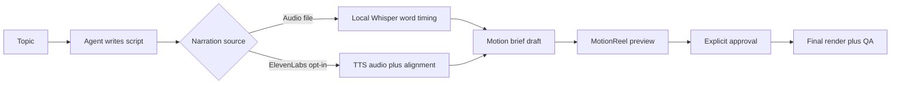

# Motion Reel Public Mode – Design

**Status:** proposed
**Target release:** 1.7.0
**Implementation base:** `origin/main` at AutoMontage-Agent 1.6.0

## Problem

AutoMontage-Agent can already render timed Remotion scenes, preview a draft, require
explicit approval, create immutable render versions and run video QA. Its public workflow,
however, starts from a video source and assumes that narration and the speaker image come
from that video.

`motion-reel` must create a vertical reel from narration without requiring a camera track.
The creative reference defines the motion grammar only: kinetic text, cards, progressive
diagrams, lists, counters and a CTA. Its colors, fonts, copy, voice identity and media are
private inputs and must not become public defaults.

## User experience

The public workflow has two narration inputs:

```bash
# Free/local path: narration already exists.
automontage motion narration.mp3 --project "Название ролика"

# Optional paid path: ElevenLabs creates narration and word timing.
automontage motion --script script.txt --voice elevenlabs \
  --voice-id <voice-id> --project "Название ролика" --accept-provider-cost
```

In normal use, the user asks Claude Code or Codex for a reel by topic. The bundled skill
writes the script and motion brief in the signed-in agent session. No separate language-model
API is needed. The CLI handles deterministic work: workspace creation, media probing,
transcription or supplied timing, preview, approval, render and QA.

The resulting flow is:



## Boundaries of the first public release

Version 1.7.0 includes:

- an audio-only project source;
- a versioned `motion-reel` draft/approved brief;
- a `MotionReel` Remotion composition with a fixed public scene library;
- preview, approval, immutable final render and QA through the existing workspace model;
- local narration files and local Whisper timing;
- an optional ElevenLabs adapter with aligned timestamps and explicit cost acceptance;
- a neutral, generated demo that works without credentials;
- a public agent skill that turns a topic into script, brief and finished reel.

It does not include scheduling, queues, automatic posting, analytics, a copied reference
theme, a personal voice ID or a live paid-provider call in tests. Those belong either to a
future orchestration service or the user's private configuration.

## Data model

Existing workspaces remain valid. `project.json` gains optional discriminators that the
loader fills for older projects:

```json
{
  "projectKind": "motion-reel",
  "source": {
    "mediaKind": "audio"
  },
  "briefs": [
    {
      "kind": "motion-reel",
      "jsonPath": "brief/v01-draft.motion.json"
    }
  ]
}
```

The new `schema/motion-brief.schema.json` is separate from the lesson schema so a
camera-free brief cannot accidentally enter `ReelScenes`. Its core contract is:

```json
{
  "version": 1,
  "kind": "motion-reel",
  "status": "draft",
  "source": "input/narration.mp3",
  "theme": "motion-neutral",
  "title": "Тема",
  "output": {
    "aspect": "vertical",
    "width": 1080,
    "height": 1920,
    "fps": 30,
    "durationInFrames": 1519
  },
  "scenes": []
}
```

Each scene has `scene`, `start`, `end` and only the fields allowed for that type. The
official scene types are:

| Scene | Purpose |
|---|---|
| `kinetic-title` | Hook or short phrase revealed by words |
| `card` | One claim or concept in a moving card |
| `steps` | A process revealed one node and connector at a time |
| `list` | Two to four items entering in speech order |
| `counter` | A number, comparison or progress value |
| `media` | Reviewed image/video with motion and optional overlay text |
| `cta` | Final action and handle/link text |

Scene text is bounded by schema limits. Timings must be ordered, frame-aligned and contained
inside the narration duration. Arbitrary React, CSS, HTML, JavaScript, shell text and remote
URLs are never executable brief fields.

## Rendering

`src/MotionDirector.jsx` owns the camera-free composition. It receives one audio source,
the selected public theme and the validated scene list. It reuses timing, typography,
transitions, safe-zone and music primitives where their contracts are independent of a face
video. It does not route through `SceneDirector` and never fabricates a blank speaker video.

The default output is 1080×1920 at 30 FPS. Full vector scenes do not show an ordinary subtitle
stripe unless the brief explicitly selects caption text. Each 1.5–2.2 second interval should
contain a visible event: a new phrase, card, connector, state or emphasis.

## Narration and ElevenLabs

The engine always accepts an existing MP3/WAV/M4A file, so the mode remains useful without a
provider account. For ElevenLabs, `ELEVENLABS_API_KEY` is read only by the local Node process;
it is never copied into props, logs, project manifests or browser state. `--voice-id` is
required or can come from a private environment variable; the repository has no personal
default.

The adapter uses the provider endpoint that returns audio and character alignment together.
It converts character alignment to words rather than retranscribing generated speech. A
content-addressed cache key covers script, voice ID, model, voice settings and output format,
which prevents duplicate paid generation after a retry. The command refuses the live request
without `--accept-provider-cost` and never retries an ambiguous response automatically.

## Approval and compatibility

Draft preview and approval retain the current invariant:

1. Only `draft` can create a watermarked preview.
2. Approval records the exact preview, narration and brief hashes.
3. Only the resulting immutable `approved` copy can render to `renders/` and `final/`.
4. A changed script, narration file, timing, theme or scene plan creates a new draft revision.

The project loader treats absent `projectKind`, `source.mediaKind` and `briefs[].kind` as
`video`, `video` and `lesson`. The broader `video` project kind covers both the existing
Dynamic and lesson workflows, so old projects are not mislabeled. Existing commands and
manifests therefore keep working.

## Public and private files

| Publish to GitHub | Keep local/private |
|---|---|
| schemas, renderer, CLI and tests | local reference reel and other source media |
| neutral scene presets and theme | copied reference colors/fonts/layout |
| generated demo fixture | real narration, scripts and finished renders |
| `.env.example` with empty placeholders | `.env` and `ELEVENLABS_API_KEY` |
| provider adapter and mocked tests | personal `voice_id` and generated audio cache |
| agent skill and documentation | project workspaces under `projects/` |

The privacy checker must reject provider secrets, non-empty tracked voice-ID assignments, local
absolute paths and unregistered media. The public demo must be reproducible without network access.

## Release acceptance

The feature is ready for 1.7.0 when:

- a fresh clone can render the neutral motion demo with no API key;
- an existing narration file completes draft → preview → approval → final;
- a mocked ElevenLabs response produces audio and deterministic word timing;
- Cyrillic text and all seven motion scenes stay within vertical safe zones;
- old lesson projects and all existing tests still pass;
- package, privacy, release and Gitleaks checks pass;
- README, architecture, templates, scene catalog, testing, decisions, changelog and skills
  describe the same commands and guarantees as the code.
