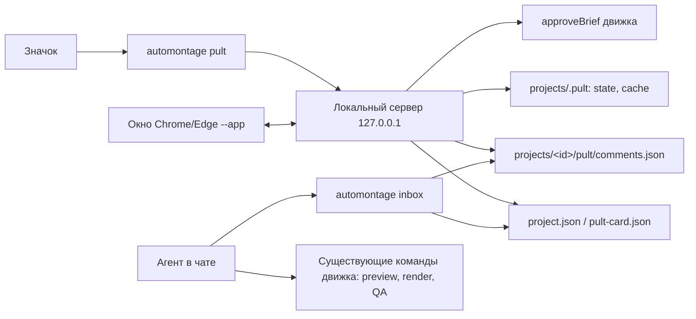

# Спецификация: Пульт роликов

**Статус:** proposed
**Целевой релиз:** 1.8.0
**База реализации:** `main` на AutoMontage-Agent 1.7.0
**Источник:** discovery-интервью с автором, 2026-09-24

## Коротко

Пульт роликов — главный экран AutoMontage-Agent на русском языке. Он показывает все ролики
из `projects/`, их состояние и следующий шаг, даёт посмотреть текущую версию, забрать файл,
оставить правки на таймкоде и зафиксировать утверждение. Монтаж, правки и финальный рендер
по-прежнему выполняет агент в Claude Code или Codex; пульт только показывает состояние и
записывает решения человека.

## Проблема

После нескольких десятков роликов пользователь теряется:

- не находит готовый MP4, чтобы опубликовать или отправить;
- не помнит, какие ролики в работе и какие ждут его утверждения;
- путается в версиях: `brief/v01…v16`, `previews/`, `renders/`, `final/`, `motion-vNN/`;
- тестовые папки, исследования и карусели мешают видеть настоящие ролики.

Review Workbench уже решает проверку одного ролика, но открывается агентом и только для одной
папки. Общей картины нет, а правки приходится формулировать в чате словами: «где-то в середине
текст залезает на лицо».

## Критерии успеха

1. Любой готовый ролик находится и забирается за 10 секунд без Finder/Проводника.
2. Первый экран сразу показывает, что ждёт решения пользователя.
3. Правки, оставленные в пульте, агент выполняет без уточнения «где именно?»: у каждой есть
   таймкод, кадр и версия preview.
4. Человек без опыта открывает пульт и без инструкции находит финал и оставляет правку.
   Проверяется одним наблюдаемым прогоном с новым пользователем перед релизом.

## Пользователи

- **Сейчас:** автор роликов, не разработчик, работает на Mac, монтирует через агента в VS Code.
- **Позже:** ученики на Mac и Windows, свежий клон публичного репозитория, без личных тем и путей.

Поэтому пульт — часть публичного движка, а не проектный скрипт.

## Решения из интервью

| Вопрос | Решение |
|---|---|
| Что такое карточка | Тема ролика; оригинал, хуки и ролики серии — варианты внутри |
| Статусы | «Ждёт меня», «В работе», «Готов», скрытый «Архив». Статуса «Опубликован» нет |
| Запуск | Значок на рабочем столе / в Dock, Mac и Windows |
| Окно | Локальная страница в Chrome/Edge в режиме приложения, без адресной строки; иначе обычная вкладка |
| Лишние папки | Скрываются в Архив; файлы и папки не перемещаются и не удаляются |
| «Утверждаю» | Записывает решение; финал и QA делает агент |
| Правки | В пульте, с привязкой к секунде видео |
| Версии | Видна одна текущая; прежние — под кнопкой «История» |
| Связь с агентом | Кнопка «Скопировать для агента» и входящие, которые агент проверяет в начале чата |
| Старые папки без паспорта | Разовая уборка: агент дописывает карточки, файлы не двигаются; новые ролики без паспорта не создаются |

## Пользовательский путь

1. Пользователь дважды кликает значок «Пульт роликов».
2. Открывается окно без адресной строки. Интернет не нужен: страница обслуживается локальной
   программой по адресу `127.0.0.1`.
3. Сверху раздел «Ждёт меня», ниже «В работе» и «Готов». «Архив» открывается отдельной вкладкой.
   Над списком — поиск по названию.
4. Карточка показывает кадр, название, статус, дату последнего изменения, формат и длину
   (`9:16 · 1:58`) и одну строку следующего шага, например «Посмотрите preview и утвердите».
5. Клик открывает ролик: плеер с текущей версией, варианты темы (Оригинал, Хук 1…),
   кнопки «Показать в папке», «История», «Открыть проверку монтажа» (Review Workbench,
   если ролик его поддерживает).
6. Правка: пауза на 0:14 → «Добавить правку» → текст. Правка сохраняет время, кадр и версию.
7. Утверждение: доступно только для полного актуального preview. Пользователь отмечает
   «Посмотрел целиком» и нажимает «Утверждаю».
8. После правок или утверждения карточка переходит в «В работе» со следующим шагом
   «Ждёт агента». Кнопка «Скопировать для агента» кладёт в буфер готовую фразу:
   `Продолжи ролик «<название>» в projects/<папка>: выполни automontage inbox и обработай входящие.`
9. В начале нового чата агент сам сообщает: «В пульте 2 ролика ждут меня».

### Набросок главного экрана

```text
┌ Пульт роликов ─────────────────────────────── [ Поиск… ] ─┐
│ ЖДЁТ МЕНЯ (2)                                             │
│ ┌──────┐ Перфекционизм — тормоз     9:16 · 0:27  18 сен   │
│ │ кадр │ Посмотрите preview и утвердите                   │
│ └──────┘                                                  │
│ В РАБОТЕ (3)                                              │
│ ┌──────┐ Ролик про агентов · 4 варианта    Ждёт агента    │
│ └──────┘                                                  │
│ ГОТОВ (14)                                     [Архив ▸]  │
└───────────────────────────────────────────────────────────┘
```

## Требования

### P0 — обязательно для 1.8.0

**Список и статусы**
- Пульт читает только манифесты: `project.json` и `pult-card.json`. Деревья файлов не обходит.
- Статус вычисляется из явных данных движка, а не угадывается по любым MP4:
  - **Готов** — файл финала реально существует и собран из текущего утверждённого brief.
    Поле `final` в `project.json` заполнено заранее, поэтому проверяется существование файла
    и `latestRender`.
  - **Ждёт меня** — текущий brief в статусе draft, есть `currentPreview` вида `full`, его
    `briefSha256` совпадает с текущим brief и нет необработанных решений из пульта.
  - **В работе** — всё остальное. Следующий шаг уточняет: «Агент собирает preview»,
    «Ждёт агента: 3 правки», «Утверждено, агент собирает финал».
  - **Архив** — скрыт пользователем; вычисленный статус сохраняется.
- Поврежденный или неизвестный манифест не ломает список: карточка «Не удалось прочитать»
  с кнопкой «Показать в папке».
- Папки без паспорта и без `pult-card.json` попадают на отдельную вкладку «Без паспорта»
  с подсказкой: «Попросите агента завести паспорт для этой папки».

**Карточки и варианты**
- Группировка: карточки с одинаковым `group.id` в `pult-card.json` объединяются в одну тему.
  Папка серии может объявить несколько вариантов в одном `pult-card.json`.
- Текущее видео варианта: существующий финал, иначе полный актуальный preview, иначе
  последний preview с пометкой «устарел».
- Кадр-обложка и длина берутся через `ffprobe`/`ffmpeg` и кэшируются в
  `projects/.pult/cache/`, а не в папке ролика.

**Действия**
- Встроенный плеер для текущего видео и вариантов.
- «Показать в папке»: `open -R` на macOS, `explorer /select,` на Windows. Отдельный argv,
  без shell.
- «В архив» / «Вернуть из архива» пишет только `projects/.pult/state.json`.
- Правки на таймкоде: время, текст, кадр, путь и `sha256` preview, `briefSha256`.
  Правку можно удалить, пока агент её не принял.
- «Утверждаю»: только для полного актуального preview и после отметки «Посмотрел целиком».
  Пульт вызывает ту же функцию движка `approveBrief`, что и Review Workbench, с
  `confirmPreviewViewed: true` и `expectedPreviewSha256` того preview, который показывала
  страница. Движок сам проверяет полный preview, хеши brief и исходника и создаёт approved-ревизию.
  Если preview успел смениться, утверждение отклоняется. Финальный рендер пульт не запускает.
- «Скопировать для агента»: фраза с названием, папкой ролика и количеством новых решений.

**Входящие для агента**
- Команда `automontage inbox` печатает Markdown-список: новые правки (таймкод, текст, кадр,
  версия видео) и утверждённые ролики без финала. Утверждения не хранятся отдельно: их
  источник — approved brief в `project.json`.
- `automontage inbox --accept <папка> <id правки>` помечает правку принятой после действия агента.
- `AGENTS.md` и навыки `reel-turnkey`, `reel-from-donor`, `motion-reel`: в начале сессии
  агент выполняет `automontage inbox`; утверждение из пульта равносильно явному «утверждаю»
  для той же версии brief и preview; любая творческая правка после утверждения требует нового
  preview.

**Запуск**
- `automontage pult` запускает локальный сервер и открывает окно. Если пульт уже запущен,
  открывается существующий экземпляр.
- `automontage pult --install-shortcut` создаёт значок:
  - macOS — минимальный `.app` в `~/Applications`, его можно перетащить в Dock;
  - Windows — ярлык на рабочем столе.
  Значок хранит абсолютные пути к Node и репозиторию, а на macOS ещё и `PATH` и
  `AUTOMONTAGE_FFMPEG_DIR` на момент установки: приложение из Dock не видит окружения
  терминала и иначе не найдёт `ffmpeg`/`ffprobe`.
- «Открыть проверку монтажа» запускает Review Workbench внутри процесса пульта
  (`startReviewServer`, `open: false`), переиспользует уже открытую сессию проекта и
  закрывает все такие сессии при остановке пульта.
- Окно: Chrome или Edge с `--app=<url>`; если браузера нет — системный браузер обычной вкладкой.
- Сервер сам завершается после 30 минут без открытого окна (heartbeat страницы).

**Паспорта**
- Новый `schema/pult-card.schema.json`: название, `group` (`id`, `title`), варианты
  (`label`, путь к видео, путь к финалу, формат, статус для legacy-папок).
- Для стандартных проектов `pult-card.json` необязателен: он нужен только для группировки
  и подписи варианта.
- `projects/` в Git не попадает; карточки конкретных роликов не публикуются.

### P1 — желательно

- Фильтр по формату (вертикаль/горизонталь) и сортировка по дате.
- Горячие клавиши плеера: пробел, стрелки по кадру, `К` — добавить правку.
- Команда разовой уборки `automontage pult --adopt <папка>`: черновик `pult-card.json` для
  legacy-папки, который агент проверяет и сохраняет.

### P2 — позже

- Linux-ярлык (`.desktop`).
- Сравнение двух версий рядом.

## Архитектура



- **Сервер:** Node без новых зависимостей, отдельный от Review, с той же моделью защиты:
  только `127.0.0.1`, токен во фрагменте URL, `Bearer` для API, `?token=` для медиа,
  проверка `Host` и `Origin`, строгий CSP. Сервер Review не меняется.
- **Экземпляр:** `projects/.pult/instance.json` (права 0600) хранит порт, токен и pid. Повторный
  запуск находит живой экземпляр через `/api/health` и просто открывает окно.
- **Правки:** `projects/<id>/pult/comments.json` (атомарная запись) и кадры
  `projects/<id>/pult/frames/<id>.jpg`. Статусы правки: `new` → `accepted`.
- **UI:** `pult/` рядом с `review/`: статические HTML/CSS/JS, русский интерфейс, без внешних
  ссылок, шрифтов и CDN.
- **Review Workbench** не меняется; пульт открывает его для конкретного проекта.

## Безопасность

- Отдаются только файлы, на которые указывают проверенные манифесты. Путь нормализуется и
  обязан остаться внутри папки проекта; симлинки наружу отклоняются.
- Никаких удалений и перемещений файлов из пульта.
- Внешние процессы (`ffprobe`, `ffmpeg`, `open`, `explorer`, браузер) — через `execFile`/`spawn`
  с массивом аргументов, без `shell: true`.
- Regression-тесты: path traversal (`../`, закодированные слэши, абсолютные пути, симлинк),
  чужой `Host`, запрос без токена, утверждение устаревшего preview, утверждение excerpt-preview.
  Для каждого — соседний позитивный случай.

## Проверка

- Unit: вычисление статуса (все ветки), группировка, выбор текущего видео, разбор битых
  манифестов, `inbox` и `--accept`, сборка argv запуска для macOS и Windows.
- Browser (Playwright): список и разделы, поиск, архив, правка на таймкоде, блокировка
  утверждения без полного просмотра, копирование фразы.
- Ручная: значок на Mac и Windows; окно без адресной строки; работа без сети;
  автоостановка сервера; прогон с новым пользователем по критерию успеха 4.

## Документация и релиз

- `README.md` — команды `pult`, `pult --install-shortcut`, `inbox`.
- Новый `docs/PULT.md` — пользовательская инструкция простым языком.
- `ARCHITECTURE.md`, `TESTING.md`, `DECISIONS.md` (локальное окно браузера вместо Electron;
  пульт записывает решения, но не рендерит), `CHANGELOG.md`.
- `AGENTS.md` и навыки — правило `inbox` и обязательного паспорта.
- Версия 1.8.0 в `package.json`, `package-lock.json`, `README.md`.

## Вне рамок

- Чат с агентом внутри пульта и запуск агента из пульта, включая кнопку «Обсудить с агентом»
  через официальный Claude Remote Control. Решение автора от 2026-09-24: не усложнять
  первый выпуск. Причины: собственный чат дал бы вторую историю разговоров, отдельную от
  VS Code, и серую зону правил подписки для учеников. Связь с агентом — только через
  «Скопировать для агента» и `automontage inbox`.
- Создание нового ролика из пульта, выбор маршрута и запуск транскрибации.
- Финальный рендер из пульта.
- Публикация в соцсети и статус «Опубликован».
- Доступ с телефона или другого компьютера, несколько пользователей.
- Удаление и перемещение папок.
- Отдельное приложение на Electron/Tauri.

## Решено при планировании

1. Порт случайный; адрес и токен живого экземпляра — в `projects/.pult/instance.json`.
2. Motion-reel утверждается той же `approveBrief`: она читает вид проекта из `project.json`.
3. Фраза для агента одна для Claude Code и Codex: «Продолжи ролик «<название>» в
   `projects/<папка>`: выполни `automontage inbox` и обработай входящие.»
4. `inbox` показывает у каждой правки путь и хеш видео; если видео с тех пор сменилось,
   рядом стоит пометка «к прежней версии».

## Приложение: выводы исследования

- OpenCreator хранит статус «нужно действие: шаг» явно в состоянии задачи, а не угадывает по
  файлам. Пульт следует этому: статус выводится из манифестов движка.
- Нынешний Review Workbench уже работает без сети, слушает только `127.0.0.1` и проверяет
  токен и `Host`. Пульт наследует эту модель.
- Около трети локальных папок роликов собраны вне стандартного пути и не имеют
  `project.json`. Без разовой уборки пульт показывал бы их неполно.
